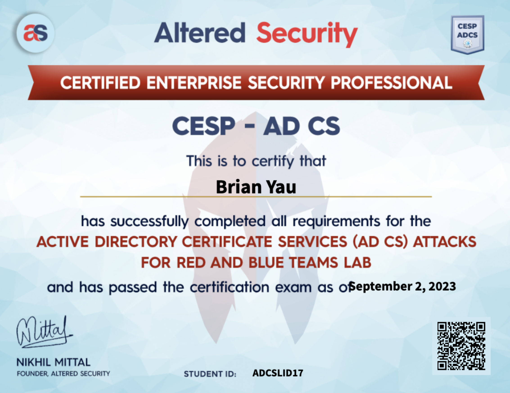

# 202309 - Altered Security CESP-ADCS Review

---

## Course Overview

With knowledge of the previous red team courses from [Nikhil Mittal](https://in.linkedin.com/in/mittalnikhil), also the author of the famous offensive PowerShell tool [Nishang](https://github.com/samratashok/nishang), it feels much easier to understand how Active Directory really works and how it is commonly misconfigured, allowing attackers to abuse and dorminate a forest.

[Active Directory Certificate Services (ADCS)](https://learn.microsoft.com/en-us/windows-server/identity/ad-cs/active-directory-certificate-services-overview) is Microsoft’s Public Key Infrastructure (PKI) for typical Windows environments. It would also be interesting to understand more from the red team perspective to assist in the defensive measures like writing detection use cases and spotting misconfigurations. Upon the release of the new [ADCS course](https://www.alteredsecurity.com/adcs), I joined it as soon as it became available!

 

---

## Course Review

Like in the previous courses, you are given the VPN access and Web access to the lab environment, and also the course slides, videos etc.

The course uses a step-by-step approach to walk through concepts such as red teaming basics (e.g., AV Bypass, PowerShell Logging bypass, etc.), the workings of AD CS, different attack paths in AD CS environments, and tools for AD CS attacks, etc. You may refer to the [Altered Security ADCS Course Page](https://www.alteredsecurity.com/adcs) to learn more about the course itself.

As a student who does not have much experience in configuring, defending and attacking ADCS, this course provides much knowledge on top of the basic AD attack surfaces learnt in the previous CRTP, CRTE and CRTM course. For someone who has 0 experience or knowledge in AD attacks, definitely check out the [CRTP course](https://www.alteredsecurity.com/adlab) to learn the fundamentals first.

When studying the course, I simply read the course slides and make notes using Markdown so I could keep referencing during my work or building labs. Unless I am very unsure about the knowledge, I skip the course videos since the content is very similar to the course slides. 

I find it is much valuable to encounter difficulties while doing the labs - I especially love that the lab manual provides the steps to work from both Windows and Linux environment, which provides great flexiblility and experience for your real life engagements.

For each labs, there are flags that you have to submit on their learning portal to make sure that you've followed the materials well.

For myself, I subscribed lab for 30 days and it is much more than enough to finish the materials.

I believe most of the materials are based on and can be found in the [SpecterOps's Certified Pre-Owned Whitepaper](https://specterops.io/wp-content/uploads/sites/3/2022/06/Certified_Pre-Owned.pdf) - and so if you would like to learn the content, you may refer to this whitepaper.

 

---

## Examination

Regarding the exam, you have 24 hours to work in the exam lab environment, and an additional 48 hours to submit the report.

In the exam, you will have to make use of the knowledge learnt in the course (nothing more!) and find the attack path to pwn the single AD domain with 5 machines (including the foothold machine). As long as you follow the content well, you should be able to crack the exam without much issue.

TIPS: Again - enumeration is always the main key to success. Make sure you understand how the vulnerabilities are found and what the tools outputs mean in the lab environment; or otherwise it would be easy to get lost!

At the end I was able to finish and submit the report in 8 hours. After submitting the report around 5 days, I am certified!

Thanks for reading this. Have been having some thought on building an ADCS lab and build some detection use cases in the future. Stay tuned!

 

---