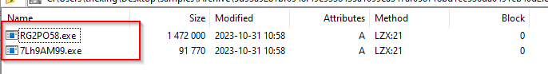

# 202310 - Extract & Extract & Extract

Sample: [MalwareBazaar 5d93a9281bf0948f49e9338435a1099ea347af058718bd1cc536da0491cb40d2](https://bazaar.abuse.ch/sample/5d93a9281bf0948f49e9338435a1099ea347af058718bd1cc536da0491cb40d2/#file_info)

- Similar samples:
  - [Hybrid Analysis: 6378cedadb8aac29185931b1f83dfeb023dc8f4d8ef7465f4bd8a75cd48fd275](https://hybrid-analysis.com/sample/6378cedadb8aac29185931b1f83dfeb023dc8f4d8ef7465f4bd8a75cd48fd275/65207092cc0f209ce1039b60)

- Original Sample: http://109[.]107.182.2/race/bus50.exe

General observations:

- Stealers tends to be malware chained together for different purposes (e.g. Evasion -> Impair Defense -> SmokeLoader -> Redline -> Mystic)
- Layers of backdoored WEXTRACT.EXE
  - 7 components serving for different purposes

  

- The backdoored WEXTRACT can be viewed as a typical ZIP file where you may use tools like 7-Zip to extract

  

- After extracting, you will find yourself in an extract loop - the file **RG2PO58.exe** is yet another WEXTRACT compiled extractor

  

- If you inspect the **resources** section, you will notice that there are instances of **RUNPROGRAM** and **POSTRUNPROGRAM**
- In the resources section of the PE, you will find a CAB in the **rcdata**
- You may use **Resource Hacker** to extract the relevant section from the backdoored WEXTRACT PE
- **bus50** could be some sort of campaign identifier, which matches the original sample name in the distribution source (unconfirmed)
- Note that you will find **wextract.exe** in **Windows\System32**, which is a legit program for extracting CAB files
- This technique has been used for over 10 years for **self-extraction**
- When running the sample, it will extract the EXE files in the `TEMP` and then execute them (likely the one in **RUNPROGRAM** and then **POSTRUNPROGRAM**)

If you manually extract the files, you will see the following pattern:

```
bus50.exe
    |__ 7Lh9AM99.exe                     (MD5: 19465EA8A948EACA48FB020A742D60EA)
    |__ RG2PO58.exe
        |__ 6ip4QK1.exe                  (MD5: E4640A6D4E342A37E2DE8591AC76DC8F)
        |__ ks8GM27.exe
            |__ 5RI5Wx6.exe              (MD5: C07F165F384ACCCABF2868AB3EFF6267)
            |__ jL7jG58.exe
                |__ 4Vb016Uy.exe         (MD5: 7CCA36E70CF00E0C7971217151879922)
                |__ Gg2Te19.exe
                    |__ 3bt07Qb.exe      (MD5: 1088CE08079743C4488D267289F9C110)
                    |__ Tk1Ov12.exe
                        |__ 2Hl5657.exe  (MD5: FA2204DCE76A6C774C43B9343FBCC843)
                        |__ 1ZE54Tl5.exe (MD5: 3293FD274A016127C9B27252FBE85DCD)
```

- Effectively, the execution order should be: bus50.exe > 7Lh9AM99.exe  > 6ip4QK1.exe > ... > 1ZE54Tl5.exe

<br/>

---

## 7Lh9AM99.exe

[Any.run test](https://app.any.run/tasks/a7c0eae4-8b7e-4351-b9a3-78d48bd5e861)

  

- Written in **PureBasic**

- First create a `.bat` file in TEMP: `C:\Users\admin\AppData\Local\Temp\FB22.tmp\FB23.tmp\FB24.bat` with the argument C:\Users\admin\AppData\Local\Temp\7Lh9AM99.exe"
- The `.bat` file will open the following URLs:
  - https://accounts.google.com
  - https://www.facebook.com/login
  - https://store.steampowered.com/login/
  - https://twitter.com/i/flow/login
  - https://steamcommunity.com/openid/loginform/
  - https://www.epicgames.com/id/login
  - https://www.youtube.com/

(May need more time to find out the reason why - but apparently a way to detect if there is any saved session)

<br/>

---

## 6ip4QK1.exe - Mystric Stealer C2 Component

[Any.run test](https://app.any.run/tasks/a24cd633-ec8b-4d6d-afea-f7d4448cc3fc)

- Call back to the C2 IP address: 193[.]233.255.7:80


References:

- Cyfirma: [https://www.cyfirma.com/outofband/mystic-stealer-evolving-stealth-malware/](https://www.cyfirma.com/outofband/mystic-stealer-evolving-stealth-malware/)

<br/>

---

## 5RI5Wx6.exe - Amadey Stealer

[Any.run test](https://app.any.run/tasks/f44f1636-3ccf-4e20-8495-f0c1a5d39490)

  


1. Drop an additional file called `explothe.exe` (MD5: c07f165f384acccabf2868ab3eff6267)
2. Create Scheduled Task for retrieving **Amadey** components: `"C:\Windows\System32\schtasks.exe" /Create /SC MINUTE /MO 1 /TN explothe.exe /TR "C:\Users\admin\AppData\Local\Temp\fefffe8cea\explothe.exe" /F`
3. Evasion: `"C:\Windows\System32\cmd.exe" /k echo Y|CACLS "explothe.exe" /P "admin:N"&&CACLS "explothe.exe" /P "admin:R" /E&&echo Y|CACLS "..\fefffe8cea" /P "admin:N"&&CACLS "..\fefffe8cea" /P "admin:R" /E&&Exit` - Making **explothe.exe** and its current folder to be READ-ONLY to prevent deletion from the current user
4.  Retrieve additional components from `http://77[.]91.124.1/theme/` - **cred.dll** and **clip.dll**; with reference to [Splunk](https://www.splunk.com/en_us/blog/security/amadey-threat-analysis-and-detections.html)
5.  These dll will be invoked by **rundll32.exe** (`C:\Windows\System32\rundll32.exe" C:\Users\admin\AppData\Roaming\006700e5a2ab05\clip.dll, Main`) to harvest sensitive information from the victim machine, and then exfiltrate it to the designated C2
6.  An HTTP POST to the C2's `/theme/index.php` will contain the following structure: `id=302019708150&vs=3.89&sd=04d170&os=9&bi=0&ar=0&pc=USER-PC&un=admin&dm=&av=0&lv=0&og=1` (This is the configuration of Any.run). This can be a network-based signature
    1.  id = Infected System ID
    2.  vs = Amadey version (3.89 in this case)
    3.  sd = Amadey ID (04d170 in this case)
    4.  os = Windows version (9 in this case means Windows 7)
    5.  bi = Architecture (0 means x86)
    6.  ar = Admin privilege (0 means non-admin)
    7.  pc = Hostname
    8.  un = Username
    9.  dm = Domain name
    10. av = List of installed malware
    11. lv = ?
    12. og = ?


References:

- Splunk: [https://www.splunk.com/en_us/blog/security/amadey-threat-analysis-and-detections.html](https://www.splunk.com/en_us/blog/security/amadey-threat-analysis-and-detections.html)
- Darktrace: [https://darktrace.com/blog/amadey-info-stealer-exploiting-n-day-vulnerabilities](https://darktrace.com/blog/amadey-info-stealer-exploiting-n-day-vulnerabilities)

<br/>

---

## 4Vb016Uy.exe - Redline Stealer Backdoor

[Any.run report](https://app.any.run/tasks/8c3b2ad8-9297-4104-9d03-4ca50ae3b720)

1. Data Exfiltration to 77[.]91.124.86:19084 with SOAP - for Command and Control + data exfiltration


References:

1. Malware.news: [https://malware.news/t/dissecting-redline-infostealer-traffic-a-soapy-endeavour/56444](https://malware.news/t/dissecting-redline-infostealer-traffic-a-soapy-endeavour/56444)
2. https://www.cloudsek.com/blog/technical-analysis-of-the-redline-stealer

<br/>

---

## 3bt07Qb.exe (SmokeLoader)

[Triage result](https://tria.ge/231031-m5x12she64)

- C2 at `http://77.91.68.29/fks/`

(To be analyzed further)

<br/>

---

## 2hl5657.exe (Mystic Stealer & C2)

C2: `http://193.233.255.73/loghub/master`

- Steal browser data
- Steal browser extension data
- Steal Cryptocurrency Wallet data

Reference:

- Zscaler: [https://www.zscaler.com/blogs/security-research/mystic-stealer-revisited](https://www.zscaler.com/blogs/security-research/mystic-stealer-revisited)

<br/>

---

## 1ZE54Tl5.exe 

  

- `Bus50` first and `Car1` at last?

(To Be Analyzed)

Reference:

- VMRay: [https://www.vmray.com/analyses/_vt/f697004fb4b1/report/overview.html](https://www.vmray.com/analyses/_vt/f697004fb4b1/report/overview.html)

<br/>

---