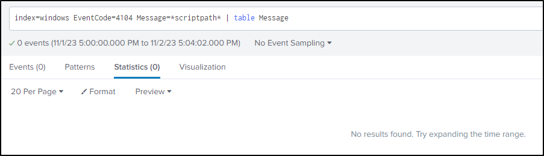
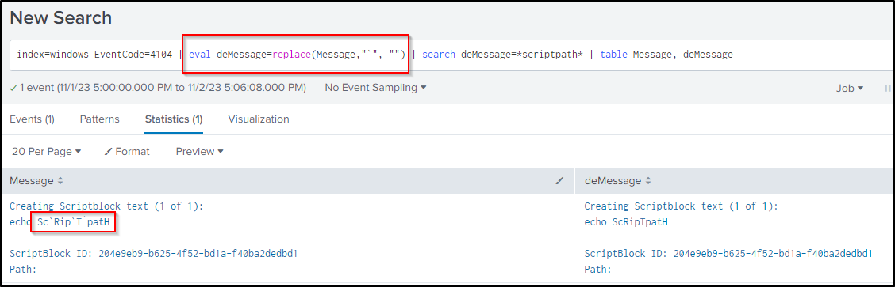

## PowerShell Obfuscation 1: Formatters

### Backtick (`` ` ``)

In PowerShell, backtick (`` ` ``) is used as an escape character (like `\` in many other languages). For example:

- ``Sc`Rip`t`path`` == `ScRiptpath`

Imagine your detection systems like SIEM will not deobfuscate PowerShell command by default, and assume you are detecting the keyword `Scriptpath`:

- `index=windows EventCode=4104 Message=*scriptpath*`

 

To avoid the false negative, one of the possible solutions is to remove all backticks. For example on Splunk:

``` spl
index=windows EventCode=4104 | eval deMessage=replace(Message,"`", "") | search deMessage=*scriptpath* | table Message, deMessage
```

  

<br/>

### Formatter with `{}`

In PowerShell, you can use `{}` with `-f` to format a string. This is similar to the following in Python:

```py
var1 = "Hello,"
var2 = "World!"
myString = "{}, {}".format(var1, var2)
print(myString)
```

The PowerShell equivalent will be:

```ps1
echo ("{0}{1}"-f"Hello,","World!")
```

For example:

``` ps1
"{3}{0}{4}{7}{9}{5}{2}{8}{1}{6}" -f'.','resS','.c','SysTEm.io','CoMp','On','ioNMoDE','RE','omp','SSI'

# Deobfuscated
SysTEm.io    .    CoMp    RE    SSI    On    .c    omp    resS    ioNMoDE
SysTEm.io.CoMpRESSIOn.compresSioNMoDE
```


<br/>

---


### Real-world example

The following case study references t[he DFIR Report: NetSupport Intrusion Results in Domain Compromise](https://thedfirreport.com/2023/10/30/netsupport-intrusion-results-in-domain-compromise/).

Here is a PowerShell code snippet used by the threat actor to defense evasion - do not run when encountering AV / Sandbox: 

- [netsupport-deploy-obfuscated.ps1](https://gist.github.com/iamaleks/c289bcfc460f85f830726694e2446c8c):

```ps1
${4`6q0o}  =[tYPE]("{3}{0}{4}{7}{9}{5}{2}{8}{1}{6}" -f'.','resS','.c','SysTEm.io','CoMp','On','ioNMoDE','RE','omp','SSI')  ;SeT-iTem  ('vaR'+'I'+'Ab'+'lE:v25yj') ([Type]("{0}{2}{4}{3}{1}" -f 's','oNVeRt','yste','.C','M') ) ; ${b`m`W1y}=[type]("{2}{1}{3}{0}" -f'FIle','tE','Sys','M.IO.')  ; ${s`cr`IptpA`TH} = &("{0}{2}{1}"-f 'spl','th','it-pa') -parent ${m`yI`NVoCatiOn}."MYCo`Mm`A`ND"."d`Ef`InItioN"


if (${Sc`Rip`T`patH} -match ("{0}{1}"-f'a','vast'))    {exit}
if (${s`Cr`ipTPatH} -match "avg")      {exit}
if (${Scr`iP`TpATH} -match ("{0}{1}" -f 'sam','ple'))   {exit}
if (${SCRi`p`TpatH} -match ("{0}{1}"-f'analy','sis')) {exit}
if (${scri`pt`p`ATh} -match ("{0}{1}{2}"-f'm','alwa','re'))  {exit}
if (${S`cRipt`paTh} -match ("{1}{0}" -f'dbox','san'))  {exit}
if (${sc`RiPTpA`TH} -match ("{1}{0}" -f'irus','v'))    {exit}
```

- `[tYPE]("{3}{0}{4}{7}{9}{5}{2}{8}{1}{6}" -f'.','resS','.c','SysTEm.io','CoMp','On','ioNMoDE','RE','omp','SSI');`
    - `[type](System.io.Compression.CompressionMode);`
- `SeT-iTem  ('vaR'+'I'+'Ab'+'lE:v25yj') ([Type]("{0}{2}{4}{3}{1}" -f 's','oNVeRt','yste','.C','M') ) ;`
    - `Set-Item variable:v25yj ([Type]System.Convert);`
    - `$v25yj = ([Type]System.Convert);`
- `${b`m`W1y}=[type]("{2}{1}{3}{0}" -f'FIle','tE','Sys','M.IO.')  ;`
    - `$bmW1y = [type](System.IO.File)`
- `` ${s`cr`IptpA`TH} = &("{0}{2}{1}"-f 'spl','th','it-pa') -parent ${m`yI`NVoCatiOn}."MYCo`Mm`A`ND"."d`Ef`InItioN" ``
    - `$scriptpath = &(split-path) -parent MyInvocation.MyCommand.Definition`

Deobfuscated:

```ps1
$46q0o = [type](System.io.Compression.CompressionMode); 
Set-Item variable:v25yj ([Type]System.Convert); 
$bmW1y = [type](System.IO.File); 
# The current script's folder path
$scriptpath = Split-path -parent MyInvocation.MyCommand.Definition

if ($scriptpath -match "avast")    {exit}
if ($scriptpath -match "avg")      {exit}
if ($scriptpath -match "sample")   {exit}
if ($scriptpath -match "analysis") {exit}
if ($scriptpath -match "malware")  {exit}
if ($scriptpath -match "sandbox")  {exit}
if ($scriptpath -match "virus")    {exit}
```

- The first 3 variable will be variables to be used in latter expressions to evade pattern-based detections
    - For example, if you are detecting the pattern `System.IO.File`, it simply replaces it by `$bmW1y` in this case
- The `if` statements are trivial - exit the program if seeing the current path matching the patterns related to some AV engines, sandbox, etc.